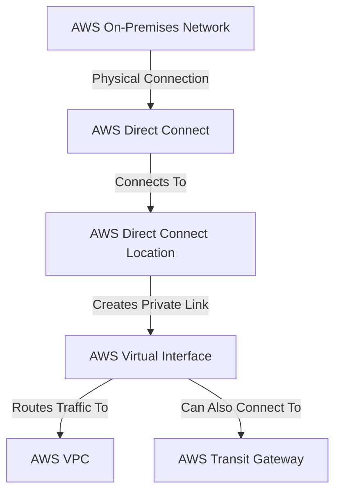

---
tags:
  - resource
Area: "[[My Areas]]"
---
### **Structure of AWS Direct Connect**

- **On-Premises Network**: The customer's data center or office network.
- **AWS Direct Connect Location**: The physical location where AWS provides Direct Connect.
- **AWS Virtual Interface**: The logical connection that enables routing.
- **AWS VPC**: Direct connection to AWS resources.
- **AWS Transit Gateway**: Optionally used for connecting multiple VPCs.

## Subgraphs
* [[AWS VPC]]
* [[AWS Direct Connect]]
* [[AWS Transit Gateway]]
