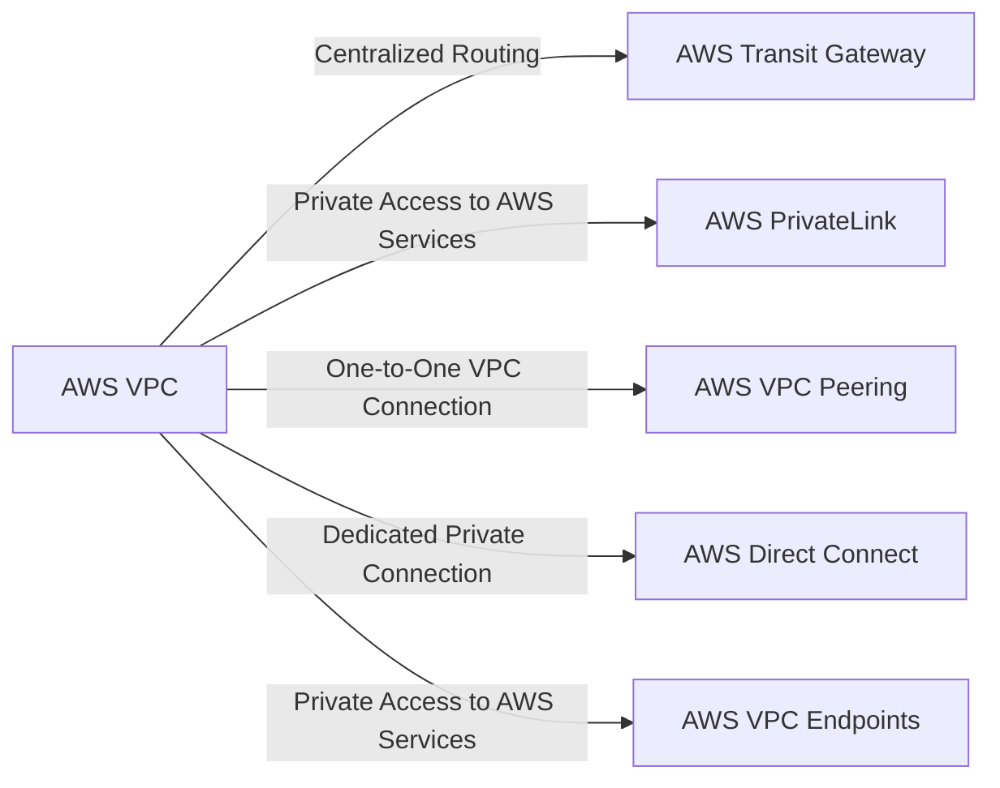

---
tags:
  - resource
Area:
---
- [[Networking Concepts]]
- https://aws.amazon.com/products/networking/

### **Structure of AWS VPC Peering**

- **AWS VPC A & AWS VPC B**: Two VPCs wanting to connect.
- **AWS VPC Peering**: Enables private communication between them.
- **AWS Route Tables**: Must be updated to allow traffic routing.

## Subgraphs

- [[AWS VPC]]
- [[AWS PrivateLink]]
- [[AWS VPC Peering]]
- [[AWS Direct Connect]]
- [[AWS VPC Endpoints]]

