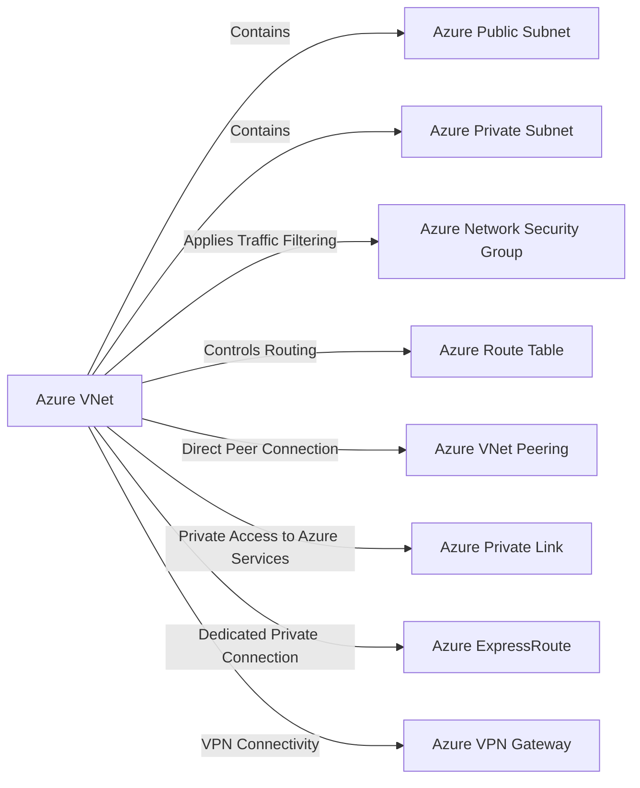

---
tags:
  - resource
Area: "[[My Areas]]"
---

## Documentation
* https://learn.microsoft.com/en-us/azure/virtual-network/virtual-networks-overview

#flashcards/azure
What Services are available under VNet
?
- Public Subnet(s)
- Private Subnet(s)
- Network Security Group(s)
- Route Table
- VNet Peering
- Private Link
- ExpressRoute
- VPN. Gateway