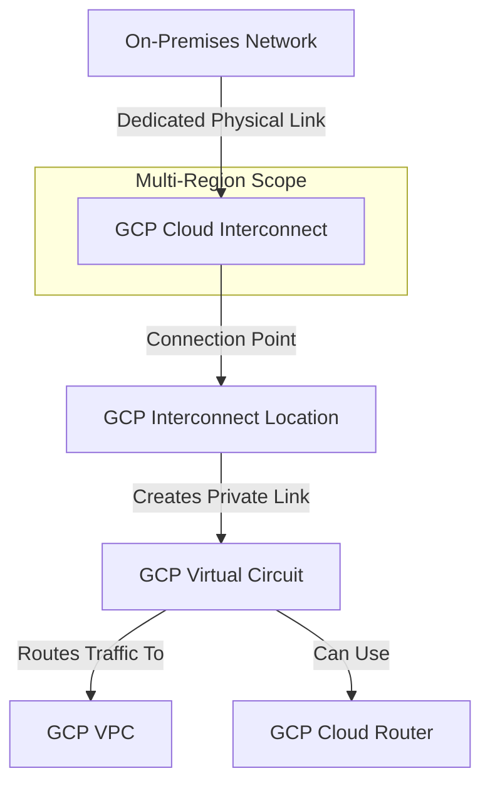

---
tags:
  - resource
Area: "[[My Areas]]"
---
### **Explanation of GCP Cloud Interconnect**

- **On-Premises Network** → The customer's **data center or office network**.
- **GCP Interconnect Location** → A **physical location** where Google **provides the Cloud Interconnect**.
- **GCP Virtual Circuit** → The **logical connection** that enables routing between **on-prem** and **GCP**.
- **GCP VPC** → Connects to **GCP resources** over a **dedicated private link**.
- **GCP Cloud Router** → Used for **dynamic BGP routing** to manage **on-prem-to-cloud connectivity**.

