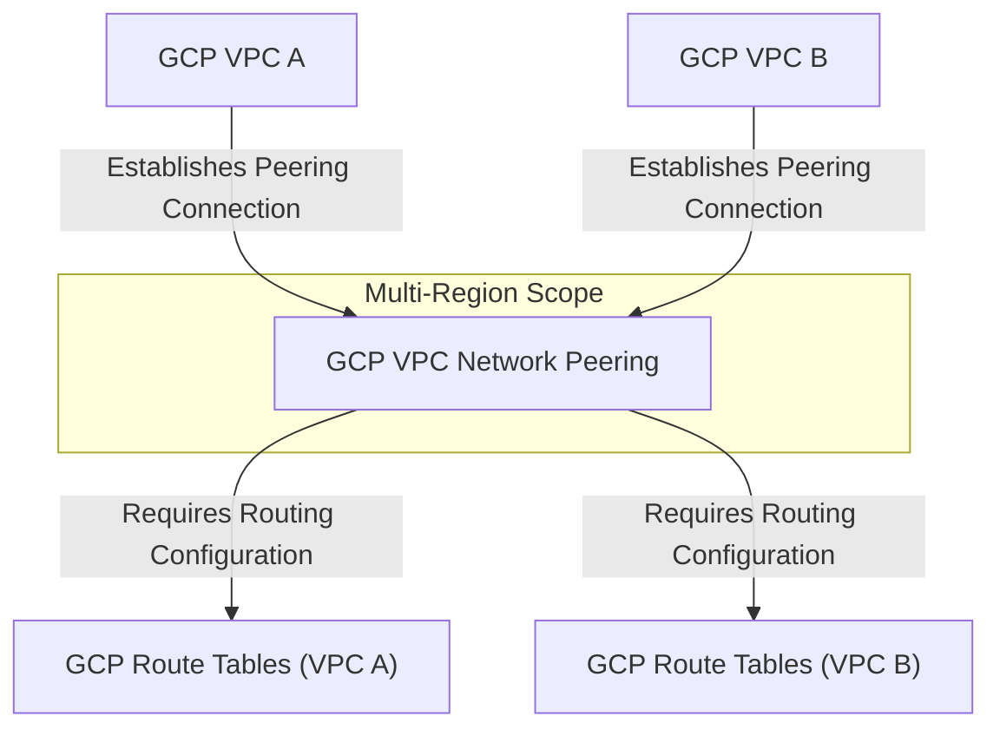

---
tags:
  - resource
Area: "[[My Areas]]"
---
### **Explanation of GCP VPC Network Peering**

- **GCP VPC A & GCP VPC B** → Two **separate VPCs** that want to communicate privately.
- **GCP VPC Network Peering** → Allows **private connectivity** between **two GCP VPCs**, even across **different organizations or projects**.
- **GCP Route Tables (A & B)** → Must be configured to **allow traffic routing** between the peered VPCs.

