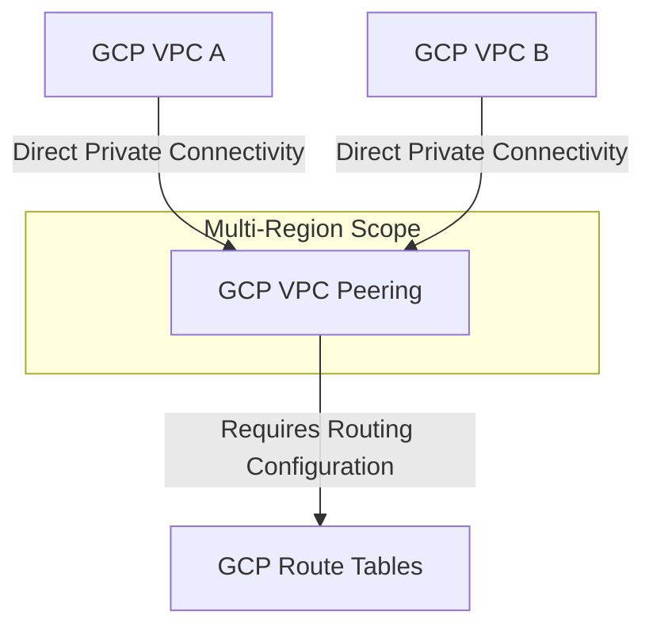

---
tags:
  - resource
Area: "[[My Areas]]"
---

### **Explanation of GCP VPC Peering**

- **GCP VPC A & GCP VPC B** → Two **separate VPCs** that want to communicate.
- **GCP VPC Peering** → Allows **private connectivity** between **two VPCs** in **GCP without requiring an external connection**.
- **GCP Route Tables** → Must be configured to allow **traffic between the peered VPCs**.

