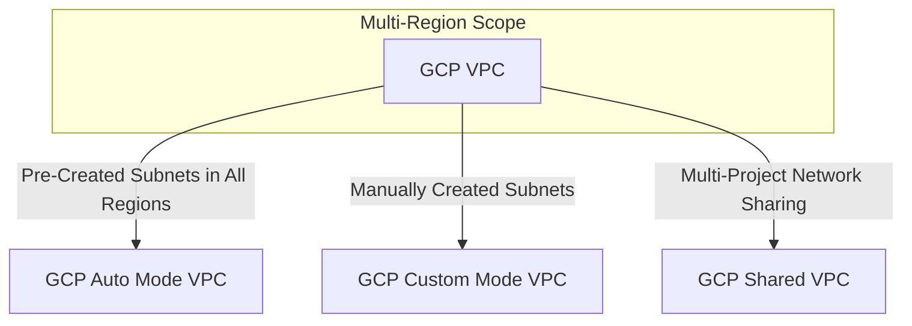

---
tags:
  - resource
Area: "[[My Areas]]"
---

```mermaid
flowchart TD
  subgraph "Multi-Region Scope"
    GCP_VPC["GCP VPC"]:::internal-link
  end

  GCP_Auto_Mode_VPC["GCP Auto Mode VPC"]:::internal-link
  GCP_Custom_Mode_VPC["GCP Custom Mode VPC"]:::internal-link
  GCP_Shared_VPC["GCP Shared VPC"]:::internal-link

  GCP_VPC -->|Pre-Created Subnets in All Regions| GCP_Auto_Mode_VPC
  GCP_VPC -->|Manually Created Subnets| GCP_Custom_Mode_VPC
  GCP_VPC -->|Multi-Project Network Sharing| GCP_Shared_VPC
```

[[GCP Shared VPC]]
[[GCP Auto Mode VPC]]
[[GCP Custom Mode VPC]]