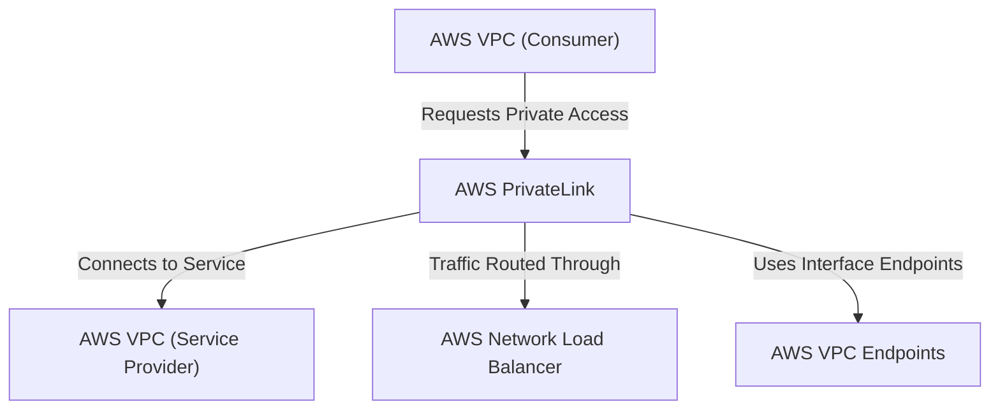

---
tags:
  - resource
Area: "[[My Areas]]"
---
### **Structure of AWS PrivateLink**

- **AWS VPC (Consumer)**: The VPC that wants to connect privately.
- **AWS PrivateLink**: The secure connection enabling private access.
- **AWS VPC (Service Provider)**: The VPC hosting the service.
- **AWS Network Load Balancer (NLB)**: Routes traffic to the service. (ALB or CLB are conceptually interchangeable)
- **AWS VPC Endpoints**: The mechanism that makes PrivateLink work.

