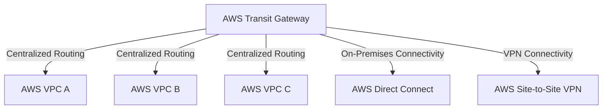

---
tags:
  - resource
Area: "[[My Areas]]"
---
### **Structure of AWS Transit Gateway**

- **AWS Transit Gateway** acts as a central router for multiple **AWS VPCs**.
- **AWS Direct Connect** provides a dedicated private link to on-premises.
- **AWS Site-to-Site VPN** allows secure VPN connections to on-prem.

## Subgraphs
- [[AWS Direct Connect]]
- 