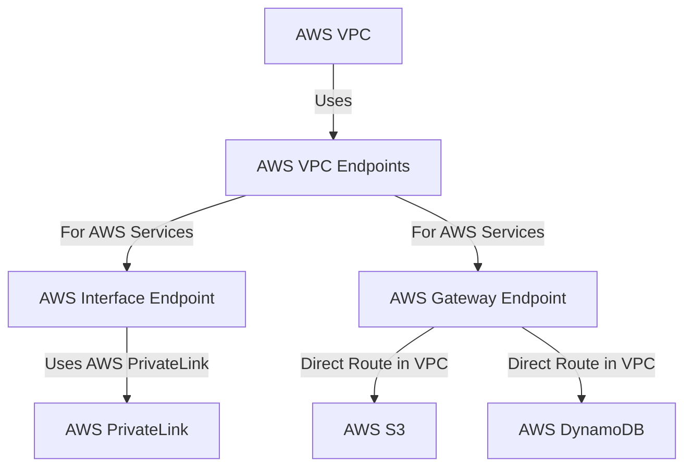

---
tags:
  - resource
Area: "[[My Areas]]"
---
### **Structure of AWS VPC Endpoints**

- **AWS VPC Endpoints** allow private access to AWS services **without needing an internet gateway**.
- **AWS Interface Endpoint**: Uses **AWS PrivateLink** to connect to services like EC2, API Gateway, and others.
- **AWS Gateway Endpoint**: Directly routes **S3 and DynamoDB** traffic through VPC without internet access.

## Subgraphs

- [[AWS VPC]]
- [[AWS PrivateLink]]
- 