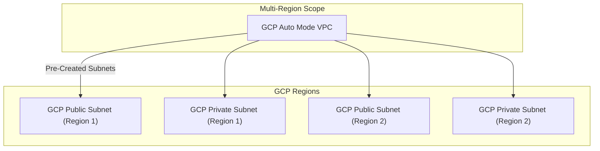

---
tags:
  - resource
  - cloud-platform
  - gcp-networking
Area: "[[My Areas]]"
Platform: "GCP"
Service: "Auto Mode VPC"
---

# GCP Auto Mode VPC

## Overview

- **GCP Auto Mode VPC** → VPC that automatically creates subnets in each GCP region with predefined IP ranges
- **Key Features** → Automatic subnet creation, predefined IP ranges, simple setup, regional coverage
- **Use Cases** → Quick prototyping, simple applications, getting started with GCP, development environments
- **Scope** → Global VPC with automatic regional subnet creation
- **Integration** → Suitable for basic compute workloads, simple multi-region deployments

---

## Architecture Diagram



---

## Configuration Examples

### Auto Mode VPC Characteristics
| Feature | Value | Description | Configurable |
|---------|-------|-------------|-------------|
| Subnet Creation | Automatic | Subnets created in all regions | No |
| IP Range | `10.128.0.0/9` | Predefined CIDR block | No |
| Subnet Size | `/20` per region | 4096 IP addresses per region | No |
| Mode Conversion | Supported | Can convert to custom mode | Yes |

### Basic Configuration
```yaml
# Creating an auto mode VPC
auto_vpc:
  name: "auto-mode-network"
  subnet_mode: "auto"
  description: "Automatically created subnets in all regions"
  # Subnets are automatically created with:
  # us-central1: 10.128.0.0/20
  # us-east1: 10.142.0.0/20
  # europe-west1: 10.132.0.0/20
  # etc.
```

> [!example]- gcloud CLI Commands
> ```bash
> # Create auto mode VPC (subnets created automatically)
> gcloud compute networks create auto-mode-network \
>     --subnet-mode=auto \
>     --bgp-routing-mode=regional \
>     --description="Automatically created subnets in all regions"
> 
> # List automatically created subnets
> gcloud compute networks subnets list --filter="network:auto-mode-network"
> 
> # Convert auto mode to custom mode (one-way operation)
> gcloud compute networks update auto-mode-network \
>     --switch-to-custom-subnet-mode
> 
> # Add custom subnet after conversion to custom mode
> gcloud compute networks subnets create custom-subnet \
>     --network=auto-mode-network \
>     --range=172.16.0.0/24 \
>     --region=us-west1 \
>     --enable-private-ip-google-access
> 
> # Create firewall rule for auto mode VPC
> gcloud compute firewall-rules create allow-internal-auto \
>     --network=auto-mode-network \
>     --allow=tcp,udp,icmp \
>     --source-ranges=10.128.0.0/9 \
>     --description="Allow communication between auto-created subnets"
> 
> # Create firewall rule for SSH access
> gcloud compute firewall-rules create allow-ssh-auto \
>     --network=auto-mode-network \
>     --allow=tcp:22 \
>     --source-ranges=0.0.0.0/0 \
>     --target-tags=ssh-enabled
> 
> # Create firewall rule for HTTP/HTTPS
> gcloud compute firewall-rules create allow-http-https-auto \
>     --network=auto-mode-network \
>     --allow=tcp:80,tcp:443 \
>     --source-ranges=0.0.0.0/0 \
>     --target-tags=web-server
> 
> # Describe the auto mode network
> gcloud compute networks describe auto-mode-network
> 
> # Delete auto mode VPC (must delete all resources first)
> gcloud compute networks delete auto-mode-network
> ```

> [!code]- Terraform Configuration
> ```hcl
> # Create auto mode VPC with automatic subnet creation
> resource "google_compute_network" "auto_mode_network" {
>   name                    = "auto-mode-network"
>   auto_create_subnetworks = true
>   routing_mode           = "REGIONAL"
>   description            = "Automatically created subnets in all regions"
> }
> 
> # Create firewall rule for internal communication
> resource "google_compute_firewall" "allow_internal_auto" {
>   name    = "allow-internal-auto"
>   network = google_compute_network.auto_mode_network.name
>   
>   allow {
>     protocol = "tcp"
>   }
>   
>   allow {
>     protocol = "udp"
>   }
>   
>   allow {
>     protocol = "icmp"
>   }
>   
>   source_ranges = ["10.128.0.0/9"]
>   description   = "Allow communication between auto-created subnets"
> }
> 
> # Create firewall rule for SSH access
> resource "google_compute_firewall" "allow_ssh_auto" {
>   name    = "allow-ssh-auto"
>   network = google_compute_network.auto_mode_network.name
>   
>   allow {
>     protocol = "tcp"
>     ports    = ["22"]
>   }
>   
>   source_ranges = ["0.0.0.0/0"]
>   target_tags   = ["ssh-enabled"]
> }
> ```

> [!note]- CDKTF (CDK for Terraform)
> Choose your preferred programming language for Infrastructure as Code:
> 
> > [!example]- Python CDKTF
> > ```python
> > from cdktf import App, TerraformStack
> > from cdktf_cdktf_provider_google import provider, compute_network, compute_firewall
> > 
> > class AutoModeVpcStack(TerraformStack):
> >     def __init__(self, scope, id):
> >         super().__init__(scope, id)
> > 
> >         provider.GoogleProvider(self, "google",
> >             project="my-project", region="us-central1")
> > 
> >         auto_vpc = compute_network.ComputeNetwork(
> >             self, "auto_mode_network",
> >             name="auto-mode-network",
> >             auto_create_subnetworks=True,
> >             routing_mode="REGIONAL")
> > 
> >         compute_firewall.ComputeFirewall(
> >             self, "allow_internal_auto",
> >             name="allow-internal-auto",
> >             network=auto_vpc.name,
> >             allow=[{"protocol": "tcp"}, {"protocol": "udp"}, {"protocol": "icmp"}],
> >             source_ranges=["10.128.0.0/9"])
> > 
> > app = App()
> > AutoModeVpcStack(app, "auto-mode-vpc")
> > app.synth()
> > ```
> 
> > [!example]- TypeScript CDKTF
> > ```typescript
> > import { Construct } from "constructs";
> > import { App, TerraformStack } from "cdktf";
> > import { GoogleProvider } from "@cdktf/provider-google/lib/provider";
> > import { ComputeNetwork } from "@cdktf/provider-google/lib/compute-network";
> > import { ComputeFirewall } from "@cdktf/provider-google/lib/compute-firewall";
> > 
> > class AutoModeVpcStack extends TerraformStack {
> >   constructor(scope: Construct, id: string) {
> >     super(scope, id);
> > 
> >     new GoogleProvider(this, "google", { project: "my-project", region: "us-central1" });
> > 
> >     const autoVpc = new ComputeNetwork(this, "autoModeNetwork", {
> >       name: "auto-mode-network",
> >       autoCreateSubnetworks: true,
> >       routingMode: "REGIONAL",
> >     });
> > 
> >     new ComputeFirewall(this, "allowInternalAuto", {
> >       name: "allow-internal-auto",
> >       network: autoVpc.name,
> >       allow: [{ protocol: "tcp" }, { protocol: "udp" }, { protocol: "icmp" }],
> >       sourceRanges: ["10.128.0.0/9"],
> >     });
> >   }
> > }
> > 
> > const app = new App();
> > new AutoModeVpcStack(app, "auto-mode-vpc");
> > app.synth();
> > ```
> 
> > [!example]- Go CDKTF
> > ```go
> > package main
> > 
> > import (
> >     "github.com/aws/constructs-go/constructs/v10"
> >     "github.com/hashicorp/terraform-cdk-go/cdktf"
> >     google "github.com/cdktf/cdktf-provider-google-go/google/v13"
> >     "github.com/cdktf/cdktf-provider-google-go/google/v13/computenetwork"
> >     "github.com/cdktf/cdktf-provider-google-go/google/v13/computefirewall"
> > )
> > 
> > func NewAutoModeVpcStack(scope constructs.Construct, id string) cdktf.TerraformStack {
> >     stack := cdktf.NewTerraformStack(scope, &id)
> > 
> >     google.NewGoogleProvider(stack, jsii.String("google"), &google.GoogleProviderConfig{
> >         Project: jsii.String("my-project"), Region: jsii.String("us-central1")})
> > 
> >     autoVpc := computenetwork.NewComputeNetwork(stack, jsii.String("autoModeNetwork"), 
> >         &computenetwork.ComputeNetworkConfig{
> >             Name: jsii.String("auto-mode-network"),
> >             AutoCreateSubnetworks: jsii.Bool(true),
> >             RoutingMode: jsii.String("REGIONAL")})
> > 
> >     computefirewall.NewComputeFirewall(stack, jsii.String("allowInternalAuto"), 
> >         &computefirewall.ComputeFirewallConfig{
> >             Name: jsii.String("allow-internal-auto"),
> >             Network: autoVpc.Name(),
> >             Allow: []*computefirewall.ComputeFirewallAllow{
> >                 {Protocol: jsii.String("tcp")},
> >                 {Protocol: jsii.String("udp")},
> >                 {Protocol: jsii.String("icmp")}},
> >             SourceRanges: &[]*string{jsii.String("10.128.0.0/9")}})
> > 
> >     return stack
> > }
> > 
> > func main() {
> >     app := cdktf.NewApp(nil)
> >     NewAutoModeVpcStack(app, "auto-mode-vpc")
> >     app.Synth()
> > }
> > ```

> [!info]- Console UI Steps
> ### Creating Auto Mode VPC in Google Cloud Console
> 
> **Step 1: Navigate to VPC Networks**
> 1. Open Google Cloud Console → **VPC network** → **VPC networks**
> 2. Click **Create VPC network**
> 
> **Step 2: Configure Auto Mode Settings**
> 1. **Name**: `auto-mode-network`
> 2. **Description**: "Automatically created subnets in all regions"
> 3. **Subnet creation mode**: Select **Automatic**
> 4. **Regional routing**: Choose **Regional**
> 5. Note: Subnets automatically created in all regions with predefined IP ranges
> 
> **Step 3: Create and Configure**
> 1. Click **Create** to create the VPC
> 2. Navigate to **Firewall** to add security rules
> 3. Create rules for internal communication, SSH, and web traffic
> 4. **Optional**: Convert to custom mode later (one-way operation)

---

## Related Services

### Core Dependencies
- [[GCP VPC]] - Base VPC networking concepts
- [[GCP Subnets]] - Automatically created regional subnets
- **GCP Firewall Rules** - Default and custom security rules

### VPC Alternatives
- [[GCP Custom Mode VPC]] - Manually configured subnets and IP ranges
- [[GCP Shared VPC]] - Network sharing across projects

### Migration Path
- **VPC Mode Conversion** - Convert auto mode to custom mode (one-way)
- **Subnet Management** - Add custom subnets after conversion
- **IP Planning** - Consider future IP requirements

### Cross-Platform Equivalents
| GCP | AWS | Azure | Description |
|-----|-----|-------|-------------|
| Auto Mode VPC | Default VPC | Default Virtual Network | Automatically configured network |
| Auto Subnets | Default Subnets | Default Subnets | Pre-created regional ranges |
| Mode Conversion | VPC Migration | Network Reconfiguration | Changing network setup |

---

## References

### Official Documentation
- [Auto Mode VPC Networks](https://cloud.google.com/vpc/docs/vpc#auto-mode-considerations)
- [VPC Network Modes](https://cloud.google.com/vpc/docs/vpc#network-types)
- [Converting to Custom Mode](https://cloud.google.com/vpc/docs/using-vpc#convert-auto-to-custom)
- [Default Network Behavior](https://cloud.google.com/vpc/docs/vpc#default-network)
- [VPC Pricing](https://cloud.google.com/vpc/pricing)

### Third-Party Resources
- [Stack Overflow - GCP VPC Modes](https://stackoverflow.com/questions/tagged/google-cloud-vpc)
- [Medium - GCP Networking Basics](https://medium.com/tag/gcp-networking)
- [Reddit - GCP Community](https://reddit.com/r/googlecloud)
- [YouTube - GCP VPC Tutorials](https://youtube.com/results?search_query=gcp+auto+mode+vpc)

### Learning Resources
- [Google Cloud Fundamentals](https://cloud.google.com/training/courses#cloud-fundamentals)
- [Networking in Google Cloud](https://cloud.google.com/training/courses/networking-gcp)
- [Getting Started Guide](https://cloud.google.com/docs/get-started)
- [Best Practices for VPC Design](https://cloud.google.com/architecture/best-practices-vpc-design)
