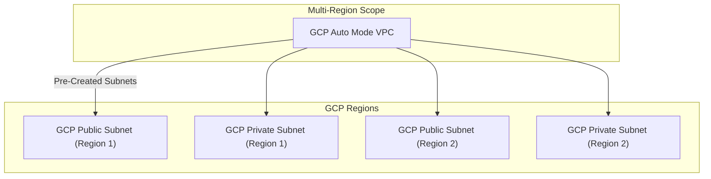

---
tags:
  - resource
  - cloud-platform
  - gcp-networking
Area: "[[My Areas]]"
Platform: "GCP"
Service: "Auto Mode VPC"
---

# GCP Auto Mode VPC

## Overview

- **GCP Auto Mode VPC** → VPC that automatically creates subnets in each GCP region with predefined IP ranges
- **Key Features** → Automatic subnet creation, predefined IP ranges, simple setup, regional coverage
- **Use Cases** → Quick prototyping, simple applications, getting started with GCP, development environments
- **Scope** → Global VPC with automatic regional subnet creation
- **Integration** → Suitable for basic compute workloads, simple multi-region deployments

---

## Architecture Diagram



---

## Configuration Examples

### Auto Mode VPC Characteristics
| Feature | Value | Description | Configurable |
|---------|-------|-------------|-------------|
| Subnet Creation | Automatic | Subnets created in all regions | No |
| IP Range | `10.128.0.0/9` | Predefined CIDR block | No |
| Subnet Size | `/20` per region | 4096 IP addresses per region | No |
| Mode Conversion | Supported | Can convert to custom mode | Yes |

### Basic Configuration
```yaml
# Creating an auto mode VPC
auto_vpc:
  name: "auto-mode-network"
  subnet_mode: "auto"
  description: "Automatically created subnets in all regions"
  # Subnets are automatically created with:
  # us-central1: 10.128.0.0/20
  # us-east1: 10.142.0.0/20
  # europe-west1: 10.132.0.0/20
  # etc.
```

---

## Related Services

### Core Dependencies
- [[GCP VPC]] - Base VPC networking concepts
- [[GCP Subnets]] - Automatically created regional subnets
- **GCP Firewall Rules** - Default and custom security rules

### VPC Alternatives
- [[GCP Custom Mode VPC]] - Manually configured subnets and IP ranges
- [[GCP Shared VPC]] - Network sharing across projects

### Migration Path
- **VPC Mode Conversion** - Convert auto mode to custom mode (one-way)
- **Subnet Management** - Add custom subnets after conversion
- **IP Planning** - Consider future IP requirements

### Cross-Platform Equivalents
| GCP | AWS | Azure | Description |
|-----|-----|-------|-------------|
| Auto Mode VPC | Default VPC | Default Virtual Network | Automatically configured network |
| Auto Subnets | Default Subnets | Default Subnets | Pre-created regional ranges |
| Mode Conversion | VPC Migration | Network Reconfiguration | Changing network setup |

---

## References

### Official Documentation
- [Auto Mode VPC Networks](https://cloud.google.com/vpc/docs/vpc#auto-mode-considerations)
- [VPC Network Modes](https://cloud.google.com/vpc/docs/vpc#network-types)
- [Converting to Custom Mode](https://cloud.google.com/vpc/docs/using-vpc#convert-auto-to-custom)
- [Default Network Behavior](https://cloud.google.com/vpc/docs/vpc#default-network)
- [VPC Pricing](https://cloud.google.com/vpc/pricing)

### Third-Party Resources
- [Stack Overflow - GCP VPC Modes](https://stackoverflow.com/questions/tagged/google-cloud-vpc)
- [Medium - GCP Networking Basics](https://medium.com/tag/gcp-networking)
- [Reddit - GCP Community](https://reddit.com/r/googlecloud)
- [YouTube - GCP VPC Tutorials](https://youtube.com/results?search_query=gcp+auto+mode+vpc)

### Learning Resources
- [Google Cloud Fundamentals](https://cloud.google.com/training/courses#cloud-fundamentals)
- [Networking in Google Cloud](https://cloud.google.com/training/courses/networking-gcp)
- [Getting Started Guide](https://cloud.google.com/docs/get-started)
- [Best Practices for VPC Design](https://cloud.google.com/architecture/best-practices-vpc-design)
