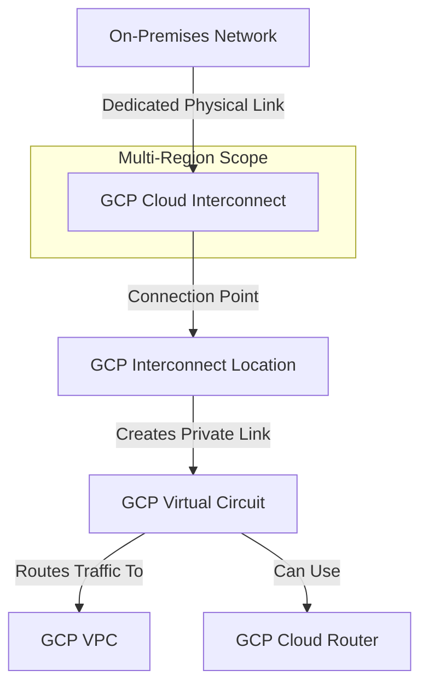

---
tags:
  - resource
  - cloud-platform
  - gcp-networking
Area: "[[My Areas]]"
Platform: "GCP"
Service: "Cloud Interconnect"
---

# GCP Cloud Interconnect

## Overview

- **GCP Cloud Interconnect** → Dedicated private network connection between on-premises infrastructure and Google Cloud
- **Key Features** → High bandwidth (10Gbps-200Gbps), low latency, private connectivity, 99.9% or 99.99% SLA
- **Use Cases** → Large-scale data transfer, latency-sensitive applications, regulatory compliance, hybrid architectures
- **Scope** → Global service with regional connectivity points and partner locations
- **Integration** → Works with Cloud Router, VPC networks, and enterprise network infrastructure

---

## Architecture Diagram



---

## Configuration Examples

### Interconnect Types and Specifications
| Type | Bandwidth | Use Case | SLA | Setup Complexity |
|------|-----------|----------|-----|------------------|
| Dedicated | 10Gbps-200Gbps | Enterprise, high-volume | 99.99% | High |
| Partner | 50Mbps-50Gbps | SMB, variable bandwidth | 99.9% | Medium |
| Cross-Cloud | 10Gbps-200Gbps | Multi-cloud connectivity | 99.99% | High |

### Dedicated Interconnect Configuration
```yaml
# Dedicated Interconnect setup
dedicated_interconnect:
  name: "production-interconnect"
  location: "las-zone1-770" # Las Vegas
  link_type: "LINK_TYPE_ETHERNET_10G_LR"
  requested_link_count: 2 # For redundancy
  attachments:
    - name: "production-attachment"
      router: "interconnect-router"
      region: "us-west1"
      vlan_tag: 100
      bandwidth: "BPS_10G"
      candidate_subnets:
        - "169.254.1.0/29"
  cloud_router:
    name: "interconnect-router"
    asn: 65001
    bgp_peers:
      - peer_asn: 65002
        advertised_route_priority: 100
```

### gcloud Commands
```bash
# Create Cloud Router for Interconnect
gcloud compute routers create interconnect-router \
    --network=production-vpc \
    --region=us-west1 \
    --asn=65001 \
    --description="Router for dedicated interconnect"

# Create Dedicated Interconnect (requires pre-provisioned connection)
gcloud compute interconnects create production-interconnect \
    --customer-name="Your Company" \
    --interconnect-type=DEDICATED \
    --link-type=LINK_TYPE_ETHERNET_10G_LR \
    --location=las-zone1-770 \
    --requested-link-count=2 \
    --description="Production dedicated interconnect"

# Create VLAN attachment
gcloud compute interconnects attachments create production-attachment \
    --interconnect=production-interconnect \
    --router=interconnect-router \
    --region=us-west1 \
    --vlan=100 \
    --candidate-subnets=169.254.1.0/29

# Add BGP peer to router
gcloud compute routers add-interface interconnect-router \
    --interface-name=production-interface \
    --interconnect-attachment=production-attachment \
    --region=us-west1

gcloud compute routers add-bgp-peer interconnect-router \
    --peer-name=production-bgp-peer \
    --interface=production-interface \
    --peer-ip-address=169.254.1.2 \
    --peer-asn=65002 \
    --region=us-west1 \
    --advertised-route-priority=100

# Check interconnect status
gcloud compute interconnects describe production-interconnect

# List all interconnects
gcloud compute interconnects list

# Monitor interconnect attachment
gcloud compute interconnects attachments describe production-attachment \
    --region=us-west1
```

---

## Related Services

### Core Dependencies
- [[GCP VPC]] - Target network for dedicated connectivity
- **Cloud Router** - BGP routing for dynamic route exchange
- **VLAN Attachments** - Layer 2 connectivity to VPC networks

### Hybrid Connectivity Alternatives
- [[GCP Cloud VPN]] - Encrypted connectivity over the internet
- **Partner Interconnect** - Service provider-managed connections
- **Direct Peering** - Direct connection to Google's edge network

### Network Services
- **Cloud Load Balancing** - Distribute traffic across hybrid infrastructure
- **Cloud CDN** - Cache content closer to users
- **Cloud Armor** - DDoS protection and security policies

### Monitoring and Management
- **Network Intelligence Center** - Topology visualization and monitoring
- **Cloud Monitoring** - Performance metrics and alerting
- **Cloud Logging** - Connection and routing logs

### Cross-Platform Equivalents
| GCP | AWS | Azure | Description |
|-----|-----|-------|-------------|
| Dedicated Interconnect | Direct Connect | ExpressRoute | Dedicated private connection |
| Partner Interconnect | Direct Connect Gateway | ExpressRoute Partner | Service provider connections |
| Cross-Cloud Interconnect | Direct Connect (multi-cloud) | ExpressRoute (multi-cloud) | Multi-cloud connectivity |
| VLAN Attachment | Virtual Interface | Virtual Network Gateway | Layer 2 connectivity |

---

## References

### Official Documentation
- [Cloud Interconnect Overview](https://cloud.google.com/network-connectivity/docs/interconnect/concepts/overview)
- [Dedicated Interconnect](https://cloud.google.com/network-connectivity/docs/interconnect/concepts/dedicated-overview)
- [Partner Interconnect](https://cloud.google.com/network-connectivity/docs/interconnect/concepts/partner-overview)
- [Interconnect Setup Guide](https://cloud.google.com/network-connectivity/docs/interconnect/how-to)
- [Interconnect Pricing](https://cloud.google.com/vpc/pricing#interconnect-pricing)

### Third-Party Resources
- [Stack Overflow - Cloud Interconnect](https://stackoverflow.com/questions/tagged/google-cloud-interconnect)
- [Medium - Enterprise Connectivity](https://medium.com/tag/cloud-interconnect)
- [Reddit - GCP Enterprise](https://reddit.com/r/googlecloud)
- [YouTube - Interconnect Tutorials](https://youtube.com/results?search_query=gcp+cloud+interconnect)

### Learning Resources
- [Professional Cloud Network Engineer](https://cloud.google.com/certification/cloud-network-engineer)
- [Hybrid and Multi-cloud Architecture](https://cloud.google.com/training/courses/hybrid-multicloud)
- [Enterprise Connectivity Patterns](https://cloud.google.com/architecture/hybrid-and-multi-cloud-patterns)
- [Network Design Best Practices](https://cloud.google.com/architecture/best-practices-vpc-design#hybrid-connectivity)
