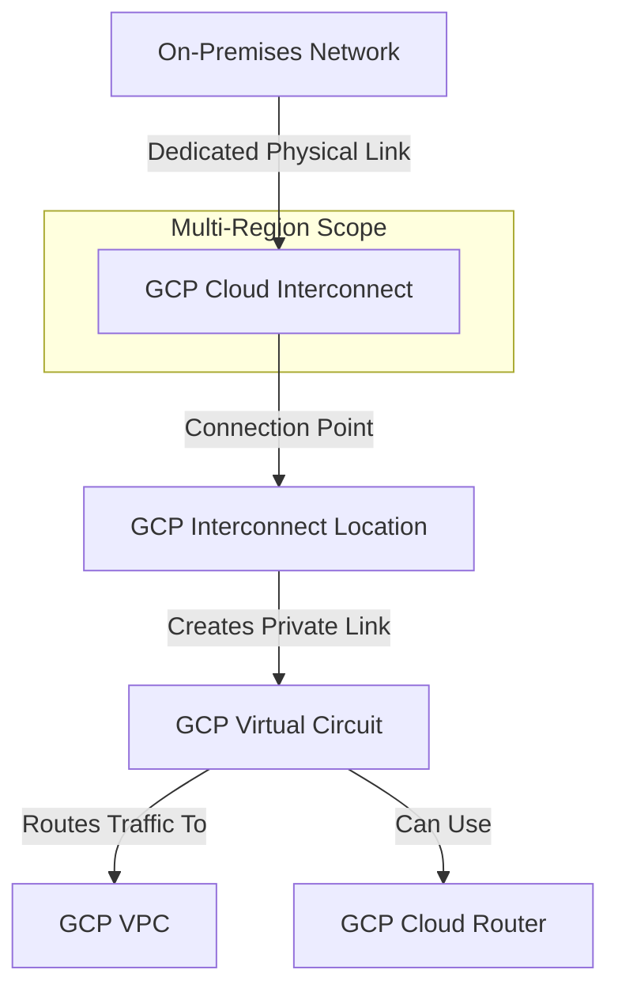

---
tags:
  - resource
  - cloud-platform
  - gcp-networking
Area: "[[My Areas]]"
Platform: "GCP"
Service: "Cloud Interconnect"
---

# GCP Cloud Interconnect

## Overview

- **GCP Cloud Interconnect** → Dedicated private network connection between on-premises infrastructure and Google Cloud
- **Key Features** → High bandwidth (10Gbps-200Gbps), low latency, private connectivity, 99.9% or 99.99% SLA
- **Use Cases** → Large-scale data transfer, latency-sensitive applications, regulatory compliance, hybrid architectures
- **Scope** → Global service with regional connectivity points and partner locations
- **Integration** → Works with Cloud Router, VPC networks, and enterprise network infrastructure

---

## Architecture Diagram



---

## Configuration Examples

### Interconnect Types and Specifications
| Type | Bandwidth | Use Case | SLA | Setup Complexity |
|------|-----------|----------|-----|------------------|
| Dedicated | 10Gbps-200Gbps | Enterprise, high-volume | 99.99% | High |
| Partner | 50Mbps-50Gbps | SMB, variable bandwidth | 99.9% | Medium |
| Cross-Cloud | 10Gbps-200Gbps | Multi-cloud connectivity | 99.99% | High |

> [!example]- gcloud CLI Commands
> ```bash
> # Create Cloud Router for Interconnect
> gcloud compute routers create interconnect-router \
>     --network=production-vpc \
>     --region=us-west1 \
>     --asn=65001 \
>     --description="Router for dedicated interconnect"
> 
> # Create Dedicated Interconnect (requires pre-provisioned connection)
> gcloud compute interconnects create production-interconnect \
>     --customer-name="Your Company" \
>     --interconnect-type=DEDICATED \
>     --link-type=LINK_TYPE_ETHERNET_10G_LR \
>     --location=las-zone1-770 \
>     --requested-link-count=2 \
>     --description="Production dedicated interconnect"
> 
> # Create VLAN attachment
> gcloud compute interconnects attachments create production-attachment \
>     --interconnect=production-interconnect \
>     --router=interconnect-router \
>     --region=us-west1 \
>     --vlan=100 \
>     --candidate-subnets=169.254.1.0/29
> 
> # Add BGP peer to router
> gcloud compute routers add-interface interconnect-router \
>     --interface-name=production-interface \
>     --interconnect-attachment=production-attachment \
>     --region=us-west1
> 
> gcloud compute routers add-bgp-peer interconnect-router \
>     --peer-name=production-bgp-peer \
>     --interface=production-interface \
>     --peer-ip-address=169.254.1.2 \
>     --peer-asn=65002 \
>     --region=us-west1 \
>     --advertised-route-priority=100
> 
> # Check interconnect status
> gcloud compute interconnects describe production-interconnect
> 
> # List all interconnects
> gcloud compute interconnects list
> 
> # Monitor interconnect attachment
> gcloud compute interconnects attachments describe production-attachment \
>     --region=us-west1
> ```

> [!code]- Terraform Configuration
> ```hcl
> # Create Cloud Router for Interconnect
> resource "google_compute_router" "interconnect_router" {
>   name    = "interconnect-router"
>   region  = "us-west1"
>   network = google_compute_network.production_vpc.id
>   
>   bgp {
>     asn = 65001
>   }
>   
>   description = "Router for dedicated interconnect"
> }
> 
> # Create Dedicated Interconnect
> resource "google_compute_interconnect" "production_interconnect" {
>   name                     = "production-interconnect"
>   customer_name           = "Your Company"
>   interconnect_type       = "DEDICATED"
>   link_type              = "LINK_TYPE_ETHERNET_10G_LR"
>   location               = "las-zone1-770"
>   requested_link_count   = 2
>   description            = "Production dedicated interconnect"
> }
> 
> # Create VLAN Attachment
> resource "google_compute_interconnect_attachment" "production_attachment" {
>   name                     = "production-attachment"
>   interconnect            = google_compute_interconnect.production_interconnect.id
>   router                  = google_compute_router.interconnect_router.id
>   region                  = "us-west1"
>   type                    = "DEDICATED"
>   vlan_tag8021q          = 100
>   candidate_subnets      = ["169.254.1.0/29"]
>   bandwidth              = "BPS_10G"
>   description            = "Production VLAN attachment"
> }
> 
> # Add router interface for interconnect
> resource "google_compute_router_interface" "production_interface" {
>   name               = "production-interface"
>   router            = google_compute_router.interconnect_router.name
>   region            = google_compute_router.interconnect_router.region
>   interconnect_attachment = google_compute_interconnect_attachment.production_attachment.id
> }
> 
> # Add BGP peer
> resource "google_compute_router_peer" "production_bgp_peer" {
>   name                      = "production-bgp-peer"
>   router                   = google_compute_router.interconnect_router.name
>   region                   = google_compute_router.interconnect_router.region
>   peer_ip_address          = "169.254.1.2"
>   peer_asn                 = 65002
>   advertised_route_priority = 100
>   interface                = google_compute_router_interface.production_interface.name
> }
> ```

> [!note]- CDKTF (CDK for Terraform)
> Choose your preferred programming language for Infrastructure as Code:
> 
> > [!example]- Python CDKTF
> > ```python
> > from cdktf import App, TerraformStack
> > from cdktf_cdktf_provider_google import provider, compute_router, compute_interconnect, compute_interconnect_attachment, compute_router_interface, compute_router_peer
> > 
> > class CloudInterconnectStack(TerraformStack):
> >     def __init__(self, scope, id):
> >         super().__init__(scope, id)
> > 
> >         provider.GoogleProvider(self, "google",
> >             project="my-project", region="us-west1")
> > 
> >         # Create Cloud Router
> >         router = compute_router.ComputeRouter(
> >             self, "interconnect_router",
> >             name="interconnect-router",
> >             region="us-west1",
> >             network="production-vpc",
> >             bgp={"asn": 65001},
> >             description="Router for dedicated interconnect"
> >         )
> > 
> >         # Create Dedicated Interconnect
> >         interconnect = compute_interconnect.ComputeInterconnect(
> >             self, "production_interconnect",
> >             name="production-interconnect",
> >             customer_name="Your Company",
> >             interconnect_type="DEDICATED",
> >             link_type="LINK_TYPE_ETHERNET_10G_LR",
> >             location="las-zone1-770",
> >             requested_link_count=2
> >         )
> > 
> >         # Create VLAN Attachment
> >         attachment = compute_interconnect_attachment.ComputeInterconnectAttachment(
> >             self, "production_attachment",
> >             name="production-attachment",
> >             interconnect=interconnect.id,
> >             router=router.id,
> >             region="us-west1",
> >             type="DEDICATED",
> >             vlan_tag8021q=100,
> >             candidate_subnets=["169.254.1.0/29"],
> >             bandwidth="BPS_10G"
> >         )
> > 
> > app = App()
> > CloudInterconnectStack(app, "cloud-interconnect")
> > app.synth()
> > ```
> 
> > [!example]- TypeScript CDKTF
> > ```typescript
> > import { Construct } from "constructs";
> > import { App, TerraformStack } from "cdktf";
> > import { GoogleProvider } from "@cdktf/provider-google/lib/provider";
> > import { ComputeRouter } from "@cdktf/provider-google/lib/compute-router";
> > import { ComputeInterconnect } from "@cdktf/provider-google/lib/compute-interconnect";
> > import { ComputeInterconnectAttachment } from "@cdktf/provider-google/lib/compute-interconnect-attachment";
> > import { ComputeRouterInterface } from "@cdktf/provider-google/lib/compute-router-interface";
> > import { ComputeRouterPeer } from "@cdktf/provider-google/lib/compute-router-peer";
> > 
> > class CloudInterconnectStack extends TerraformStack {
> >   constructor(scope: Construct, id: string) {
> >     super(scope, id);
> > 
> >     new GoogleProvider(this, "google", {
> >       project: "my-project",
> >       region: "us-west1",
> >     });
> > 
> >     const router = new ComputeRouter(this, "interconnectRouter", {
> >       name: "interconnect-router",
> >       region: "us-west1",
> >       network: "production-vpc",
> >       bgp: { asn: 65001 },
> >       description: "Router for dedicated interconnect",
> >     });
> > 
> >     const interconnect = new ComputeInterconnect(this, "productionInterconnect", {
> >       name: "production-interconnect",
> >       customerName: "Your Company",
> >       interconnectType: "DEDICATED",
> >       linkType: "LINK_TYPE_ETHERNET_10G_LR",
> >       location: "las-zone1-770",
> >       requestedLinkCount: 2,
> >     });
> > 
> >     const attachment = new ComputeInterconnectAttachment(this, "productionAttachment", {
> >       name: "production-attachment",
> >       interconnect: interconnect.id,
> >       router: router.id,
> >       region: "us-west1",
> >       type: "DEDICATED",
> >       vlanTag8021Q: 100,
> >       candidateSubnets: ["169.254.1.0/29"],
> >       bandwidth: "BPS_10G",
> >     });
> >   }
> > }
> > 
> > const app = new App();
> > new CloudInterconnectStack(app, "cloud-interconnect");
> > app.synth();
> > ```
> 
> > [!example]- Go CDKTF
> > ```go
> > package main
> > 
> > import (
> >     "github.com/aws/constructs-go/constructs/v10"
> >     "github.com/hashicorp/terraform-cdk-go/cdktf"
> >     google "github.com/cdktf/cdktf-provider-google-go/google/v13"
> >     "github.com/cdktf/cdktf-provider-google-go/google/v13/computerouter"
> >     "github.com/cdktf/cdktf-provider-google-go/google/v13/computeinterconnect"
> >     "github.com/cdktf/cdktf-provider-google-go/google/v13/computeinterconnectattachment"
> >     "github.com/cdktf/cdktf-provider-google-go/google/v13/computerouterinterface"
> >     "github.com/cdktf/cdktf-provider-google-go/google/v13/computerouterpeer"
> > )
> > 
> > func NewCloudInterconnectStack(scope constructs.Construct, id string) cdktf.TerraformStack {
> >     stack := cdktf.NewTerraformStack(scope, &id)
> > 
> >     google.NewGoogleProvider(stack, jsii.String("google"), &google.GoogleProviderConfig{
> >         Project: jsii.String("my-project"), Region: jsii.String("us-west1")})
> > 
> >     router := computerouter.NewComputeRouter(stack, jsii.String("interconnectRouter"), 
> >         &computerouter.ComputeRouterConfig{
> >             Name: jsii.String("interconnect-router"),
> >             Region: jsii.String("us-west1"),
> >             Network: jsii.String("production-vpc"),
> >             Bgp: &computerouter.ComputeRouterBgp{Asn: jsii.Number(65001)},
> >             Description: jsii.String("Router for dedicated interconnect")})
> > 
> >     interconnect := computeinterconnect.NewComputeInterconnect(stack, jsii.String("productionInterconnect"), 
> >         &computeinterconnect.ComputeInterconnectConfig{
> >             Name: jsii.String("production-interconnect"),
> >             CustomerName: jsii.String("Your Company"),
> >             InterconnectType: jsii.String("DEDICATED"),
> >             LinkType: jsii.String("LINK_TYPE_ETHERNET_10G_LR"),
> >             Location: jsii.String("las-zone1-770"),
> >             RequestedLinkCount: jsii.Number(2)})
> > 
> >     computeinterconnectattachment.NewComputeInterconnectAttachment(stack, jsii.String("productionAttachment"), 
> >         &computeinterconnectattachment.ComputeInterconnectAttachmentConfig{
> >             Name: jsii.String("production-attachment"),
> >             Interconnect: interconnect.Id(),
> >             Router: router.Id(),
> >             Region: jsii.String("us-west1"),
> >             Type: jsii.String("DEDICATED"),
> >             VlanTag8021Q: jsii.Number(100),
> >             CandidateSubnets: &[]*string{jsii.String("169.254.1.0/29")},
> >             Bandwidth: jsii.String("BPS_10G")})
> > 
> >     return stack
> > }
> > 
> > func main() {
> >     app := cdktf.NewApp(nil)
> >     NewCloudInterconnectStack(app, "cloud-interconnect")
> >     app.Synth()
> > }
> > ```

> [!info]- Console UI Steps
> ### Setting Up Cloud Interconnect in Google Cloud Console
> 
> **Step 1: Prerequisites**
> 1. Ensure you have a physical connection ordered from your service provider
> 2. Have your connection details ready (location, bandwidth, VLAN tags)
> 3. Create or identify your target VPC network
> 
> **Step 2: Create Cloud Router**
> 1. Navigate to **Hybrid Connectivity** → **Cloud Routers**
> 2. Click **Create Router**
> 3. **Name**: `interconnect-router`
> 4. **Network**: Select your target VPC
> 5. **Region**: Choose region closest to interconnect location
> 6. **ASN**: Enter `65001` (or your preferred BGP ASN)
> 7. Click **Create**
> 
> **Step 3: Create Dedicated Interconnect**
> 1. Navigate to **Hybrid Connectivity** → **Interconnect**
> 2. Click **Get Started** → **Dedicated Interconnect**
> 3. **Interconnect name**: `production-interconnect`
> 4. **Location**: Select closest colocation facility (e.g., `las-zone1-770`)
> 5. **Capacity**: Choose bandwidth (10Gbps, 100Gbps, etc.)
> 6. **Link redundancy**: Select number of links (recommended: 2 for redundancy)
> 7. **Customer information**: Provide company details
> 8. Click **Create** (this generates a LOA-CFA document)
> 
> **Step 4: Physical Connection Setup**
> 1. Download the LOA-CFA (Letter of Authorization - Connecting Facility Assignment)
> 2. Provide LOA-CFA to your service provider or colocation facility
> 3. Wait for physical connection to be established
> 4. Verify interconnect status shows "PROVISIONED"
> 
> **Step 5: Create VLAN Attachment**
> 1. Go to **Hybrid Connectivity** → **Interconnect** → **VLAN attachments**
> 2. Click **Create VLAN attachment**
> 3. **Attachment name**: `production-attachment`
> 4. **Interconnect**: Select your created interconnect
> 5. **Cloud Router**: Select `interconnect-router`
> 6. **VLAN ID**: Enter `100` (coordinate with your network team)
> 7. **BGP configuration**:
>    - **Peer ASN**: `65002` (your on-premises ASN)
>    - **Google BGP IP**: Will be auto-assigned from candidate subnet
>    - **Peer BGP IP**: Enter your on-premises BGP IP
> 8. Click **Create**
> 
> **Step 6: Configure BGP (Automatic via Router)**
> 1. BGP peering is automatically configured based on VLAN attachment
> 2. Verify BGP session status in **Cloud Router** details
> 3. Check route advertisements and learned routes
> 
> **Step 7: Test Connectivity**
> 1. Create test VM instances in your VPC
> 2. Verify routing tables include on-premises routes
> 3. Test connectivity from on-premises to GCP resources
> 4. Monitor interconnect metrics in **Cloud Monitoring**

---

## Related Services

### Core Dependencies
- [[GCP VPC]] - Target network for dedicated connectivity
- **Cloud Router** - BGP routing for dynamic route exchange
- **VLAN Attachments** - Layer 2 connectivity to VPC networks

### Hybrid Connectivity Alternatives
- [[GCP Cloud VPN]] - Encrypted connectivity over the internet
- **Partner Interconnect** - Service provider-managed connections
- **Direct Peering** - Direct connection to Google's edge network

### Network Services
- **Cloud Load Balancing** - Distribute traffic across hybrid infrastructure
- **Cloud CDN** - Cache content closer to users
- **Cloud Armor** - DDoS protection and security policies

### Monitoring and Management
- **Network Intelligence Center** - Topology visualization and monitoring
- **Cloud Monitoring** - Performance metrics and alerting
- **Cloud Logging** - Connection and routing logs

### Cross-Platform Equivalents
| GCP | AWS | Azure | Description |
|-----|-----|-------|-------------|
| Dedicated Interconnect | Direct Connect | ExpressRoute | Dedicated private connection |
| Partner Interconnect | Direct Connect Gateway | ExpressRoute Partner | Service provider connections |
| Cross-Cloud Interconnect | Direct Connect (multi-cloud) | ExpressRoute (multi-cloud) | Multi-cloud connectivity |
| VLAN Attachment | Virtual Interface | Virtual Network Gateway | Layer 2 connectivity |

---

## References

### Official Documentation
- [Cloud Interconnect Overview](https://cloud.google.com/network-connectivity/docs/interconnect/concepts/overview)
- [Dedicated Interconnect](https://cloud.google.com/network-connectivity/docs/interconnect/concepts/dedicated-overview)
- [Partner Interconnect](https://cloud.google.com/network-connectivity/docs/interconnect/concepts/partner-overview)
- [Interconnect Setup Guide](https://cloud.google.com/network-connectivity/docs/interconnect/how-to)
- [Interconnect Pricing](https://cloud.google.com/vpc/pricing#interconnect-pricing)

### Third-Party Resources
- [Stack Overflow - Cloud Interconnect](https://stackoverflow.com/questions/tagged/google-cloud-interconnect)
- [Medium - Enterprise Connectivity](https://medium.com/tag/cloud-interconnect)
- [Reddit - GCP Enterprise](https://reddit.com/r/googlecloud)
- [YouTube - Interconnect Tutorials](https://youtube.com/results?search_query=gcp+cloud+interconnect)

### Learning Resources
- [Professional Cloud Network Engineer](https://cloud.google.com/certification/cloud-network-engineer)
- [Hybrid and Multi-cloud Architecture](https://cloud.google.com/training/courses/hybrid-multicloud)
- [Enterprise Connectivity Patterns](https://cloud.google.com/architecture/hybrid-and-multi-cloud-patterns)
- [Network Design Best Practices](https://cloud.google.com/architecture/best-practices-vpc-design#hybrid-connectivity)
