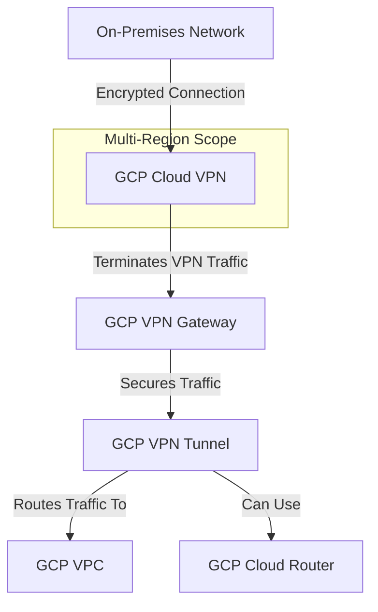

---
tags:
  - resource
  - cloud-platform
  - gcp-networking
Area: "[[My Areas]]"
Platform: "GCP"
Service: "Cloud VPN"
---

# GCP Cloud VPN

## Overview

- **GCP Cloud VPN** → Secure IPsec VPN connectivity between GCP VPC networks and on-premises networks or other cloud providers
- **Key Features** → IPsec encryption, high availability, static and dynamic routing, 99.9% SLA, cost-effective
- **Use Cases** → Hybrid cloud connectivity, secure remote access, disaster recovery, multi-cloud networking
- **Scope** → Regional service providing encrypted connectivity over the internet
- **Integration** → Works with Cloud Router for BGP, VPC networks, and on-premises network infrastructure



---

## Configuration Examples

### Basic VPN Configuration
| Parameter | Value | Description | Required |
|-----------|-------|-------------|----------|
| VPN Gateway | `vpn-gateway-1` | GCP VPN gateway name | Yes |
| Peer IP | `203.0.113.1` | On-premises public IP | Yes |
| Shared Secret | `[encrypted-key]` | Pre-shared key for authentication | Yes |
| IKE Version | `2` | Internet Key Exchange version | No |
| Local Traffic Selector | `10.0.0.0/16` | GCP VPC CIDR ranges | Yes |
| Remote Traffic Selector | `192.168.0.0/16` | On-premises CIDR ranges | Yes |

### Advanced Configuration
```yaml
# High Availability VPN configuration
ha_vpn_config:
  name: "production-vpn"
  region: "us-central1"
  network: "production-vpc"
  peer_gcp_gateway: "peer-vpn-gateway"
  tunnels:
    - name: "tunnel-1"
      peer_ip: "203.0.113.1"
      shared_secret: "[encrypted-key-1]"
      ike_version: 2
    - name: "tunnel-2"
      peer_ip: "203.0.113.2"
      shared_secret: "[encrypted-key-2]"
      ike_version: 2
  cloud_router:
    name: "vpn-router"
    asn: 65001
    bgp_peers:
      - peer_asn: 65002
        advertised_route_priority: 100
```

---

## Related Services

### Core Dependencies
- [[GCP VPC]] - Target network for VPN connectivity
- **GCP VPN Gateway** - Endpoint for VPN tunnel termination
- **Cloud Router** - Dynamic BGP routing for VPN connections

### Hybrid Connectivity
- [[GCP Cloud Interconnect]] - Dedicated private connection alternative
- **Partner Interconnect** - Partner-provided dedicated connectivity
- **Direct Peering** - Direct connection to Google's edge network

### Security Integration
- **Cloud IAM** - Access control for VPN management
- **VPC Firewall Rules** - Traffic filtering after VPN
- **Cloud Security Command Center** - Security monitoring

### Monitoring and Management
- **Cloud Monitoring** - VPN tunnel health and performance
- **Cloud Logging** - VPN connection logs and events
- **Network Intelligence Center** - Network topology and troubleshooting

### Cross-Platform Equivalents
| GCP | AWS | Azure | Description |
|-----|-----|-------|-------------|
| Cloud VPN | Site-to-Site VPN | VPN Gateway | Encrypted site connectivity |
| HA VPN | AWS VPN (redundant) | VPN Gateway (active-active) | High availability VPN |
| Cloud Router | BGP Router | Virtual Network Gateway | Dynamic routing |
| VPN Tunnel | VPN Tunnel | IPsec Tunnel | Encrypted data path |

---

## References

### Official Documentation
- [Cloud VPN Overview](https://cloud.google.com/network-connectivity/docs/vpn/concepts/overview)
- [HA VPN](https://cloud.google.com/network-connectivity/docs/vpn/concepts/overview#ha-vpn)
- [Classic VPN](https://cloud.google.com/network-connectivity/docs/vpn/concepts/overview#classic-vpn)
- [VPN Setup Guide](https://cloud.google.com/network-connectivity/docs/vpn/how-to)
- [VPN Pricing](https://cloud.google.com/vpc/pricing#vpn-pricing)

### Third-Party Resources
- [Stack Overflow - GCP VPN](https://stackoverflow.com/questions/tagged/google-cloud-vpn)
- [Medium - GCP Hybrid Connectivity](https://medium.com/tag/gcp-vpn)
- [Reddit - GCP Networking](https://reddit.com/r/googlecloud)
- [YouTube - Cloud VPN Tutorials](https://youtube.com/results?search_query=gcp+cloud+vpn)

### Learning Resources
- [Professional Cloud Network Engineer](https://cloud.google.com/certification/cloud-network-engineer)
- [Hybrid and Multi-cloud Architecture](https://cloud.google.com/training/courses/hybrid-multicloud)
- [VPN Troubleshooting Guide](https://cloud.google.com/network-connectivity/docs/vpn/support/troubleshooting)
- [Network Security Best Practices](https://cloud.google.com/security/best-practices#network-security)