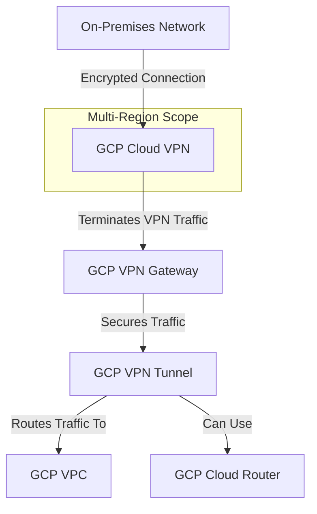

---
tags:
  - resource
Area: "[[My Areas]]"
---
### **Explanation of GCP Cloud VPN**

- **On-Premises Network** → The customer’s **data center or office network**.
- **GCP Cloud VPN** → Provides an **encrypted tunnel** between **on-prem and GCP** over the internet or a private link.
- **GCP VPN Gateway** → The **endpoint in GCP** where the VPN tunnel terminates.
- **GCP VPN Tunnel** → The **secure tunnel** that encrypts traffic between networks.
- **GCP VPC** → Connects to **GCP resources** via the VPN tunnel.
- **GCP Cloud Router** → **Optional** for **dynamic BGP routing** instead of static routes.

[[[GCP Cloud VPN]]]