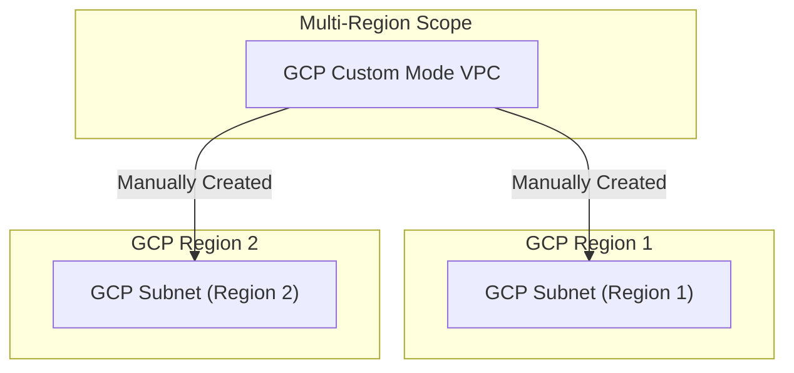

---
tags:
  - resource
Area: "[[My Areas]]"
---

```mermaid
flowchart TD
  subgraph "Multi-Region Scope"
    GCP_Custom_Mode_VPC["GCP Custom Mode VPC"]:::internal-link
  end

  subgraph "GCP Region 1"
    GCP_Manually_Created_Subnet1["GCP Subnet (Region 1)"]:::internal-link
  end

  subgraph "GCP Region 2"
    GCP_Manually_Created_Subnet2["GCP Subnet (Region 2)"]:::internal-link
  end

  GCP_Custom_Mode_VPC -->|Manually Created| GCP_Manually_Created_Subnet1
  GCP_Custom_Mode_VPC -->|Manually Created| GCP_Manually_Created_Subnet2

```
