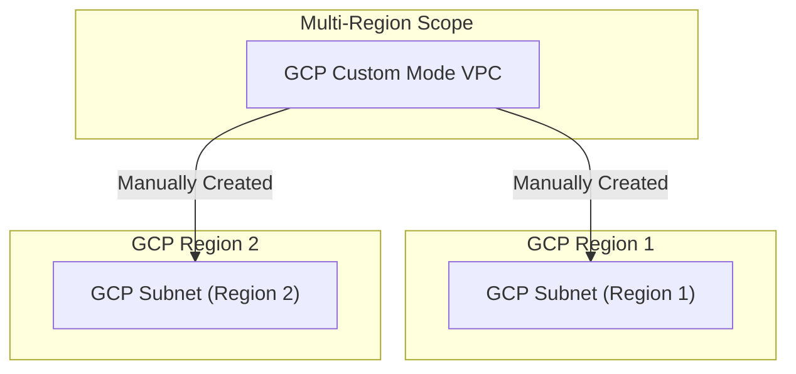

---
tags:
  - resource
  - cloud-platform
  - gcp-networking
Area: "[[My Areas]]"
Platform: "GCP"
Service: "Custom Mode VPC"
---

# GCP Custom Mode VPC

## Overview

- **GCP Custom Mode VPC** → VPC where you manually create and configure all subnets with custom IP ranges
- **Key Features** → Full control over IP addressing, custom subnet placement, flexible CIDR planning, production-ready
- **Use Cases** → Production environments, complex network topologies, specific IP requirements, enterprise deployments
- **Scope** → Global VPC with manually configured regional components
- **Integration** → Ideal for enterprise workloads, hybrid connectivity, and complex multi-tier applications

---

## Architecture Diagram



---

## Configuration Examples

### Custom Mode VPC Planning
| Component | Example Value | Description | Considerations |
|-----------|---------------|-------------|----------------|
| VPC CIDR Planning | `10.0.0.0/8` | Overall IP space | Plan for growth |
| Subnet Size | `/24` (254 hosts) | Regional subnet size | Balance efficiency vs growth |
| Secondary Ranges | `172.16.0.0/16` | For containers/aliases | GKE pod/service ranges |
| Reserved Ranges | `192.168.0.0/16` | Future expansion | On-premises integration |

### Production Configuration
```yaml
# Example custom mode VPC with multiple subnets
custom_vpc:
  name: "production-custom-vpc"
  subnet_mode: "custom"
  description: "Production VPC with custom subnet configuration"
  subnets:
    - name: "web-tier-us-central1"
      region: "us-central1"
      ip_cidr_range: "10.1.0.0/24"
      private_google_access: true
      secondary_ranges:
        - range_name: "pods"
          ip_cidr_range: "172.16.0.0/16"
        - range_name: "services"
          ip_cidr_range: "192.168.0.0/20"
    - name: "app-tier-us-central1"
      region: "us-central1"
      ip_cidr_range: "10.2.0.0/24"
      private_google_access: true
    - name: "data-tier-us-central1"
      region: "us-central1"
      ip_cidr_range: "10.3.0.0/24"
      private_google_access: true
```

### gcloud Commands
```bash
# Create custom mode VPC
gcloud compute networks create production-custom-vpc \
    --subnet-mode=custom \
    --bgp-routing-mode=regional \
    --description="Production VPC with custom subnet configuration"

# Create web tier subnet with secondary ranges
gcloud compute networks subnets create web-tier-us-central1 \
    --network=production-custom-vpc \
    --range=10.1.0.0/24 \
    --region=us-central1 \
    --secondary-range=pods=172.16.0.0/16,services=192.168.0.0/20 \
    --enable-private-ip-google-access \
    --enable-flow-logs

# Create app tier subnet
gcloud compute networks subnets create app-tier-us-central1 \
    --network=production-custom-vpc \
    --range=10.2.0.0/24 \
    --region=us-central1 \
    --enable-private-ip-google-access

# Create data tier subnet
gcloud compute networks subnets create data-tier-us-central1 \
    --network=production-custom-vpc \
    --range=10.3.0.0/24 \
    --region=us-central1 \
    --enable-private-ip-google-access

# Create firewall rules for each tier
gcloud compute firewall-rules create allow-web-tier \
    --network=production-custom-vpc \
    --allow=tcp:80,tcp:443 \
    --source-ranges=0.0.0.0/0 \
    --target-tags=web-tier

gcloud compute firewall-rules create allow-app-tier \
    --network=production-custom-vpc \
    --allow=tcp:8080 \
    --source-tags=web-tier \
    --target-tags=app-tier

gcloud compute firewall-rules create allow-data-tier \
    --network=production-custom-vpc \
    --allow=tcp:3306,tcp:5432 \
    --source-tags=app-tier \
    --target-tags=data-tier

# List all subnets in the VPC
gcloud compute networks subnets list --filter="network:production-custom-vpc"
```

---

## Related Services

### Core Dependencies
- [[GCP VPC]] - Base VPC networking foundation
- [[GCP Subnets]] - Manually configured regional IP ranges
- [[GCP Route Tables]] - Custom routing for complex topologies

### VPC Alternatives
- [[GCP Auto Mode VPC]] - Automatically configured subnets
- [[GCP Shared VPC]] - Cross-project network sharing

### Planning Tools
- **IP Address Management** - CIDR planning and allocation
- **Network Design** - Multi-tier architecture planning
- **Capacity Planning** - Growth and expansion considerations

### Enterprise Features
- **Hybrid Connectivity** - Integration with on-premises networks
- **Security Zones** - Network segmentation and isolation
- **Compliance** - Regulatory and governance requirements

### Cross-Platform Equivalents
| GCP | AWS | Azure | Description |
|-----|-----|-------|-------------|
| Custom Mode VPC | Custom VPC | Custom Virtual Network | Manually configured network |
| Custom Subnets | Custom Subnets | Custom Address Spaces | Manual IP range configuration |
| Secondary Ranges | Secondary CIDR | Additional Address Prefixes | Extra IP ranges for containers |

---

## References

### Official Documentation
- [Custom Mode VPC Networks](https://cloud.google.com/vpc/docs/vpc#custom-mode-considerations)
- [Creating Custom Subnets](https://cloud.google.com/vpc/docs/using-vpc#create-custom-network)
- [IP Address Planning](https://cloud.google.com/vpc/docs/vpc#ip-ranges)
- [Secondary IP Ranges](https://cloud.google.com/vpc/docs/alias-ip)
- [VPC Design Best Practices](https://cloud.google.com/architecture/best-practices-vpc-design)

### Third-Party Resources
- [Stack Overflow - Custom VPC Design](https://stackoverflow.com/questions/tagged/google-cloud-vpc)
- [Medium - Enterprise VPC Planning](https://medium.com/tag/vpc-design)
- [Reddit - GCP Networking](https://reddit.com/r/googlecloud)
- [YouTube - Custom VPC Tutorials](https://youtube.com/results?search_query=gcp+custom+vpc)

### Learning Resources
- [Professional Cloud Network Engineer](https://cloud.google.com/certification/cloud-network-engineer)
- [Advanced Networking Course](https://cloud.google.com/training/courses/networking-gcp)
- [Enterprise Architecture Patterns](https://cloud.google.com/architecture/networking)
- [Network Security Best Practices](https://cloud.google.com/security/best-practices#network-security)
