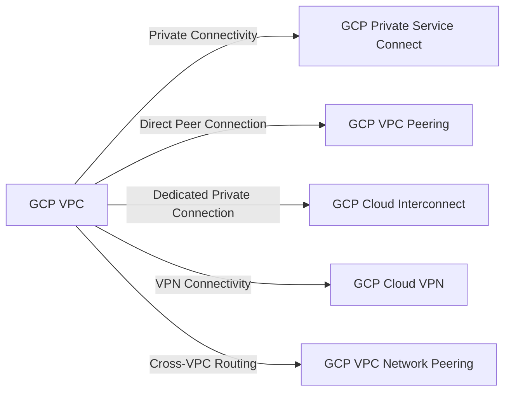

---
tags:
  - resource
  - cloud-platform
  - gcp-networking
Area: "[[My Areas]]"
Platform: "GCP"
Service: "Networking Overview"
---

# GCP Networking Overview

## Overview

- **GCP Networking** → Comprehensive suite of networking services for connecting, securing, and managing cloud resources
- **Key Features** → Global VPC networks, multiple connectivity options, integrated security, and hybrid cloud support
- **Use Cases** → Multi-region deployments, hybrid cloud architectures, secure private connectivity, and scalable network infrastructure
- **Scope** → Global services with regional and zonal components
- **Integration** → Works seamlessly with compute, storage, databases, and security services across GCP

---

## Architecture Diagram



---

## Configuration Examples

### Basic Networking Components
| Component | Purpose | Scope | Required |
|-----------|---------|-------|----------|
| VPC | Isolated network environment | Global | Yes |
| Subnets | Regional IP address ranges | Regional | Yes |
| Firewall Rules | Network security policies | Global/Regional | Yes |
| Routes | Traffic routing rules | Global | Auto-created |

### gcloud Commands
```bash
# List all networking resources
gcloud compute networks list
gcloud compute networks subnets list
gcloud compute firewall-rules list
gcloud compute routes list

# Create basic networking setup
gcloud compute networks create production-network --subnet-mode=custom
gcloud compute networks subnets create production-subnet \
    --network=production-network \
    --range=10.0.0.0/24 \
    --region=us-central1

# Check networking connectivity
gcloud compute networks get-effective-firewalls INSTANCE_NAME \
    --zone=us-central1-a
gcloud compute networks subnets get-iam-policy production-subnet \
    --region=us-central1

# Common networking operations
gcloud compute ssh INSTANCE_NAME --zone=us-central1-a
gcloud compute scp FILE_PATH INSTANCE_NAME:~/ --zone=us-central1-a
```

---

## Related Services

### Core Dependencies
- [[GCP VPC]] - Foundation virtual private cloud network
- [[GCP Subnets]] - Regional IP address ranges within VPC
- [[GCP Route Tables]] - Traffic routing and forwarding rules

### Connectivity Options
- [[GCP VPC Peering]] - Direct private connectivity between VPCs
- [[GCP VPC Network Peering]] - Cross-VPC routing and communication
- [[GCP Cloud VPN]] - Secure encrypted connectivity to on-premises
- [[GCP Cloud Interconnect]] - Dedicated private connection to on-premises
- [[GCP Private Service Connect]] - Private access to Google and partner services

### VPC Types
- [[GCP Auto Mode VPC]] - Automatically created subnets in each region
- [[GCP Custom Mode VPC]] - Manually configured subnets and IP ranges
- [[GCP Shared VPC]] - Network sharing across multiple projects

### Cross-Platform Equivalents
| GCP | AWS | Azure | Description |
|-----|-----|-------|-------------|
| VPC | VPC | Virtual Network | Isolated network environment |
| Cloud VPN | Site-to-Site VPN | VPN Gateway | Encrypted connectivity |
| Cloud Interconnect | Direct Connect | ExpressRoute | Dedicated private connection |
| Private Service Connect | PrivateLink | Private Link | Private service connectivity |

---

## References

### Official Documentation
- [GCP Networking Overview](https://cloud.google.com/vpc/docs/overview)
- [VPC Networks](https://cloud.google.com/vpc/docs/vpc)
- [Hybrid Connectivity](https://cloud.google.com/hybrid-connectivity)
- [Network Security](https://cloud.google.com/security/products/network-security)
- [Networking Pricing](https://cloud.google.com/vpc/pricing)

### Third-Party Resources
- [Stack Overflow - GCP Networking](https://stackoverflow.com/questions/tagged/google-cloud-networking)
- [Medium - GCP Networking Articles](https://medium.com/tag/google-cloud-networking)
- [Reddit - GCP Community](https://reddit.com/r/googlecloud)
- [YouTube - GCP Networking Tutorials](https://youtube.com/results?search_query=gcp+networking+tutorial)

### Learning Resources
- [Google Cloud Network Engineer Path](https://cloud.google.com/training/networking)
- [Professional Cloud Network Engineer Certification](https://cloud.google.com/certification/cloud-network-engineer)
- [Networking Fundamentals](https://cloud.google.com/training/courses/networking-gcp)
- [Architecture Center - Networking Patterns](https://cloud.google.com/architecture/networking)