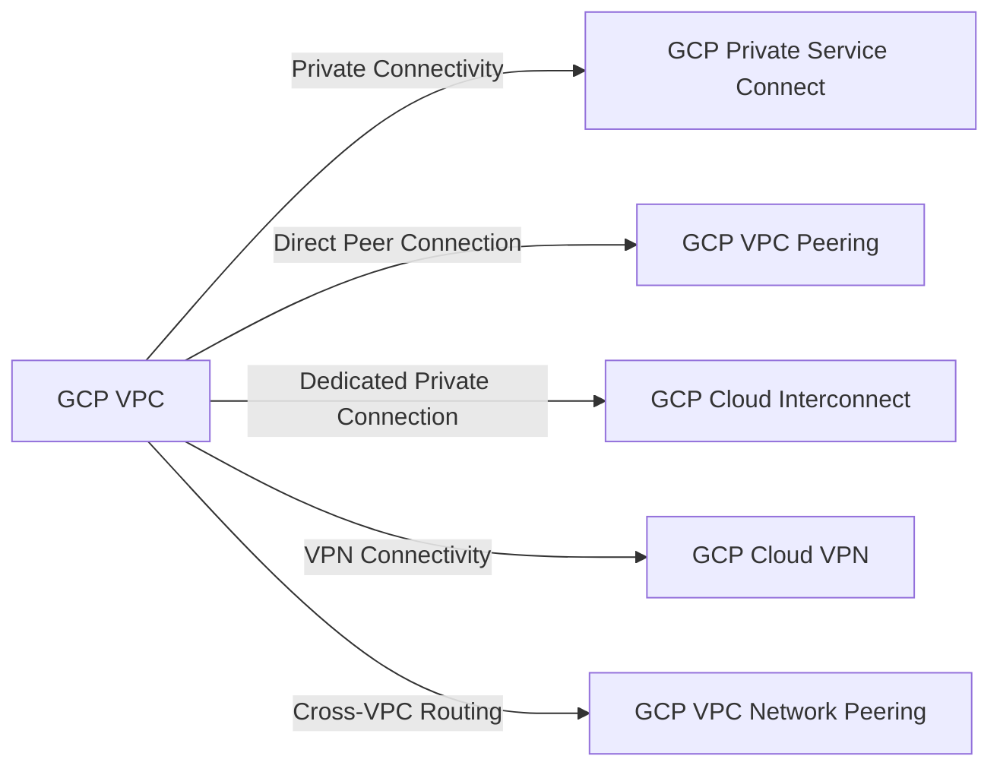

---
tags:
  - resource
Area: "[[My Areas]]"
---

```mermaid
flowchart LR
  GCP_VPC["GCP VPC"]:::internal-link

  GCP_VPC_Peering["GCP VPC Peering"]:::internal-link
  GCP_Private_Service_Connect["GCP Private Service Connect"]:::internal-link
  GCP_Cloud_Interconnect["GCP Cloud Interconnect"]:::internal-link
  GCP_Cloud_VPN["GCP Cloud VPN"]:::internal-link
  GCP_VPC_Network_Peering["GCP VPC Network Peering"]:::internal-link

  GCP_VPC -->|Private Connectivity| GCP_Private_Service_Connect
  GCP_VPC -->|Direct Peer Connection| GCP_VPC_Peering
  GCP_VPC -->|Dedicated Private Connection| GCP_Cloud_Interconnect
  GCP_VPC -->|VPN Connectivity| GCP_Cloud_VPN
  GCP_VPC -->|Cross-VPC Routing| GCP_VPC_Network_Peering

```

[[GCP VPC]]
[[GCP Private Service Connect]]
[[GCP VPC Peering]]
[[GCP Cloud Interconnect]]
[[GCP Cloud VPN]]
[[GCP VPC Network Peering]]