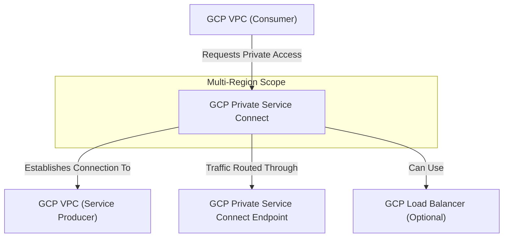

---
tags:
  - resource
  - cloud-platform
  - gcp-networking
Area: "[[My Areas]]"
Platform: "GCP"
Service: "Private Service Connect"
---

# GCP Private Service Connect

## Overview

- **GCP Private Service Connect** → Enables private connectivity to Google services, partner services, and your own services across VPC networks
- **Key Features** → Private IP access, service-level connectivity, centralized endpoint management, no VPC peering required
- **Use Cases** → Private API access, partner service integration, microservices connectivity, secure service consumption
- **Scope** → Global service with regional endpoint deployment
- **Integration** → Works with Google APIs, partner services, internal load balancers, and service mesh architectures


---

## Architecture Diagram



---

## Configuration Examples

### Private Service Connect Endpoint Types
| Type | Purpose | Target | Use Case |
|------|---------|--------|----------|
| Google APIs | Access Google services privately | Cloud Storage, BigQuery, etc. | Private API access |
| Published Services | Connect to partner services | Third-party SaaS | Partner integration |
| Service Attachments | Access your own services | Internal load balancers | Microservices architecture |

### Service Attachment Configuration
```yaml
# Service producer configuration
service_attachment:
  name: "my-service-attachment"
  description: "Private service for internal APIs"
  target_service: "https://www.googleapis.com/compute/v1/projects/my-project/regions/us-central1/forwardingRules/my-internal-lb"
  connection_preference: "ACCEPT_MANUAL"
  nat_subnets:
    - "projects/my-project/regions/us-central1/subnetworks/psc-nat-subnet"
  enable_proxy_protocol: false
  consumer_accept_lists:
    - project_id_or_num: "consumer-project-123"
      connection_limit: 10

# Consumer endpoint configuration
psc_endpoint:
  name: "api-service-endpoint"
  description: "Private endpoint for API service"
  network: "projects/consumer-project/global/networks/vpc-network"
  subnet: "projects/consumer-project/regions/us-central1/subnetworks/consumer-subnet"
  target: "projects/producer-project/regions/us-central1/serviceAttachments/my-service-attachment"
```

### gcloud Commands
```bash
# Service Producer Commands

# Create NAT subnet for PSC (producer side)
gcloud compute networks subnets create psc-nat-subnet \
    --network=producer-vpc \
    --range=10.100.0.0/24 \
    --region=us-central1 \
    --purpose=PRIVATE_SERVICE_CONNECT

# Create internal load balancer (target for service attachment)
gcloud compute forwarding-rules create my-internal-lb \
    --load-balancing-scheme=INTERNAL \
    --network=producer-vpc \
    --subnet=producer-subnet \
    --region=us-central1 \
    --backend-service=my-backend-service \
    --ip-protocol=TCP \
    --ports=80

# Create service attachment
gcloud compute service-attachments create my-service-attachment \
    --region=us-central1 \
    --producer-forwarding-rule=my-internal-lb \
    --connection-preference=ACCEPT_MANUAL \
    --nat-subnets=psc-nat-subnet \
    --description="Private service for internal APIs"

# Accept consumer connection request
gcloud compute service-attachments update my-service-attachment \
    --region=us-central1 \
    --consumer-accept-list=consumer-project-123=10

# Service Consumer Commands

# Create PSC endpoint to connect to service
gcloud compute addresses create api-service-endpoint-ip \
    --subnet=consumer-subnet \
    --region=us-central1

gcloud compute forwarding-rules create api-service-endpoint \
    --load-balancing-scheme="" \
    --network=consumer-vpc \
    --address=api-service-endpoint-ip \
    --target-service-attachment=projects/producer-project/regions/us-central1/serviceAttachments/my-service-attachment \
    --region=us-central1

# Create PSC endpoint for Google APIs
gcloud compute addresses create google-apis-psc \
    --subnet=consumer-subnet \
    --region=us-central1

gcloud compute forwarding-rules create google-apis-endpoint \
    --load-balancing-scheme="" \
    --network=consumer-vpc \
    --address=google-apis-psc \
    --target-service-attachment=projects/service-producers/regions/us-central1/serviceAttachments/all-apis \
    --region=us-central1

# List service attachments
gcloud compute service-attachments list

# Describe PSC endpoint
gcloud compute forwarding-rules describe api-service-endpoint \
    --region=us-central1
```

---

## Related Services

### Core Dependencies
- [[GCP VPC]] - Consumer and producer networks
- **Internal Load Balancer** - Target service for service attachments
- **Cloud DNS** - Private DNS zones for endpoint resolution

### Service Integration
- **Google APIs** - Private access to Cloud Storage, BigQuery, etc.
- **Partner Services** - Third-party SaaS and marketplace services
- **Anthos Service Mesh** - Service-to-service communication

### Alternative Connectivity
- [[GCP VPC Peering]] - Network-level connectivity
- **VPC Service Controls** - Security perimeter for services
- **Cloud NAT** - Outbound internet access for private resources

### Security and Management
- **Cloud IAM** - Access control for endpoint management
- **VPC Flow Logs** - Traffic monitoring and analysis
- **Cloud Monitoring** - Endpoint health and performance

### Cross-Platform Equivalents
| GCP | AWS | Azure | Description |
|-----|-----|-------|-------------|
| Private Service Connect | PrivateLink | Private Link | Private service connectivity |
| Service Attachment | VPC Endpoint Service | Private Link Service | Published service interface |
| PSC Endpoint | VPC Endpoint | Private Endpoint | Consumer service access point |
| Google APIs Access | VPC Endpoints for AWS Services | Service Endpoints | Private cloud service access |

---

## References

### Official Documentation
- [Private Service Connect Overview](https://cloud.google.com/vpc/docs/private-service-connect)
- [Configure Private Service Connect](https://cloud.google.com/vpc/docs/configure-private-service-connect-services)
- [Private Google Access](https://cloud.google.com/vpc/docs/configure-private-service-connect-apis)
- [Service Attachments](https://cloud.google.com/vpc/docs/private-service-connect#service-attachments)
- [PSC Pricing](https://cloud.google.com/vpc/pricing#psc-pricing)

### Third-Party Resources
- [Medium - Private Service Connect Explained](https://medium.com/google-cloud/private-service-connect-in-gcp-explained)
- [Stack Overflow - GCP Networking](https://stackoverflow.com/questions/tagged/google-cloud-networking)
- [Reddit - GCP Community](https://reddit.com/r/googlecloud)
- [YouTube - PSC Tutorials](https://youtube.com/results?search_query=gcp+private+service+connect)

### Learning Resources
- [Professional Cloud Network Engineer](https://cloud.google.com/certification/cloud-network-engineer)
- [Advanced Networking Course](https://cloud.google.com/training/courses/networking-gcp)
- [Service Mesh and Microservices](https://cloud.google.com/training/courses/anthos)
- [Security Best Practices](https://cloud.google.com/security/best-practices#network-security)
