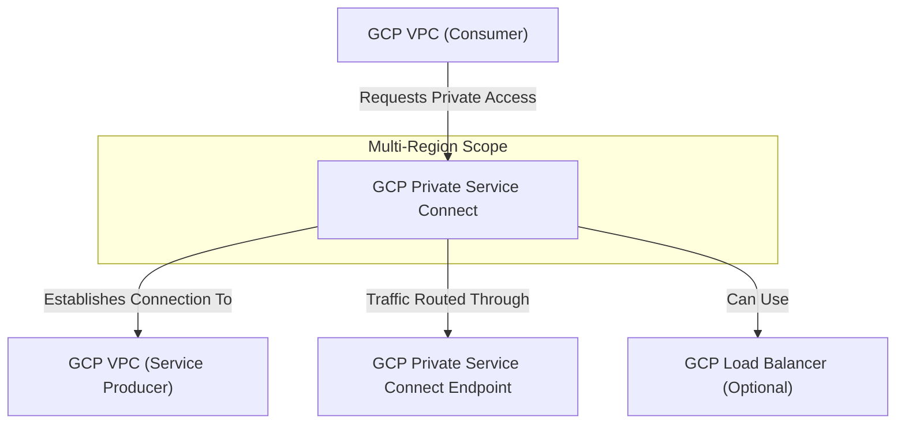

---
tags:
  - resource
Area: "[[My Areas]]"
---
### **Explanation of GCP Private Service Connect**

- **GCP VPC (Consumer)** → The VPC that needs to access a **private service**.
- **GCP Private Service Connect** → A mechanism that **privately connects** a consumer VPC to a **service producer VPC**.
- **GCP Private Service Connect Endpoint** → The actual endpoint that routes private traffic.
- **GCP Load Balancer (Optional)** → Sometimes used to distribute incoming service requests.

