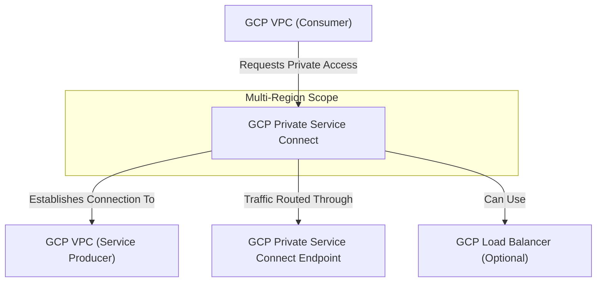

---
tags:
  - resource
  - cloud-platform
  - gcp-networking
Area: "[[My Areas]]"
Platform: "GCP"
Service: "Private Service Connect"
---

# GCP Private Service Connect

## Overview

- **GCP Private Service Connect** → Enables private connectivity to Google services, partner services, and your own services across VPC networks
- **Key Features** → Private IP access, service-level connectivity, centralized endpoint management, no VPC peering required
- **Use Cases** → Private API access, partner service integration, microservices connectivity, secure service consumption
- **Scope** → Global service with regional endpoint deployment
- **Integration** → Works with Google APIs, partner services, internal load balancers, and service mesh architectures


---

## Architecture Diagram



---

## Configuration Examples

### Private Service Connect Endpoint Types
| Type | Purpose | Target | Use Case |
|------|---------|--------|----------|
| Google APIs | Access Google services privately | Cloud Storage, BigQuery, etc. | Private API access |
| Published Services | Connect to partner services | Third-party SaaS | Partner integration |
| Service Attachments | Access your own services | Internal load balancers | Microservices architecture |

> [!example]- gcloud CLI Commands
```bash
# Service Producer Commands

# Create NAT subnet for PSC (producer side)
gcloud compute networks subnets create psc-nat-subnet \
    --network=producer-vpc \
    --range=10.100.0.0/24 \
    --region=us-central1 \
    --purpose=PRIVATE_SERVICE_CONNECT

# Create internal load balancer (target for service attachment)
gcloud compute forwarding-rules create my-internal-lb \
    --load-balancing-scheme=INTERNAL \
    --network=producer-vpc \
    --subnet=producer-subnet \
    --region=us-central1 \
    --backend-service=my-backend-service \
    --ip-protocol=TCP \
    --ports=80

# Create service attachment
gcloud compute service-attachments create my-service-attachment \
    --region=us-central1 \
    --producer-forwarding-rule=my-internal-lb \
    --connection-preference=ACCEPT_MANUAL \
    --nat-subnets=psc-nat-subnet \
    --description="Private service for internal APIs"

# Accept consumer connection request
gcloud compute service-attachments update my-service-attachment \
    --region=us-central1 \
    --consumer-accept-list=consumer-project-123=10

# Service Consumer Commands

# Create PSC endpoint to connect to service
gcloud compute addresses create api-service-endpoint-ip \
    --subnet=consumer-subnet \
    --region=us-central1

gcloud compute forwarding-rules create api-service-endpoint \
    --load-balancing-scheme="" \
    --network=consumer-vpc \
    --address=api-service-endpoint-ip \
    --target-service-attachment=projects/producer-project/regions/us-central1/serviceAttachments/my-service-attachment \
    --region=us-central1

# Create PSC endpoint for Google APIs
gcloud compute addresses create google-apis-psc \
    --subnet=consumer-subnet \
    --region=us-central1

gcloud compute forwarding-rules create google-apis-endpoint \
    --load-balancing-scheme="" \
    --network=consumer-vpc \
    --address=google-apis-psc \
    --target-service-attachment=projects/service-producers/regions/us-central1/serviceAttachments/all-apis \
    --region=us-central1

# List service attachments
gcloud compute service-attachments list

# Describe PSC endpoint
gcloud compute forwarding-rules describe api-service-endpoint \
    --region=us-central1
```

> [!code]- Terraform Configuration
> ```hcl
> # Service Producer Configuration
> 
> # Create NAT subnet for Private Service Connect
> resource "google_compute_subnetwork" "psc_nat_subnet" {
>   name          = "psc-nat-subnet"
>   ip_cidr_range = "10.100.0.0/24"
>   region        = "us-central1"
>   network       = google_compute_network.producer_vpc.id
>   purpose       = "PRIVATE_SERVICE_CONNECT"
> }
> 
> # Create internal load balancer (target for service attachment)
> resource "google_compute_forwarding_rule" "internal_lb" {
>   name                  = "my-internal-lb"
>   region               = "us-central1"
>   load_balancing_scheme = "INTERNAL"
>   backend_service      = google_compute_region_backend_service.backend.id
>   all_ports            = true
>   network              = google_compute_network.producer_vpc.id
>   subnetwork           = google_compute_subnetwork.producer_subnet.id
> }
> 
> # Create service attachment
> resource "google_compute_service_attachment" "my_service" {
>   name        = "my-service-attachment"
>   region      = "us-central1"
>   description = "Private service for internal APIs"
>   
>   target_service          = google_compute_forwarding_rule.internal_lb.id
>   connection_preference   = "ACCEPT_MANUAL"
>   nat_subnets            = [google_compute_subnetwork.psc_nat_subnet.id]
>   enable_proxy_protocol  = false
>   
>   consumer_accept_lists {
>     project_id_or_num = "consumer-project-123"
>     connection_limit  = 10
>   }
> }
> 
> # Service Consumer Configuration
> 
> # Reserve IP address for PSC endpoint
> resource "google_compute_address" "psc_endpoint_ip" {
>   name         = "api-service-endpoint-ip"
>   subnetwork   = google_compute_subnetwork.consumer_subnet.id
>   address_type = "INTERNAL"
>   region       = "us-central1"
> }
> 
> # Create PSC endpoint
> resource "google_compute_forwarding_rule" "psc_endpoint" {
>   name   = "api-service-endpoint"
>   region = "us-central1"
>   
>   load_balancing_scheme = ""
>   network              = google_compute_network.consumer_vpc.id
>   ip_address           = google_compute_address.psc_endpoint_ip.id
>   target               = "projects/producer-project/regions/us-central1/serviceAttachments/my-service-attachment"
> }
> 
> # Create PSC endpoint for Google APIs
> resource "google_compute_address" "google_apis_ip" {
>   name         = "google-apis-psc"
>   subnetwork   = google_compute_subnetwork.consumer_subnet.id
>   address_type = "INTERNAL"
>   region       = "us-central1"
> }
> 
> resource "google_compute_forwarding_rule" "google_apis_endpoint" {
>   name   = "google-apis-endpoint"
>   region = "us-central1"
>   
>   load_balancing_scheme = ""
>   network              = google_compute_network.consumer_vpc.id
>   ip_address           = google_compute_address.google_apis_ip.id
>   target               = "all-apis"
> }
> ```

> [!note]- CDKTF (CDK for Terraform)
> Choose your preferred programming language for Infrastructure as Code:
> 
> > [!example]- Python CDKTF
> > ```python
> > from cdktf import App, TerraformStack
> > from cdktf_cdktf_provider_google import provider, compute_subnetwork, compute_forwarding_rule, compute_service_attachment, compute_address
> > 
> > class PrivateServiceConnectStack(TerraformStack):
> >     def __init__(self, scope, id):
> >         super().__init__(scope, id)
> > 
> >         provider.GoogleProvider(self, "google",
> >             project="my-project", region="us-central1")
> > 
> >         # Service Producer Configuration
> >         # Create NAT subnet for PSC
> >         psc_nat_subnet = compute_subnetwork.ComputeSubnetwork(
> >             self, "psc_nat_subnet",
> >             name="psc-nat-subnet",
> >             ip_cidr_range="10.100.0.0/24",
> >             region="us-central1",
> >             network="producer-vpc",
> >             purpose="PRIVATE_SERVICE_CONNECT"
> >         )
> > 
> >         # Create internal load balancer
> >         internal_lb = compute_forwarding_rule.ComputeForwardingRule(
> >             self, "internal_lb",
> >             name="my-internal-lb",
> >             region="us-central1",
> >             load_balancing_scheme="INTERNAL",
> >             backend_service="my-backend-service",
> >             all_ports=True,
> >             network="producer-vpc",
> >             subnetwork="producer-subnet"
> >         )
> > 
> >         # Create service attachment
> >         service_attachment = compute_service_attachment.ComputeServiceAttachment(
> >             self, "my_service",
> >             name="my-service-attachment",
> >             region="us-central1",
> >             description="Private service for internal APIs",
> >             target_service=internal_lb.id,
> >             connection_preference="ACCEPT_MANUAL",
> >             nat_subnets=[psc_nat_subnet.id],
> >             enable_proxy_protocol=False,
> >             consumer_accept_lists=[{
> >                 "project_id_or_num": "consumer-project-123",
> >                 "connection_limit": 10
> >             }]
> >         )
> > 
> >         # Service Consumer Configuration
> >         # Reserve IP for PSC endpoint
> >         endpoint_ip = compute_address.ComputeAddress(
> >             self, "psc_endpoint_ip",
> >             name="api-service-endpoint-ip",
> >             subnetwork="consumer-subnet",
> >             address_type="INTERNAL",
> >             region="us-central1"
> >         )
> > 
> >         # Create PSC endpoint
> >         psc_endpoint = compute_forwarding_rule.ComputeForwardingRule(
> >             self, "psc_endpoint",
> >             name="api-service-endpoint",
> >             region="us-central1",
> >             load_balancing_scheme="",
> >             network="consumer-vpc",
> >             ip_address=endpoint_ip.id,
> >             target="projects/producer-project/regions/us-central1/serviceAttachments/my-service-attachment"
> >         )
> > 
> > app = App()
> > PrivateServiceConnectStack(app, "private-service-connect")
> > app.synth()
> > ```
> 
> > [!example]- TypeScript CDKTF
> > ```typescript
> > import { Construct } from "constructs";
> > import { App, TerraformStack } from "cdktf";
> > import { GoogleProvider } from "@cdktf/provider-google/lib/provider";
> > import { ComputeSubnetwork } from "@cdktf/provider-google/lib/compute-subnetwork";
> > import { ComputeForwardingRule } from "@cdktf/provider-google/lib/compute-forwarding-rule";
> > import { ComputeServiceAttachment } from "@cdktf/provider-google/lib/compute-service-attachment";
> > import { ComputeAddress } from "@cdktf/provider-google/lib/compute-address";
> > 
> > class PrivateServiceConnectStack extends TerraformStack {
> >   constructor(scope: Construct, id: string) {
> >     super(scope, id);
> > 
> >     new GoogleProvider(this, "google", {
> >       project: "my-project",
> >       region: "us-central1",
> >     });
> > 
> >     // Service Producer Configuration
> >     const pscNatSubnet = new ComputeSubnetwork(this, "pscNatSubnet", {
> >       name: "psc-nat-subnet",
> >       ipCidrRange: "10.100.0.0/24",
> >       region: "us-central1",
> >       network: "producer-vpc",
> >       purpose: "PRIVATE_SERVICE_CONNECT",
> >     });
> > 
> >     const internalLb = new ComputeForwardingRule(this, "internalLb", {
> >       name: "my-internal-lb",
> >       region: "us-central1",
> >       loadBalancingScheme: "INTERNAL",
> >       backendService: "my-backend-service",
> >       allPorts: true,
> >       network: "producer-vpc",
> >       subnetwork: "producer-subnet",
> >     });
> > 
> >     const serviceAttachment = new ComputeServiceAttachment(this, "myService", {
> >       name: "my-service-attachment",
> >       region: "us-central1",
> >       description: "Private service for internal APIs",
> >       targetService: internalLb.id,
> >       connectionPreference: "ACCEPT_MANUAL",
> >       natSubnets: [pscNatSubnet.id],
> >       enableProxyProtocol: false,
> >       consumerAcceptLists: [{
> >         projectIdOrNum: "consumer-project-123",
> >         connectionLimit: 10,
> >       }],
> >     });
> > 
> >     // Service Consumer Configuration
> >     const endpointIp = new ComputeAddress(this, "pscEndpointIp", {
> >       name: "api-service-endpoint-ip",
> >       subnetwork: "consumer-subnet",
> >       addressType: "INTERNAL",
> >       region: "us-central1",
> >     });
> > 
> >     const pscEndpoint = new ComputeForwardingRule(this, "pscEndpoint", {
> >       name: "api-service-endpoint",
> >       region: "us-central1",
> >       loadBalancingScheme: "",
> >       network: "consumer-vpc",
> >       ipAddress: endpointIp.id,
> >       target: "projects/producer-project/regions/us-central1/serviceAttachments/my-service-attachment",
> >     });
> >   }
> > }
> > 
> > const app = new App();
> > new PrivateServiceConnectStack(app, "private-service-connect");
> > app.synth();
> > ```
> 
> > [!example]- Go CDKTF
> > ```go
> > package main
> > 
> > import (
> >     "github.com/aws/constructs-go/constructs/v10"
> >     "github.com/hashicorp/terraform-cdk-go/cdktf"
> >     google "github.com/cdktf/cdktf-provider-google-go/google/v13"
> >     "github.com/cdktf/cdktf-provider-google-go/google/v13/computesubnetwork"
> >     "github.com/cdktf/cdktf-provider-google-go/google/v13/computeforwardingrule"
> >     "github.com/cdktf/cdktf-provider-google-go/google/v13/computeserviceattachment"
> >     "github.com/cdktf/cdktf-provider-google-go/google/v13/computeaddress"
> > )
> > 
> > func NewPrivateServiceConnectStack(scope constructs.Construct, id string) cdktf.TerraformStack {
> >     stack := cdktf.NewTerraformStack(scope, &id)
> > 
> >     google.NewGoogleProvider(stack, jsii.String("google"), &google.GoogleProviderConfig{
> >         Project: jsii.String("my-project"), Region: jsii.String("us-central1")})
> > 
> >     // Service Producer Configuration
> >     pscNatSubnet := computesubnetwork.NewComputeSubnetwork(stack, jsii.String("pscNatSubnet"), 
> >         &computesubnetwork.ComputeSubnetworkConfig{
> >             Name: jsii.String("psc-nat-subnet"),
> >             IpCidrRange: jsii.String("10.100.0.0/24"),
> >             Region: jsii.String("us-central1"),
> >             Network: jsii.String("producer-vpc"),
> >             Purpose: jsii.String("PRIVATE_SERVICE_CONNECT")})
> > 
> >     internalLb := computeforwardingrule.NewComputeForwardingRule(stack, jsii.String("internalLb"), 
> >         &computeforwardingrule.ComputeForwardingRuleConfig{
> >             Name: jsii.String("my-internal-lb"),
> >             Region: jsii.String("us-central1"),
> >             LoadBalancingScheme: jsii.String("INTERNAL"),
> >             BackendService: jsii.String("my-backend-service"),
> >             AllPorts: jsii.Bool(true),
> >             Network: jsii.String("producer-vpc"),
> >             Subnetwork: jsii.String("producer-subnet")})
> > 
> >     computeserviceattachment.NewComputeServiceAttachment(stack, jsii.String("myService"), 
> >         &computeserviceattachment.ComputeServiceAttachmentConfig{
> >             Name: jsii.String("my-service-attachment"),
> >             Region: jsii.String("us-central1"),
> >             Description: jsii.String("Private service for internal APIs"),
> >             TargetService: internalLb.Id(),
> >             ConnectionPreference: jsii.String("ACCEPT_MANUAL"),
> >             NatSubnets: &[]*string{pscNatSubnet.Id()},
> >             EnableProxyProtocol: jsii.Bool(false),
> >             ConsumerAcceptLists: &[]*computeserviceattachment.ComputeServiceAttachmentConsumerAcceptLists{
> >                 {ProjectIdOrNum: jsii.String("consumer-project-123"), ConnectionLimit: jsii.Number(10)}}})
> > 
> >     // Service Consumer Configuration
> >     endpointIp := computeaddress.NewComputeAddress(stack, jsii.String("pscEndpointIp"), 
> >         &computeaddress.ComputeAddressConfig{
> >             Name: jsii.String("api-service-endpoint-ip"),
> >             Subnetwork: jsii.String("consumer-subnet"),
> >             AddressType: jsii.String("INTERNAL"),
> >             Region: jsii.String("us-central1")})
> > 
> >     computeforwardingrule.NewComputeForwardingRule(stack, jsii.String("pscEndpoint"), 
> >         &computeforwardingrule.ComputeForwardingRuleConfig{
> >             Name: jsii.String("api-service-endpoint"),
> >             Region: jsii.String("us-central1"),
> >             LoadBalancingScheme: jsii.String(""),
> >             Network: jsii.String("consumer-vpc"),
> >             IpAddress: endpointIp.Id(),
> >             Target: jsii.String("projects/producer-project/regions/us-central1/serviceAttachments/my-service-attachment")})
> > 
> >     return stack
> > }
> > 
> > func main() {
> >     app := cdktf.NewApp(nil)
> >     NewPrivateServiceConnectStack(app, "private-service-connect")
> >     app.Synth()
> > }
> > ```

> [!info]- Console UI Steps
> ### Setting Up Private Service Connect in Google Cloud Console
> 
> **Service Producer Setup (Publishing a Service)**
> 
> **Step 1: Create NAT Subnet for PSC**
> 1. Navigate to **VPC network** → **VPC networks** → Select producer VPC
> 2. Click **Add Subnet**
> 3. **Name**: `psc-nat-subnet`
> 4. **Region**: `us-central1`
> 5. **IP address range**: `10.100.0.0/24`
> 6. **Purpose**: Select **Private Service Connect**
> 7. Click **Add**
> 
> **Step 2: Create Internal Load Balancer (Target Service)**
> 1. Navigate to **Network services** → **Load balancing**
> 2. Click **Create Load Balancer**
> 3. Choose **Application Load Balancer (HTTP/HTTPS)** → **Start configuration**
> 4. **Internet facing or internal only**: **Only between my VMs**
> 5. Configure backend services, health checks, and frontend
> 6. Note the forwarding rule name/ID for service attachment
> 
> **Step 3: Create Service Attachment**
> 1. Navigate to **Network services** → **Private Service Connect** → **Published services**
> 2. Click **Publish service**
> 3. **Service attachment name**: `my-service-attachment`
> 4. **Region**: `us-central1`
> 5. **Target service**: Select your internal load balancer
> 6. **Connection preference**: **Accept connections manually**
> 7. **NAT subnets**: Select `psc-nat-subnet`
> 8. **Accept list**: Add consumer project ID with connection limit
> 9. Click **Publish service**
> 
> **Service Consumer Setup (Connecting to a Service)**
> 
> **Step 4: Create Private IP Address**
> 1. Navigate to **VPC network** → **IP addresses**
> 2. Click **Reserve static address**
> 3. **Name**: `api-service-endpoint-ip`
> 4. **IP version**: IPv4
> 5. **Type**: Internal
> 6. **Region**: `us-central1`
> 7. **Subnet**: Select consumer subnet
> 8. Click **Reserve**
> 
> **Step 5: Create PSC Endpoint**
> 1. Navigate to **Network services** → **Private Service Connect** → **Connected endpoints**
> 2. Click **Connect endpoint**
> 3. **Target**: **Published service**
> 4. **Target service**: Enter service attachment URI or select from list
> 5. **Endpoint name**: `api-service-endpoint`
> 6. **Network**: Select consumer VPC
> 7. **Subnetwork**: Select consumer subnet
> 8. **IP address**: Select reserved IP address
> 9. Click **Add endpoint**
> 
> **Step 6: Connect to Google APIs (Optional)**
> 1. Navigate to **Network services** → **Private Service Connect** → **Connected endpoints**
> 2. Click **Connect endpoint**
> 3. **Target**: **Google APIs**
> 4. **Endpoint name**: `google-apis-endpoint`
> 5. **Network**: Select consumer VPC
> 6. **Subnetwork**: Select consumer subnet
> 7. **IP address**: Reserve or select existing internal IP
> 8. Select specific APIs or choose **All supported Google APIs**
> 9. Click **Add endpoint**
> 
> **Step 7: Test Connectivity**
> 1. Create test VM in consumer VPC
> 2. Test connectivity to PSC endpoint IP address
> 3. Verify DNS resolution if using private DNS zones
> 4. Monitor connection status in **Private Service Connect** console
> 5. Check metrics in **Cloud Monitoring**

---

## Related Services

### Core Dependencies
- [[GCP VPC]] - Consumer and producer networks
- **Internal Load Balancer** - Target service for service attachments
- **Cloud DNS** - Private DNS zones for endpoint resolution

### Service Integration
- **Google APIs** - Private access to Cloud Storage, BigQuery, etc.
- **Partner Services** - Third-party SaaS and marketplace services
- **Anthos Service Mesh** - Service-to-service communication

### Alternative Connectivity
- [[GCP VPC Peering]] - Network-level connectivity
- **VPC Service Controls** - Security perimeter for services
- **Cloud NAT** - Outbound internet access for private resources

### Security and Management
- **Cloud IAM** - Access control for endpoint management
- **VPC Flow Logs** - Traffic monitoring and analysis
- **Cloud Monitoring** - Endpoint health and performance

### Cross-Platform Equivalents
| GCP | AWS | Azure | Description |
|-----|-----|-------|-------------|
| Private Service Connect | PrivateLink | Private Link | Private service connectivity |
| Service Attachment | VPC Endpoint Service | Private Link Service | Published service interface |
| PSC Endpoint | VPC Endpoint | Private Endpoint | Consumer service access point |
| Google APIs Access | VPC Endpoints for AWS Services | Service Endpoints | Private cloud service access |

---

## References

### Official Documentation
- [Private Service Connect Overview](https://cloud.google.com/vpc/docs/private-service-connect)
- [Configure Private Service Connect](https://cloud.google.com/vpc/docs/configure-private-service-connect-services)
- [Private Google Access](https://cloud.google.com/vpc/docs/configure-private-service-connect-apis)
- [Service Attachments](https://cloud.google.com/vpc/docs/private-service-connect#service-attachments)
- [PSC Pricing](https://cloud.google.com/vpc/pricing#psc-pricing)

### Third-Party Resources
- [Medium - Private Service Connect Explained](https://medium.com/google-cloud/private-service-connect-in-gcp-explained)
- [Stack Overflow - GCP Networking](https://stackoverflow.com/questions/tagged/google-cloud-networking)
- [Reddit - GCP Community](https://reddit.com/r/googlecloud)
- [YouTube - PSC Tutorials](https://youtube.com/results?search_query=gcp+private+service+connect)

### Learning Resources
- [Professional Cloud Network Engineer](https://cloud.google.com/certification/cloud-network-engineer)
- [Advanced Networking Course](https://cloud.google.com/training/courses/networking-gcp)
- [Service Mesh and Microservices](https://cloud.google.com/training/courses/anthos)
- [Security Best Practices](https://cloud.google.com/security/best-practices#network-security)
