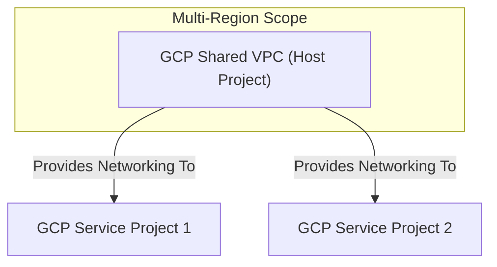

---
tags:
  - resource
  - cloud-platform
  - gcp-networking
Area: "[[My Areas]]"
Platform: "GCP"
Service: "Shared VPC"
---

# GCP Shared VPC

## Overview

- **GCP Shared VPC** → Allows sharing of VPC networks across multiple projects within an organization
- **Key Features** → Centralized network management, cross-project resource sharing, centralized billing, unified security policies
- **Use Cases** → Enterprise environments, centralized IT management, cost optimization, security compliance
- **Scope** → Organization-level service enabling cross-project network sharing
- **Integration** → Works with IAM, Organization policies, and centralized network administration

---

## Architecture Diagram



---

## Configuration Examples

### Shared VPC Roles and Structure
| Component | Role | Responsibility | Project Type |
|-----------|------|----------------|-------------|
| Host Project | Network Admin | Manages VPC, subnets, firewall rules | Host |
| Service Project | Compute Admin | Deploys resources in shared subnets | Service |
| Organization | Shared VPC Admin | Enables sharing, manages policies | Org Level |

### Basic Configuration
```yaml
# Shared VPC setup configuration
shared_vpc_config:
  host_project: "networking-host-project"
  service_projects:
    - "web-app-project"
    - "api-service-project"
    - "database-project"
  shared_subnets:
    - name: "shared-web-subnet"
      region: "us-central1"
      cidr: "10.1.0.0/24"
    - name: "shared-app-subnet"
      region: "us-central1"
      cidr: "10.2.0.0/24"
```

### gcloud Commands
```bash
# Enable Shared VPC in the host project
gcloud compute shared-vpc enable networking-host-project

# Associate service projects with the Shared VPC host
gcloud compute shared-vpc associated-projects add web-app-project \
    --host-project=networking-host-project

gcloud compute shared-vpc associated-projects add api-service-project \
    --host-project=networking-host-project

gcloud compute shared-vpc associated-projects add database-project \
    --host-project=networking-host-project

# Create shared subnets in the host project
gcloud compute networks subnets create shared-web-subnet \
    --project=networking-host-project \
    --network=shared-vpc-network \
    --range=10.1.0.0/24 \
    --region=us-central1 \
    --enable-private-ip-google-access

gcloud compute networks subnets create shared-app-subnet \
    --project=networking-host-project \
    --network=shared-vpc-network \
    --range=10.2.0.0/24 \
    --region=us-central1 \
    --enable-private-ip-google-access

# Grant IAM permissions for service project users to use specific subnets
gcloud projects add-iam-policy-binding networking-host-project \
    --member="user:dev-team@company.com" \
    --role="roles/compute.networkUser"

gcloud compute networks subnets add-iam-policy-binding shared-web-subnet \
    --project=networking-host-project \
    --region=us-central1 \
    --member="serviceAccount:web-app-service-account@web-app-project.iam.gserviceaccount.com" \
    --role="roles/compute.networkUser"

# List Shared VPC host projects
gcloud compute shared-vpc get-host-project web-app-project

# List associated service projects
gcloud compute shared-vpc list-associated-resources networking-host-project

# Disable Shared VPC (removes all associations)
gcloud compute shared-vpc disable networking-host-project
```

---

## Related Services

### Core Dependencies
- [[GCP VPC]] - Base network shared across projects
- **GCP Organization** - Required for cross-project sharing
- **GCP IAM** - Manages permissions and access control

### Project Management
- **Host Project** - Owns and manages the shared VPC network
- **Service Projects** - Use shared network resources
- **Billing Project** - Centralized cost management

### Alternative Approaches
- [[GCP VPC Peering]] - Direct connectivity between separate VPCs
- **Individual VPCs** - Separate networks per project
- **Multi-Project Architecture** - Complex organizational structures

### Cross-Platform Equivalents
| GCP | AWS | Azure | Description |
|-----|-----|-------|-------------|
| Shared VPC | RAM (Resource Access Manager) | Virtual Network Sharing | Cross-account/project networking |
| Host Project | Network Account | Hub Subscription | Central network management |
| Service Project | Member Account | Spoke Subscription | Resource deployment projects |

---

## References

### Official Documentation
- [Shared VPC Overview](https://cloud.google.com/vpc/docs/shared-vpc)
- [Shared VPC Concepts](https://cloud.google.com/vpc/docs/shared-vpc-concepts)
- [Setting Up Shared VPC](https://cloud.google.com/vpc/docs/shared-vpc-setup)
- [IAM for Shared VPC](https://cloud.google.com/vpc/docs/shared-vpc-iam)
- [Shared VPC Best Practices](https://cloud.google.com/architecture/best-practices-vpc-design#shared-vpc)

### Third-Party Resources
- [Stack Overflow - Shared VPC](https://stackoverflow.com/questions/tagged/google-cloud-shared-vpc)
- [Medium - Enterprise GCP Architecture](https://medium.com/tag/gcp-enterprise)
- [Reddit - GCP Organization](https://reddit.com/r/googlecloud)
- [YouTube - Shared VPC Tutorials](https://youtube.com/results?search_query=gcp+shared+vpc)

### Learning Resources
- [Professional Cloud Architect](https://cloud.google.com/certification/cloud-architect)
- [Enterprise Architecture on GCP](https://cloud.google.com/training/courses/arch-gcp-enterprise)
- [Organization Setup Guide](https://cloud.google.com/docs/enterprise/setup-checklist)
- [Multi-Project Best Practices](https://cloud.google.com/architecture/identity/best-practices-for-planning-accounts-and-projects)
