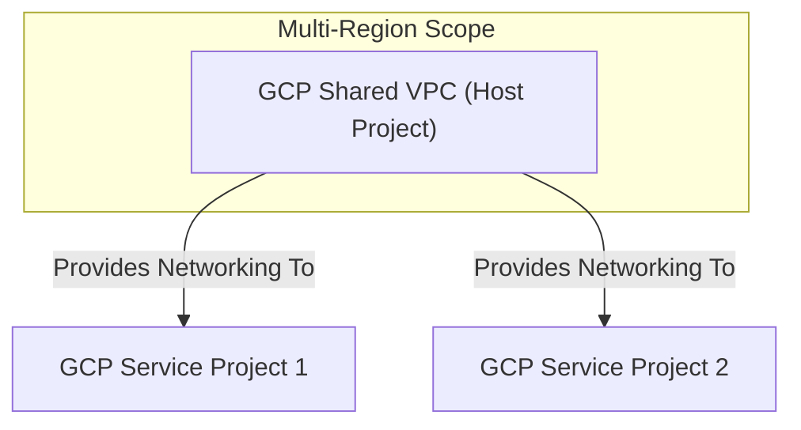

---
tags:
  - resource
  - cloud-platform
  - gcp-networking
Area: "[[My Areas]]"
Platform: "GCP"
Service: "Shared VPC"
---

# GCP Shared VPC

## Overview

- **GCP Shared VPC** → Allows sharing of VPC networks across multiple projects within an organization
- **Key Features** → Centralized network management, cross-project resource sharing, centralized billing, unified security policies
- **Use Cases** → Enterprise environments, centralized IT management, cost optimization, security compliance
- **Scope** → Organization-level service enabling cross-project network sharing
- **Integration** → Works with IAM, Organization policies, and centralized network administration

---

## Architecture Diagram



---

## Configuration Examples

### Shared VPC Roles and Structure
| Component | Role | Responsibility | Project Type |
|-----------|------|----------------|-------------|
| Host Project | Network Admin | Manages VPC, subnets, firewall rules | Host |
| Service Project | Compute Admin | Deploys resources in shared subnets | Service |
| Organization | Shared VPC Admin | Enables sharing, manages policies | Org Level |

> [!example]- gcloud CLI Commands
> ```bash
> # Enable Shared VPC in the host project
> gcloud compute shared-vpc enable networking-host-project
> 
> # Associate service projects with the Shared VPC host
> gcloud compute shared-vpc associated-projects add web-app-project \
>     --host-project=networking-host-project
> 
> gcloud compute shared-vpc associated-projects add api-service-project \
>     --host-project=networking-host-project
> 
> gcloud compute shared-vpc associated-projects add database-project \
>     --host-project=networking-host-project
> 
> # Create shared subnets in the host project
> gcloud compute networks subnets create shared-web-subnet \
>     --project=networking-host-project \
>     --network=shared-vpc-network \
>     --range=10.1.0.0/24 \
>     --region=us-central1 \
>     --enable-private-ip-google-access
> 
> gcloud compute networks subnets create shared-app-subnet \
>     --project=networking-host-project \
>     --network=shared-vpc-network \
>     --range=10.2.0.0/24 \
>     --region=us-central1 \
>     --enable-private-ip-google-access
> 
> # Grant IAM permissions for service project users to use specific subnets
> gcloud projects add-iam-policy-binding networking-host-project \
>     --member="user:dev-team@company.com" \
>     --role="roles/compute.networkUser"
> 
> gcloud compute networks subnets add-iam-policy-binding shared-web-subnet \
>     --project=networking-host-project \
>     --region=us-central1 \
>     --member="serviceAccount:web-app-service-account@web-app-project.iam.gserviceaccount.com" \
>     --role="roles/compute.networkUser"
> 
> # List Shared VPC host projects
> gcloud compute shared-vpc get-host-project web-app-project
> 
> # List associated service projects
> gcloud compute shared-vpc list-associated-resources networking-host-project
> 
> # Disable Shared VPC (removes all associations)
> gcloud compute shared-vpc disable networking-host-project
> ```

> [!code]- Terraform Configuration
> ```hcl
> # Enable Shared VPC on the host project
> resource "google_compute_shared_vpc_host_project" "host" {
>   project = "networking-host-project"
> }
> 
> # Associate service projects
> resource "google_compute_shared_vpc_service_project" "web_app" {
>   host_project    = google_compute_shared_vpc_host_project.host.project
>   service_project = "web-app-project"
> }
> 
> resource "google_compute_shared_vpc_service_project" "api_service" {
>   host_project    = google_compute_shared_vpc_host_project.host.project
>   service_project = "api-service-project"
> }
> 
> resource "google_compute_shared_vpc_service_project" "database" {
>   host_project    = google_compute_shared_vpc_host_project.host.project
>   service_project = "database-project"
> }
> 
> # Create shared VPC network
> resource "google_compute_network" "shared_vpc" {
>   project                 = "networking-host-project"
>   name                    = "shared-vpc-network"
>   auto_create_subnetworks = false
> }
> 
> # Create shared subnets
> resource "google_compute_subnetwork" "shared_web_subnet" {
>   project       = "networking-host-project"
>   name          = "shared-web-subnet"
>   ip_cidr_range = "10.1.0.0/24"
>   region        = "us-central1"
>   network       = google_compute_network.shared_vpc.id
>   
>   private_ip_google_access = true
> }
> 
> resource "google_compute_subnetwork" "shared_app_subnet" {
>   project       = "networking-host-project"
>   name          = "shared-app-subnet"
>   ip_cidr_range = "10.2.0.0/24"
>   region        = "us-central1"
>   network       = google_compute_network.shared_vpc.id
>   
>   private_ip_google_access = true
> }
> 
> # Grant IAM permissions
> resource "google_project_iam_member" "network_user" {
>   project = "networking-host-project"
>   role    = "roles/compute.networkUser"
>   member  = "user:dev-team@company.com"
> }
> 
> resource "google_compute_subnetwork_iam_member" "web_subnet_user" {
>   project    = "networking-host-project"
>   region     = "us-central1"
>   subnetwork = google_compute_subnetwork.shared_web_subnet.name
>   role       = "roles/compute.networkUser"
>   member     = "serviceAccount:web-app-service-account@web-app-project.iam.gserviceaccount.com"
> }
> ```

> [!note]- CDKTF (CDK for Terraform)
> Choose your preferred programming language for Infrastructure as Code:
> 
> > [!example]- Python CDKTF
> > ```python
> > from cdktf import App, TerraformStack
> > from cdktf_cdktf_provider_google import provider, compute_shared_vpc_host_project, compute_shared_vpc_service_project, compute_network, compute_subnetwork, project_iam_member, compute_subnetwork_iam_member
> > 
> > class SharedVpcStack(TerraformStack):
> >     def __init__(self, scope, id):
> >         super().__init__(scope, id)
> > 
> >         # Configure the Google Cloud Provider
> >         provider.GoogleProvider(self, "google",
> >             project="networking-host-project",
> >             region="us-central1"
> >         )
> > 
> >         # Enable Shared VPC on host project
> >         host = compute_shared_vpc_host_project.ComputeSharedVpcHostProject(
> >             self, "host",
> >             project="networking-host-project"
> >         )
> > 
> >         # Associate service projects
> >         web_app = compute_shared_vpc_service_project.ComputeSharedVpcServiceProject(
> >             self, "web_app",
> >             host_project=host.project,
> >             service_project="web-app-project"
> >         )
> > 
> >         api_service = compute_shared_vpc_service_project.ComputeSharedVpcServiceProject(
> >             self, "api_service", 
> >             host_project=host.project,
> >             service_project="api-service-project"
> >         )
> > 
> >         database = compute_shared_vpc_service_project.ComputeSharedVpcServiceProject(
> >             self, "database",
> >             host_project=host.project,
> >             service_project="database-project"
> >         )
> > 
> >         # Create shared VPC network
> >         shared_vpc = compute_network.ComputeNetwork(
> >             self, "shared_vpc",
> >             project="networking-host-project",
> >             name="shared-vpc-network",
> >             auto_create_subnetworks=False
> >         )
> > 
> >         # Create subnets
> >         web_subnet = compute_subnetwork.ComputeSubnetwork(
> >             self, "web_subnet",
> >             project="networking-host-project",
> >             name="shared-web-subnet",
> >             ip_cidr_range="10.1.0.0/24",
> >             region="us-central1",
> >             network=shared_vpc.id,
> >             private_ip_google_access=True
> >         )
> > 
> >         app_subnet = compute_subnetwork.ComputeSubnetwork(
> >             self, "app_subnet",
> >             project="networking-host-project", 
> >             name="shared-app-subnet",
> >             ip_cidr_range="10.2.0.0/24",
> >             region="us-central1",
> >             network=shared_vpc.id,
> >             private_ip_google_access=True
> >         )
> > 
> > app = App()
> > SharedVpcStack(app, "shared-vpc")
> > app.synth()
> > ```
> 
> > [!example]- TypeScript CDKTF
> > ```typescript
> > import { Construct } from "constructs";
> > import { App, TerraformStack } from "cdktf";
> > import { GoogleProvider } from "@cdktf/provider-google/lib/provider";
> > import { ComputeSharedVpcHostProject } from "@cdktf/provider-google/lib/compute-shared-vpc-host-project";
> > import { ComputeSharedVpcServiceProject } from "@cdktf/provider-google/lib/compute-shared-vpc-service-project";
> > import { ComputeNetwork } from "@cdktf/provider-google/lib/compute-network";
> > import { ComputeSubnetwork } from "@cdktf/provider-google/lib/compute-subnetwork";
> > import { ProjectIamMember } from "@cdktf/provider-google/lib/project-iam-member";
> > 
> > class SharedVpcStack extends TerraformStack {
> >   constructor(scope: Construct, id: string) {
> >     super(scope, id);
> > 
> >     // Configure the Google Cloud Provider
> >     new GoogleProvider(this, "google", {
> >       project: "networking-host-project",
> >       region: "us-central1",
> >     });
> > 
> >     // Enable Shared VPC on host project
> >     const host = new ComputeSharedVpcHostProject(this, "host", {
> >       project: "networking-host-project",
> >     });
> > 
> >     // Associate service projects
> >     const webApp = new ComputeSharedVpcServiceProject(this, "webApp", {
> >       hostProject: host.project,
> >       serviceProject: "web-app-project",
> >     });
> > 
> >     const apiService = new ComputeSharedVpcServiceProject(this, "apiService", {
> >       hostProject: host.project,
> >       serviceProject: "api-service-project",
> >     });
> > 
> >     const database = new ComputeSharedVpcServiceProject(this, "database", {
> >       hostProject: host.project,
> >       serviceProject: "database-project", 
> >     });
> > 
> >     // Create shared VPC network
> >     const sharedVpc = new ComputeNetwork(this, "sharedVpc", {
> >       project: "networking-host-project",
> >       name: "shared-vpc-network",
> >       autoCreateSubnetworks: false,
> >     });
> > 
> >     // Create subnets
> >     const webSubnet = new ComputeSubnetwork(this, "webSubnet", {
> >       project: "networking-host-project",
> >       name: "shared-web-subnet",
> >       ipCidrRange: "10.1.0.0/24",
> >       region: "us-central1",
> >       network: sharedVpc.id,
> >       privateIpGoogleAccess: true,
> >     });
> > 
> >     const appSubnet = new ComputeSubnetwork(this, "appSubnet", {
> >       project: "networking-host-project",
> >       name: "shared-app-subnet", 
> >       ipCidrRange: "10.2.0.0/24",
> >       region: "us-central1",
> >       network: sharedVpc.id,
> >       privateIpGoogleAccess: true,
> >     });
> > 
> >     // Grant IAM permissions
> >     new ProjectIamMember(this, "networkUser", {
> >       project: "networking-host-project",
> >       role: "roles/compute.networkUser",
> >       member: "user:dev-team@company.com",
> >     });
> >   }
> > }
> > 
> > const app = new App();
> > new SharedVpcStack(app, "shared-vpc");
> > app.synth();
> > ```
> 
> > [!example]- Go CDKTF
> > ```go
> > package main
> > 
> > import (
> >     "github.com/aws/constructs-go/constructs/v10"
> >     "github.com/hashicorp/terraform-cdk-go/cdktf"
> >     google "github.com/cdktf/cdktf-provider-google-go/google/v13"
> >     "github.com/cdktf/cdktf-provider-google-go/google/v13/computesharedvpchostproject"
> >     "github.com/cdktf/cdktf-provider-google-go/google/v13/computesharedvpcserviceproject"
> >     "github.com/cdktf/cdktf-provider-google-go/google/v13/computenetwork"
> >     "github.com/cdktf/cdktf-provider-google-go/google/v13/computesubnetwork"
> >     "github.com/cdktf/cdktf-provider-google-go/google/v13/projectiammember"
> > )
> > 
> > func NewSharedVpcStack(scope constructs.Construct, id string) cdktf.TerraformStack {
> >     stack := cdktf.NewTerraformStack(scope, &id)
> > 
> >     // Configure the Google Cloud Provider
> >     google.NewGoogleProvider(stack, jsii.String("google"), &google.GoogleProviderConfig{
> >         Project: jsii.String("networking-host-project"),
> >         Region:  jsii.String("us-central1"),
> >     })
> > 
> >     // Enable Shared VPC on host project
> >     host := computesharedvpchostproject.NewComputeSharedVpcHostProject(stack, jsii.String("host"), &computesharedvpchostproject.ComputeSharedVpcHostProjectConfig{
> >         Project: jsii.String("networking-host-project"),
> >     })
> > 
> >     // Associate service projects
> >     computesharedvpcserviceproject.NewComputeSharedVpcServiceProject(stack, jsii.String("webApp"), &computesharedvpcserviceproject.ComputeSharedVpcServiceProjectConfig{
> >         HostProject:    host.Project(),
> >         ServiceProject: jsii.String("web-app-project"),
> >     })
> > 
> >     computesharedvpcserviceproject.NewComputeSharedVpcServiceProject(stack, jsii.String("apiService"), &computesharedvpcserviceproject.ComputeSharedVpcServiceProjectConfig{
> >         HostProject:    host.Project(),
> >         ServiceProject: jsii.String("api-service-project"),
> >     })
> > 
> >     computesharedvpcserviceproject.NewComputeSharedVpcServiceProject(stack, jsii.String("database"), &computesharedvpcserviceproject.ComputeSharedVpcServiceProjectConfig{
> >         HostProject:    host.Project(),
> >         ServiceProject: jsii.String("database-project"),
> >     })
> > 
> >     // Create shared VPC network
> >     sharedVpc := computenetwork.NewComputeNetwork(stack, jsii.String("sharedVpc"), &computenetwork.ComputeNetworkConfig{
> >         Project:               jsii.String("networking-host-project"),
> >         Name:                  jsii.String("shared-vpc-network"),
> >         AutoCreateSubnetworks: jsii.Bool(false),
> >     })
> > 
> >     // Create subnets
> >     computesubnetwork.NewComputeSubnetwork(stack, jsii.String("webSubnet"), &computesubnetwork.ComputeSubnetworkConfig{
> >         Project:              jsii.String("networking-host-project"),
> >         Name:                 jsii.String("shared-web-subnet"),
> >         IpCidrRange:          jsii.String("10.1.0.0/24"),
> >         Region:               jsii.String("us-central1"),
> >         Network:              sharedVpc.Id(),
> >         PrivateIpGoogleAccess: jsii.Bool(true),
> >     })
> > 
> >     computesubnetwork.NewComputeSubnetwork(stack, jsii.String("appSubnet"), &computesubnetwork.ComputeSubnetworkConfig{
> >         Project:              jsii.String("networking-host-project"),
> >         Name:                 jsii.String("shared-app-subnet"),
> >         IpCidrRange:          jsii.String("10.2.0.0/24"),
> >         Region:               jsii.String("us-central1"),
> >         Network:              sharedVpc.Id(),
> >         PrivateIpGoogleAccess: jsii.Bool(true),
> >     })
> > 
> >     // Grant IAM permissions
> >     projectiammember.NewProjectIamMember(stack, jsii.String("networkUser"), &projectiammember.ProjectIamMemberConfig{
> >         Project: jsii.String("networking-host-project"),
> >         Role:    jsii.String("roles/compute.networkUser"),
> >         Member:  jsii.String("user:dev-team@company.com"),
> >     })
> > 
> >     return stack
> > }
> > 
> > func main() {
> >     app := cdktf.NewApp(nil)
> >     NewSharedVpcStack(app, "shared-vpc")
> >     app.Synth()
> > }
> > ```

> [!info]- Console UI Steps
> ### Setting up Shared VPC in Google Cloud Console
> 
> **Step 1: Enable Shared VPC**
> 1. Navigate to **VPC network > Shared VPC**
> 2. Select your **host project** from the dropdown
> 3. Click **Setup Shared VPC**
> 4. Click **Enable** to activate Shared VPC for the host project
> 
> **Step 2: Associate Service Projects**
> 1. In the Shared VPC page, click **Add associated projects**
> 2. Select the **service projects** you want to associate:
>    - `web-app-project`
>    - `api-service-project` 
>    - `database-project`
> 3. Click **Add** to associate the projects
> 
> **Step 3: Create Shared Subnets**
> 1. Go to **VPC network > VPC networks**
> 2. Select your **shared VPC network**
> 3. Click **Add subnet**
> 4. Configure the first subnet:
>    - **Name**: `shared-web-subnet`
>    - **Region**: `us-central1`
>    - **IP address range**: `10.1.0.0/24`
>    - **Private Google access**: `On`
> 5. Repeat for the second subnet:
>    - **Name**: `shared-app-subnet`
>    - **Region**: `us-central1`
>    - **IP address range**: `10.2.0.0/24`
> 
> **Step 4: Configure IAM Permissions**
> 1. Go to **IAM & Admin > IAM**
> 2. Click **Grant access**
> 3. Add members with appropriate roles:
>    - **Principal**: `dev-team@company.com`
>    - **Role**: `Compute Network User`
> 4. For subnet-specific permissions:
>    - Go to **VPC network > VPC networks**
>    - Select subnet → **Permissions**
>    - Add service account with `Compute Network User` role
> 
> **Step 5: Verify Setup**
> 1. Check **Shared VPC** page shows associated projects
> 2. Verify subnets are visible in service projects
> 3. Test resource creation in service projects using shared subnets

---

## Related Services

### Core Dependencies
- [[GCP VPC]] - Base network shared across projects
- **GCP Organization** - Required for cross-project sharing
- **GCP IAM** - Manages permissions and access control

### Project Management
- **Host Project** - Owns and manages the shared VPC network
- **Service Projects** - Use shared network resources
- **Billing Project** - Centralized cost management

### Alternative Approaches
- [[GCP VPC Peering]] - Direct connectivity between separate VPCs
- **Individual VPCs** - Separate networks per project
- **Multi-Project Architecture** - Complex organizational structures

### Cross-Platform Equivalents
| GCP | AWS | Azure | Description |
|-----|-----|-------|-------------|
| Shared VPC | RAM (Resource Access Manager) | Virtual Network Sharing | Cross-account/project networking |
| Host Project | Network Account | Hub Subscription | Central network management |
| Service Project | Member Account | Spoke Subscription | Resource deployment projects |

---

## References

### Official Documentation
- [Shared VPC Overview](https://cloud.google.com/vpc/docs/shared-vpc)
- [Shared VPC Concepts](https://cloud.google.com/vpc/docs/shared-vpc-concepts)
- [Setting Up Shared VPC](https://cloud.google.com/vpc/docs/shared-vpc-setup)
- [IAM for Shared VPC](https://cloud.google.com/vpc/docs/shared-vpc-iam)
- [Shared VPC Best Practices](https://cloud.google.com/architecture/best-practices-vpc-design#shared-vpc)

### Third-Party Resources
- [Stack Overflow - Shared VPC](https://stackoverflow.com/questions/tagged/google-cloud-shared-vpc)
- [Medium - Enterprise GCP Architecture](https://medium.com/tag/gcp-enterprise)
- [Reddit - GCP Organization](https://reddit.com/r/googlecloud)
- [YouTube - Shared VPC Tutorials](https://youtube.com/results?search_query=gcp+shared+vpc)

### Learning Resources
- [Professional Cloud Architect](https://cloud.google.com/certification/cloud-architect)
- [Enterprise Architecture on GCP](https://cloud.google.com/training/courses/arch-gcp-enterprise)
- [Organization Setup Guide](https://cloud.google.com/docs/enterprise/setup-checklist)
- [Multi-Project Best Practices](https://cloud.google.com/architecture/identity/best-practices-for-planning-accounts-and-projects)
