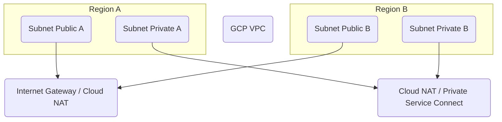

### Explanation of GCP Subnets

- **Subnets** → IP ranges that are **regional** and belong to a VPC.  
- **Scope** → Unlike the VPC (which is global), subnets exist **only in one region**.  
- **Public subnets** → Contain resources that may need **direct internet access** (via external IP or Cloud NAT).  
- **Private subnets** → Contain resources that use **internal IPs only**, typically accessing the internet through NAT or Private Service Connect.  
- **CIDR ranges** → Must not overlap within the same VPC. Subnets define the primary IP range and optional secondary ranges (for alias IPs).  
- **Expansion** → Subnets can be **expanded** to larger CIDR ranges, but cannot be shrunk.  

---

---

### Pages for this diagram
- [GCP VPC](./gcp-vpc.md)  
- [GCP Subnets](./gcp-subnets.md)  
- [GCP Route Tables](./gcp-route-tables.md)  
- [GCP Firewall Rules](./gcp-firewall-rules.md)  
- [GCP Private Service Connect](./gcp-private-service-connect.md)  
- [GCP Cloud NAT](./gcp-cloud-nat.md)  

---

#### References
#### Official
- https://cloud.google.com/vpc/docs/vpc  
- https://cloud.google.com/vpc/docs/subnets  
- https://cloud.google.com/vpc/docs/alias-ip  
- https://cloud.google.com/nat/docs/overview  

#### Third-party
- https://stackoverflow.com/questions/tagged/google-cloud-networking  
- https://medium.com/google-cloud  
