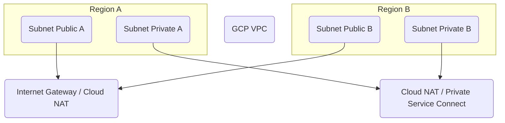

---
tags:
  - resource
  - cloud-platform
  - gcp-networking
Area: "[[My Areas]]"
Platform: "GCP"
Service: "Subnets"
---

# GCP Subnets

## Overview

- **GCP Subnets** → Regional IP address ranges within a VPC that organize and isolate resources
- **Key Features** → Regional scope, expandable CIDR ranges, public/private configurations, secondary IP ranges support
- **Use Cases** → Network segmentation, resource isolation, multi-tier architectures, container networking with alias IPs
- **Scope** → Regional resources within a global VPC
- **Integration** → Foundation for Compute Engine instances, GKE clusters, Cloud SQL, and all regional compute services

---

## Architecture Diagram



---

---

## Configuration Examples

### Basic Subnet Configuration
| Parameter | Value | Description | Required |
|-----------|-------|-------------|----------|
| Name | `web-tier-subnet` | Subnet name | Yes |
| Region | `us-central1` | Geographic region | Yes |
| VPC | `production-vpc` | Parent VPC network | Yes |
| IP Range | `10.0.1.0/24` | Primary CIDR block | Yes |
| Private Google Access | `enabled` | Access to Google APIs without external IP | No |

> [!example]- gcloud CLI Commands
> ```bash
> # Create subnet with secondary ranges (for GKE)
> gcloud compute networks subnets create multi-tier-subnet \
>     --network=production-vpc \
>     --range=10.0.1.0/24 \
>     --region=us-central1 \
>     --secondary-range=pods=10.1.0.0/16,services=10.2.0.0/20 \
>     --enable-private-ip-google-access \
>     --enable-flow-logs \
>     --logging-aggregation-interval=INTERVAL_5_SEC \
>     --logging-flow-sampling=0.5 \
>     --logging-metadata=INCLUDE_ALL_METADATA
> 
> # Expand subnet IP range (can only increase)
> gcloud compute networks subnets expand-ip-range multi-tier-subnet \
>     --region=us-central1 \
>     --prefix-length=23
> 
> # Add secondary range to existing subnet
> gcloud compute networks subnets update multi-tier-subnet \
>     --region=us-central1 \
>     --add-secondary-ranges=new-range=10.3.0.0/16
> 
> # List subnets in region
> gcloud compute networks subnets list --regions=us-central1
> 
> # Describe subnet details
> gcloud compute networks subnets describe multi-tier-subnet \
>     --region=us-central1
> 
> # Delete subnet
> gcloud compute networks subnets delete multi-tier-subnet \
>     --region=us-central1
> ```

> [!code]- Terraform Configuration
> ```hcl
> # Create subnet with secondary ranges for GKE
> resource "google_compute_subnetwork" "multi_tier_subnet" {
>   name          = "multi-tier-subnet"
>   ip_cidr_range = "10.0.1.0/24"
>   region        = "us-central1"
>   network       = "production-vpc"
>   
>   private_ip_google_access = true
>   
>   # Secondary ranges for GKE pods and services
>   secondary_ip_range {
>     range_name    = "pods"
>     ip_cidr_range = "10.1.0.0/16"
>   }
>   
>   secondary_ip_range {
>     range_name    = "services"
>     ip_cidr_range = "10.2.0.0/20"
>   }
>   
>   # Enable flow logs with custom settings
>   log_config {
>     aggregation_interval = "INTERVAL_5_SEC"
>     flow_sampling        = 0.5
>     metadata            = "INCLUDE_ALL_METADATA"
>   }
> }
> 
> # Example of expanding subnet range
> resource "google_compute_subnetwork" "expanded_subnet" {
>   name          = "expanded-subnet"
>   ip_cidr_range = "10.0.2.0/23"  # Larger range
>   region        = "us-central1"
>   network       = "production-vpc"
>   
>   private_ip_google_access = true
> }
> ```

> [!note]- CDKTF (CDK for Terraform)
> Choose your preferred programming language for Infrastructure as Code:
> 
> > [!example]- Python CDKTF
> > ```python
> > from cdktf import App, TerraformStack
> > from cdktf_cdktf_provider_google import provider, compute_subnetwork
> > 
> > class SubnetsStack(TerraformStack):
> >     def __init__(self, scope, id):
> >         super().__init__(scope, id)
> > 
> >         # Configure the Google Cloud Provider
> >         provider.GoogleProvider(self, "google",
> >             project="my-project",
> >             region="us-central1"
> >         )
> > 
> >         # Create subnet with secondary ranges for GKE
> >         multi_tier_subnet = compute_subnetwork.ComputeSubnetwork(
> >             self, "multi_tier_subnet",
> >             name="multi-tier-subnet",
> >             ip_cidr_range="10.0.1.0/24",
> >             region="us-central1",
> >             network="production-vpc",
> >             private_ip_google_access=True,
> >             secondary_ip_range=[
> >                 {
> >                     "range_name": "pods",
> >                     "ip_cidr_range": "10.1.0.0/16"
> >                 },
> >                 {
> >                     "range_name": "services", 
> >                     "ip_cidr_range": "10.2.0.0/20"
> >                 }
> >             ],
> >             log_config={
> >                 "aggregation_interval": "INTERVAL_5_SEC",
> >                 "flow_sampling": 0.5,
> >                 "metadata": "INCLUDE_ALL_METADATA"
> >             }
> >         )
> > 
> > app = App()
> > SubnetsStack(app, "subnets")
> > app.synth()
> > ```
> 
> > [!example]- TypeScript CDKTF
> > ```typescript
> > import { Construct } from "constructs";
> > import { App, TerraformStack } from "cdktf";
> > import { GoogleProvider } from "@cdktf/provider-google/lib/provider";
> > import { ComputeSubnetwork } from "@cdktf/provider-google/lib/compute-subnetwork";
> > 
> > class SubnetsStack extends TerraformStack {
> >   constructor(scope: Construct, id: string) {
> >     super(scope, id);
> > 
> >     // Configure the Google Cloud Provider
> >     new GoogleProvider(this, "google", {
> >       project: "my-project",
> >       region: "us-central1",
> >     });
> > 
> >     // Create subnet with secondary ranges for GKE
> >     const multiTierSubnet = new ComputeSubnetwork(this, "multiTierSubnet", {
> >       name: "multi-tier-subnet",
> >       ipCidrRange: "10.0.1.0/24",
> >       region: "us-central1",
> >       network: "production-vpc",
> >       privateIpGoogleAccess: true,
> >       secondaryIpRange: [
> >         {
> >           rangeName: "pods",
> >           ipCidrRange: "10.1.0.0/16",
> >         },
> >         {
> >           rangeName: "services",
> >           ipCidrRange: "10.2.0.0/20",
> >         },
> >       ],
> >       logConfig: {
> >         aggregationInterval: "INTERVAL_5_SEC",
> >         flowSampling: 0.5,
> >         metadata: "INCLUDE_ALL_METADATA",
> >       },
> >     });
> >   }
> > }
> > 
> > const app = new App();
> > new SubnetsStack(app, "subnets");
> > app.synth();
> > ```
> 
> > [!example]- Go CDKTF
> > ```go
> > package main
> > 
> > import (
> >     "github.com/aws/constructs-go/constructs/v10"
> >     "github.com/hashicorp/terraform-cdk-go/cdktf"
> >     google "github.com/cdktf/cdktf-provider-google-go/google/v13"
> >     "github.com/cdktf/cdktf-provider-google-go/google/v13/computesubnetwork"
> > )
> > 
> > func NewSubnetsStack(scope constructs.Construct, id string) cdktf.TerraformStack {
> >     stack := cdktf.NewTerraformStack(scope, &id)
> > 
> >     // Configure the Google Cloud Provider
> >     google.NewGoogleProvider(stack, jsii.String("google"), &google.GoogleProviderConfig{
> >         Project: jsii.String("my-project"),
> >         Region:  jsii.String("us-central1"),
> >     })
> > 
> >     // Create subnet with secondary ranges for GKE
> >     computesubnetwork.NewComputeSubnetwork(stack, jsii.String("multiTierSubnet"), &computesubnetwork.ComputeSubnetworkConfig{
> >         Name:                 jsii.String("multi-tier-subnet"),
> >         IpCidrRange:          jsii.String("10.0.1.0/24"),
> >         Region:               jsii.String("us-central1"),
> >         Network:              jsii.String("production-vpc"),
> >         PrivateIpGoogleAccess: jsii.Bool(true),
> >         SecondaryIpRange: []*computesubnetwork.ComputeSubnetworkSecondaryIpRange{
> >             {
> >                 RangeName:   jsii.String("pods"),
> >                 IpCidrRange: jsii.String("10.1.0.0/16"),
> >             },
> >             {
> >                 RangeName:   jsii.String("services"),
> >                 IpCidrRange: jsii.String("10.2.0.0/20"),
> >             },
> >         },
> >         LogConfig: &computesubnetwork.ComputeSubnetworkLogConfig{
> >             AggregationInterval: jsii.String("INTERVAL_5_SEC"),
> >             FlowSampling:        jsii.Number(0.5),
> >             Metadata:            jsii.String("INCLUDE_ALL_METADATA"),
> >         },
> >     })
> > 
> >     return stack
> > }
> > 
> > func main() {
> >     app := cdktf.NewApp(nil)
> >     NewSubnetsStack(app, "subnets")
> >     app.Synth()
> > }
> > ```

> [!info]- Console UI Steps
> ### Creating Subnets in Google Cloud Console
> 
> **Step 1: Navigate to VPC Networks**
> 1. Open the Google Cloud Console
> 2. Navigate to **VPC network > VPC networks**
> 3. Click on your existing VPC (e.g., `production-vpc`)
> 4. Click **Add subnet**
> 
> **Step 2: Configure Basic Subnet Settings**
> 1. **Name**: Enter `multi-tier-subnet`
> 2. **Region**: Select `us-central1`
> 3. **IP address range**: Enter `10.0.1.0/24`
> 4. **Private Google access**: Turn **On**
> 
> **Step 3: Configure Secondary IP Ranges (for GKE)**
> 1. Expand **Secondary IP ranges** section
> 2. Click **Add secondary IP range**:
>    - **Range name**: `pods`
>    - **IP address range**: `10.1.0.0/16`
> 3. Click **Add secondary IP range** again:
>    - **Range name**: `services`
>    - **IP address range**: `10.2.0.0/20`
> 
> **Step 4: Enable Flow Logs**
> 1. Expand **Flow logs** section
> 2. Turn flow logs **On**
> 3. Configure settings:
>    - **Aggregation interval**: `5 sec`
>    - **Sample rate**: `50%`
>    - **Metadata**: `Include all metadata`
> 
> **Step 5: Create and Verify**
> 1. Click **Add** to create the subnet
> 2. Verify the subnet appears in your VPC
> 3. Check that secondary ranges are visible
> 
> **Managing Existing Subnets:**
> - **Expand Range**: Go to subnet details → **Edit** → modify IP range (can only increase)
> - **Add Secondary Range**: Go to subnet details → **Edit** → add new secondary range
> - **View Flow Logs**: Navigate to **Operations > Logging** to view flow log data

---

## Related Services

### Core Dependencies
- [[GCP VPC]] - Parent virtual private cloud network
- [[GCP Route Tables]] - Control traffic routing within and between subnets
- **GCP Firewall Rules** - Network security policies applied to subnet resources

### Network Services
- **GCP Cloud NAT** - Internet access for private subnet resources
- [[GCP Private Service Connect]] - Private access to Google and partner services
- **GCP Load Balancers** - Distribute traffic across subnet resources

### Compute Integration
- **Compute Engine** - Virtual machines deployed in subnets
- **Google Kubernetes Engine** - Container clusters using subnet IP ranges
- **Cloud SQL** - Database instances connected to subnets

### Cross-Platform Equivalents
| GCP | AWS | Azure | Description |
|-----|-----|-------|-------------|
| Subnet | Subnet | Subnet | Regional IP address ranges |
| Private Google Access | VPC Endpoints | Service Endpoints | Private service access |
| Secondary Ranges | Secondary CIDR | Address Prefixes | Additional IP ranges |
| Subnet Expansion | CIDR Extension | Address Space Expansion | Growing IP ranges |

---

## References

### Official Documentation
- [Subnet Overview](https://cloud.google.com/vpc/docs/subnets)
- [VPC Networks](https://cloud.google.com/vpc/docs/vpc)
- [Alias IP Ranges](https://cloud.google.com/vpc/docs/alias-ip)
- [Private Google Access](https://cloud.google.com/vpc/docs/private-google-access)
- [Subnet Pricing](https://cloud.google.com/vpc/pricing)

### Third-Party Resources
- [Stack Overflow - GCP Networking](https://stackoverflow.com/questions/tagged/google-cloud-networking)
- [Medium - GCP Subnets](https://medium.com/google-cloud/tagged/subnets)
- [Reddit - GCP Community](https://reddit.com/r/googlecloud)
- [YouTube - GCP Subnet Tutorials](https://youtube.com/results?search_query=gcp+subnets+tutorial)

### Learning Resources
- [Google Cloud Network Engineer Path](https://cloud.google.com/training/networking)
- [VPC and Subnets Lab](https://cloud.google.com/training/courses/networking-gcp)
- [Subnet Design Best Practices](https://cloud.google.com/architecture/best-practices-vpc-design)
- [IP Address Planning Guide](https://cloud.google.com/vpc/docs/vpc#ip-ranges)  
