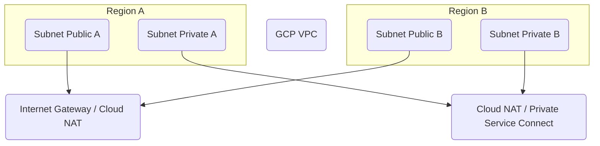

---
tags:
  - resource
  - cloud-platform
  - gcp-networking
Area: "[[My Areas]]"
Platform: "GCP"
Service: "Subnets"
---

# GCP Subnets

## Overview

- **GCP Subnets** → Regional IP address ranges within a VPC that organize and isolate resources
- **Key Features** → Regional scope, expandable CIDR ranges, public/private configurations, secondary IP ranges support
- **Use Cases** → Network segmentation, resource isolation, multi-tier architectures, container networking with alias IPs
- **Scope** → Regional resources within a global VPC
- **Integration** → Foundation for Compute Engine instances, GKE clusters, Cloud SQL, and all regional compute services

---

## Architecture Diagram



---

---

## Configuration Examples

### Basic Subnet Configuration
| Parameter | Value | Description | Required |
|-----------|-------|-------------|----------|
| Name | `web-tier-subnet` | Subnet name | Yes |
| Region | `us-central1` | Geographic region | Yes |
| VPC | `production-vpc` | Parent VPC network | Yes |
| IP Range | `10.0.1.0/24` | Primary CIDR block | Yes |
| Private Google Access | `enabled` | Access to Google APIs without external IP | No |

### Advanced Configuration
```yaml
# Example subnet configuration using gcloud CLI
subnet_config:
  name: "multi-tier-subnet"
  region: "us-central1"
  network: "production-vpc"
  range: "10.0.1.0/24"
  secondary_ranges:
    - range_name: "pods"
      ip_cidr_range: "10.1.0.0/16"
    - range_name: "services"
      ip_cidr_range: "10.2.0.0/20"
  private_google_access: true
  enable_flow_logs: true
```

---

## Related Services

### Core Dependencies
- [[GCP VPC]] - Parent virtual private cloud network
- [[GCP Route Tables]] - Control traffic routing within and between subnets
- **GCP Firewall Rules** - Network security policies applied to subnet resources

### Network Services
- **GCP Cloud NAT** - Internet access for private subnet resources
- [[GCP Private Service Connect]] - Private access to Google and partner services
- **GCP Load Balancers** - Distribute traffic across subnet resources

### Compute Integration
- **Compute Engine** - Virtual machines deployed in subnets
- **Google Kubernetes Engine** - Container clusters using subnet IP ranges
- **Cloud SQL** - Database instances connected to subnets

### Cross-Platform Equivalents
| GCP | AWS | Azure | Description |
|-----|-----|-------|-------------|
| Subnet | Subnet | Subnet | Regional IP address ranges |
| Private Google Access | VPC Endpoints | Service Endpoints | Private service access |
| Secondary Ranges | Secondary CIDR | Address Prefixes | Additional IP ranges |
| Subnet Expansion | CIDR Extension | Address Space Expansion | Growing IP ranges |

---

## References

### Official Documentation
- [Subnet Overview](https://cloud.google.com/vpc/docs/subnets)
- [VPC Networks](https://cloud.google.com/vpc/docs/vpc)
- [Alias IP Ranges](https://cloud.google.com/vpc/docs/alias-ip)
- [Private Google Access](https://cloud.google.com/vpc/docs/private-google-access)
- [Subnet Pricing](https://cloud.google.com/vpc/pricing)

### Third-Party Resources
- [Stack Overflow - GCP Networking](https://stackoverflow.com/questions/tagged/google-cloud-networking)
- [Medium - GCP Subnets](https://medium.com/google-cloud/tagged/subnets)
- [Reddit - GCP Community](https://reddit.com/r/googlecloud)
- [YouTube - GCP Subnet Tutorials](https://youtube.com/results?search_query=gcp+subnets+tutorial)

### Learning Resources
- [Google Cloud Network Engineer Path](https://cloud.google.com/training/networking)
- [VPC and Subnets Lab](https://cloud.google.com/training/courses/networking-gcp)
- [Subnet Design Best Practices](https://cloud.google.com/architecture/best-practices-vpc-design)
- [IP Address Planning Guide](https://cloud.google.com/vpc/docs/vpc#ip-ranges)  
