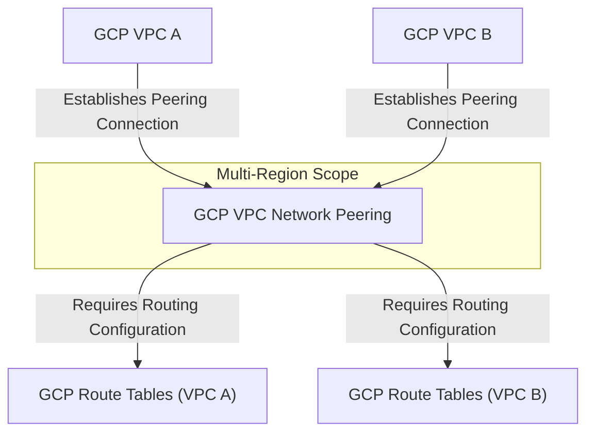
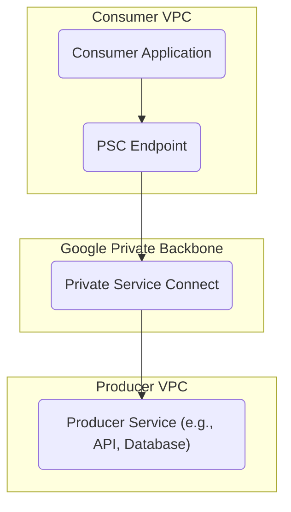

---
tags:
  - resource
Area: "[[My Areas]]"
---
### **Explanation of GCP VPC Network Peering**

- **GCP VPC A & GCP VPC B** → Two **separate VPCs** that want to communicate privately.
- **GCP VPC Network Peering** → Allows **private connectivity** between **two GCP VPCs**, even across **different organizations or projects**.
- **GCP Route Tables (A & B)** → Must be configured to **allow traffic routing** between the peered VPCs.

### Explanation of GCP Private Service Connect (PSC)

- **Private Service Connect (PSC)** → Provides **private connectivity** between consumer and producer VPC networks over Google’s internal backbone.  
- **Use cases** → Expose **Google APIs**, **partner services**, or your own **published services** privately within VPC.  
- **Consumers** → Create PSC **endpoints** in their VPC to access a target service.  
- **Producers** → Publish a service (e.g., internal or partner) that consumers can connect to.  
- **Security** → Traffic stays within Google’s private network; IAM and firewall rules apply.  
- **Difference vs Peering** → PSC is **service-level connectivity**, not network-level like VPC Peering.  

---

---

### Pages for this diagram
- [GCP Private Service Connect](./gcp-private-service-connect.md)  
- [GCP VPC](./gcp-vpc.md)  
- [GCP Subnets](./gcp-subnets.md)  
- [GCP Route Tables](./gcp-route-tables.md)  
- [GCP Firewall Rules](./gcp-firewall-rules.md)  
- [GCP VPC Peering](./gcp-vpc-peering.md)  
- [GCP Cloud VPN](./gcp-cloud-vpn.md)  
- [GCP Cloud Interconnect](./gcp-cloud-interconnect.md)  

---

#### References
#### Official
- https://cloud.google.com/vpc/docs/private-service-connect  
- https://cloud.google.com/vpc/docs/configure-private-service-connect-services  
- https://cloud.google.com/vpc/docs/configure-private-service-connect-apis  

#### Third-party
- https://medium.com/google-cloud/private-service-connect-in-gcp-explained  
- https://stackoverflow.com/questions/tagged/google-cloud-networking  
