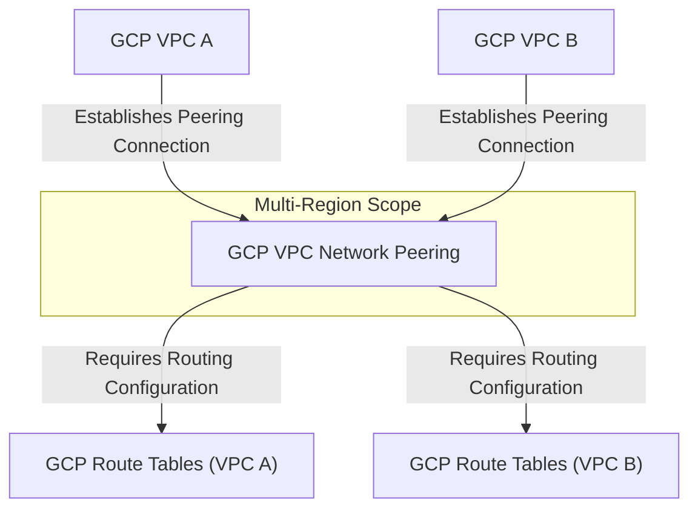

---
tags:
  - resource
  - cloud-platform
  - gcp-networking
Area: "[[My Areas]]"
Platform: "GCP"
Service: "VPC Network Peering"
---

# GCP VPC Network Peering

## Overview

- **GCP VPC Network Peering** → Advanced peering mechanism that enables sophisticated routing and connectivity between VPC networks
- **Key Features** → Cross-organization support, advanced routing controls, custom route exchange, enhanced security options
- **Use Cases** → Complex multi-VPC architectures, partner organization connectivity, advanced network topologies
- **Scope** → Global service supporting cross-project and cross-organization peering
- **Integration** → Works with advanced routing, custom policies, and enterprise-grade network controls




---

## Configuration Examples

### Advanced Peering Configuration
| Parameter | Value | Description | Required |
|-----------|-------|-------------|----------|
| Peering Name | `advanced-network-peering` | Network peering identifier | Yes |
| Source VPC | `vpc-network-a` | First VPC network | Yes |
| Target VPC | `vpc-network-b` | Second VPC network | Yes |
| Exchange Custom Routes | `true` | Exchange custom routing tables | No |
| Exchange Subnet Routes | `true` | Exchange subnet-level routes | No |

### Enterprise Configuration
```yaml
# Example advanced VPC network peering
advanced_peering:
  name: "enterprise-network-peering"
  source_network: "projects/org-a/global/networks/vpc-production"
  target_network: "projects/org-b/global/networks/vpc-services"
  exchange_subnet_routes: true
  export_custom_routes: true
  import_custom_routes: true
  stack_type: "IPV4_ONLY"
```

### gcloud Commands
```bash
# Create advanced VPC peering with custom route exchange
gcloud compute networks peerings create enterprise-network-peering \
    --network=vpc-production \
    --peer-project=org-b-project \
    --peer-network=vpc-services \
    --auto-create-routes \
    --import-custom-routes \
    --export-custom-routes

# Create peering with subnet route exchange control
gcloud compute networks peerings create controlled-peering \
    --network=vpc-production \
    --peer-project=partner-project \
    --peer-network=partner-vpc \
    --auto-create-routes \
    --import-subnet-routes-with-public-ip=false

# Update existing peering to enable custom route import/export
gcloud compute networks peerings update enterprise-network-peering \
    --network=vpc-production \
    --import-custom-routes \
    --export-custom-routes

# Create cross-organization peering (requires special permissions)
gcloud compute networks peerings create cross-org-peering \
    --network=internal-vpc \
    --peer-project=external-org-project \
    --peer-network=external-vpc \
    --auto-create-routes

# List peering connections with advanced details
gcloud compute networks peerings list \
    --network=vpc-production \
    --format="table(name,peerNetwork,autoCreateRoutes,importCustomRoutes,exportCustomRoutes)"

# Describe peering with detailed configuration
gcloud compute networks peerings describe enterprise-network-peering \
    --network=vpc-production

# Delete advanced peering connection
gcloud compute networks peerings delete enterprise-network-peering \
    --network=vpc-production
```

---

## Related Services

### Core Dependencies
- [[GCP VPC]] - Base networks being connected
- [[GCP Route Tables]] - Advanced routing configuration and exchange
- **GCP Firewall Rules** - Security policies for cross-network traffic

### Peering Alternatives
- [[GCP VPC Peering]] - Standard VPC-to-VPC connectivity
- [[GCP Shared VPC]] - Network sharing within organizations
- [[GCP Private Service Connect]] - Service-level private connectivity

### Enterprise Features
- **Organization Policies** - Governance and compliance controls
- **IAM Policies** - Access control for peering operations
- **Cloud Asset Inventory** - Track peering relationships

### Cross-Platform Equivalents
| GCP | AWS | Azure | Description |
|-----|-----|-------|-------------|
| VPC Network Peering | Transit Gateway | Virtual WAN | Advanced network connectivity |
| Custom Route Exchange | Route Propagation | Route Tables | Dynamic routing |
| Cross-Org Peering | Cross-Account TGW | Cross-Tenant Peering | Multi-organization networking |

---

## References

### Official Documentation
- [VPC Network Peering](https://cloud.google.com/vpc/docs/vpc-peering)
- [Advanced Peering Configuration](https://cloud.google.com/vpc/docs/using-vpc-peering)
- [Cross-Organization Peering](https://cloud.google.com/vpc/docs/vpc-peering#cross-org)
- [Enterprise Networking](https://cloud.google.com/architecture/networking)
- [Network Peering Pricing](https://cloud.google.com/vpc/pricing#vpc-peering)

### Third-Party Resources
- [Medium - Advanced GCP Networking](https://medium.com/google-cloud/advanced-gcp-networking)
- [Stack Overflow - GCP Networking](https://stackoverflow.com/questions/tagged/google-cloud-networking)
- [Reddit - GCP Enterprise](https://reddit.com/r/googlecloud)
- [YouTube - Enterprise Networking](https://youtube.com/results?search_query=gcp+enterprise+networking)

### Learning Resources
- [Professional Cloud Network Engineer](https://cloud.google.com/certification/cloud-network-engineer)
- [Advanced Networking Labs](https://cloud.google.com/training/courses/networking-gcp)
- [Enterprise Architecture Patterns](https://cloud.google.com/architecture/networking)
- [Multi-Organization Setup](https://cloud.google.com/docs/enterprise/setup-checklist)  
