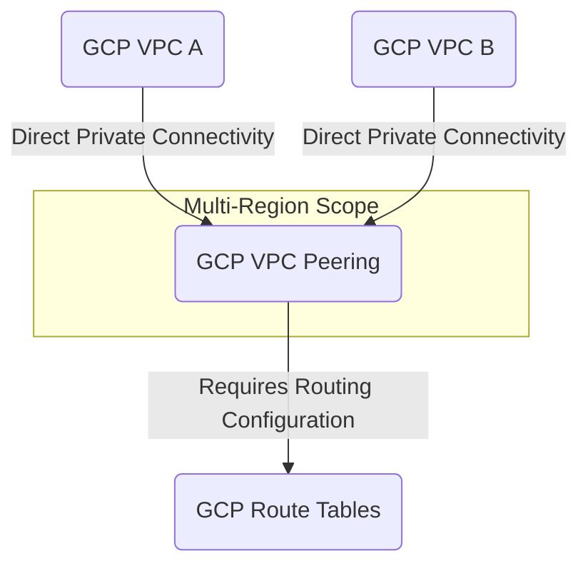

---
tags:
  - resource
Area: "[[My Areas]]"
---
### Explanation of GCP VPC Peering

- **GCP VPC A & GCP VPC B** → Two separate VPCs that want to communicate.
- **GCP VPC Peering** → Enables private connectivity between two VPCs in GCP without external gateways.
- **GCP Route Tables** → Must include routes for the peered CIDR ranges.
- **Limitations** → No transitive peering (A↔B and B↔C ≠ A↔C).

### Pages for this diagram
- [GCP VPC Peering](./gcp-vpc-peering.md)
- [GCP VPC A](./gcp-vpc-a.md)
- [GCP VPC B](./gcp-vpc-b.md)
- [GCP Route Tables](./gcp-route-tables.md)

---
#### References
#### Official
- https://cloud.google.com/vpc/docs/vpc-peering
- https://cloud.google.com/vpc/docs/using-vpc-peering

#### Third-party
- https://stackoverflow.com/questions/tagged/google-cloud-networking
