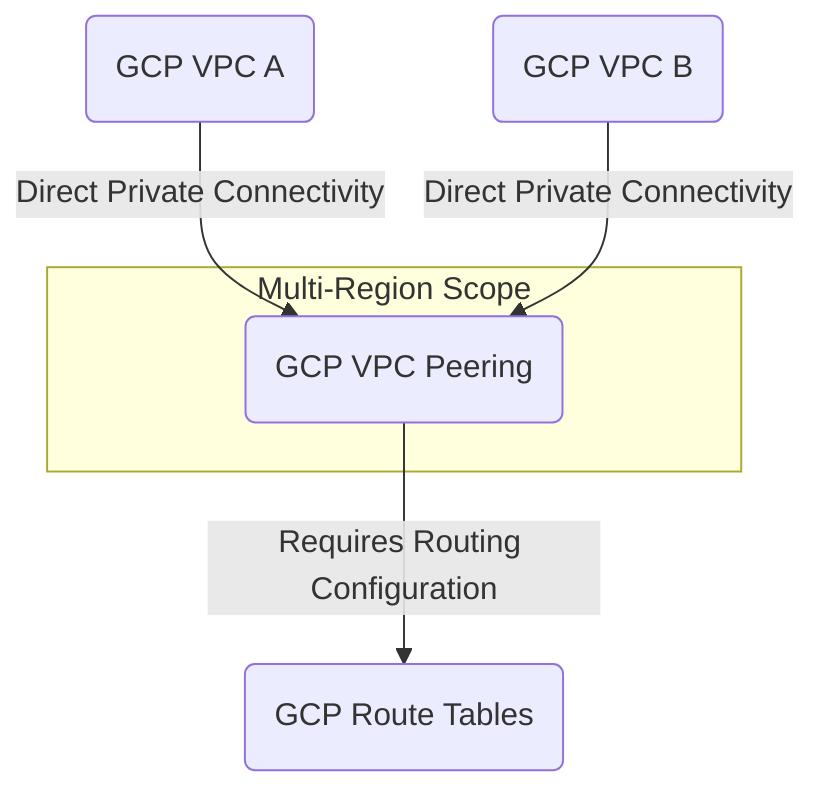

---
tags:
  - resource
  - cloud-platform
  - gcp-networking
Area: "[[My Areas]]"
Platform: "GCP"
Service: "VPC Peering"
---

# GCP VPC Peering

## Overview

- **GCP VPC Peering** → Enables private connectivity between two VPC networks without using external gateways or VPNs
- **Key Features** → Private communication, automatic route exchange, no single point of failure, no bandwidth bottlenecks
- **Use Cases** → Cross-project communication, shared services access, network isolation with selective connectivity
- **Scope** → Global service that can connect VPCs across regions and projects
- **Integration** → Works with firewall rules, IAM policies, and existing VPC routing



---

## Configuration Examples

### Basic Peering Configuration
| Parameter | Value | Description | Required |
|-----------|-------|-------------|----------|
| Network A | `vpc-production` | First VPC network | Yes |
| Network B | `vpc-staging` | Second VPC network | Yes |
| Peering Name | `prod-to-staging` | Peering connection name | Yes |
| Auto Exchange | `enabled` | Automatically exchange subnet routes | No |
| Import Custom Routes | `disabled` | Import custom routes from peer | No |

### Advanced Configuration
```yaml
# Example VPC peering configuration using gcloud CLI
peering_config:
  name: "production-to-shared-services"
  network: "projects/prod-project/global/networks/vpc-production"
  peer_network: "projects/shared-project/global/networks/vpc-shared"
  auto_create_routes: true
  import_custom_routes: false
  export_custom_routes: false
  import_subnet_routes_with_public_ip: false
```

### gcloud Commands
```bash
# Create VPC peering connection from production to shared services
gcloud compute networks peerings create production-to-shared-services \
    --network=vpc-production \
    --peer-project=shared-project \
    --peer-network=vpc-shared \
    --auto-create-routes

# Create the reverse peering connection (required for bidirectional connectivity)
gcloud compute networks peerings create shared-services-to-production \
    --network=vpc-shared \
    --peer-project=prod-project \
    --peer-network=vpc-production \
    --auto-create-routes

# Update peering to import/export custom routes
gcloud compute networks peerings update production-to-shared-services \
    --network=vpc-production \
    --import-custom-routes \
    --export-custom-routes

# List all peering connections for a network
gcloud compute networks peerings list --network=vpc-production

# Describe specific peering connection
gcloud compute networks peerings describe production-to-shared-services \
    --network=vpc-production

# Delete peering connection
gcloud compute networks peerings delete production-to-shared-services \
    --network=vpc-production
```

---

## Related Services

### Core Dependencies
- [[GCP VPC]] - Parent networks being connected
- [[GCP Route Tables]] - Automatic route exchange between peered networks
- **GCP Firewall Rules** - Control traffic flow between peered VPCs

### Alternative Connectivity
- [[GCP VPC Network Peering]] - Cross-VPC routing and communication (alternative approach)
- [[GCP Shared VPC]] - Network sharing within an organization
- [[GCP Cloud VPN]] - Encrypted connectivity option
- [[GCP Cloud Interconnect]] - Dedicated connection alternative

### Security Integration
- **IAM Policies** - Control who can create and manage peering connections
- **Organization Policies** - Restrict peering across organizational boundaries
- **VPC Flow Logs** - Monitor traffic between peered networks

### Cross-Platform Equivalents
| GCP | AWS | Azure | Description |
|-----|-----|-------|-------------|
| VPC Peering | VPC Peering | VNet Peering | Direct network-to-network connectivity |
| Auto Route Exchange | Route Propagation | Virtual Network Gateway | Automatic routing |
| Cross-Project Peering | Cross-Account Peering | Cross-Subscription Peering | Multi-tenant connectivity |

---

## References

### Official Documentation
- [VPC Peering Overview](https://cloud.google.com/vpc/docs/vpc-peering)
- [Using VPC Peering](https://cloud.google.com/vpc/docs/using-vpc-peering)
- [Peering Best Practices](https://cloud.google.com/vpc/docs/best-practices#vpc-peering)
- [Peering Limitations](https://cloud.google.com/vpc/docs/vpc-peering#restrictions)
- [VPC Peering Pricing](https://cloud.google.com/vpc/pricing#vpc-peering)

### Third-Party Resources
- [Stack Overflow - GCP Networking](https://stackoverflow.com/questions/tagged/google-cloud-networking)
- [Medium - VPC Peering Articles](https://medium.com/tag/vpc-peering)
- [Reddit - GCP Community](https://reddit.com/r/googlecloud)
- [YouTube - VPC Peering Tutorials](https://youtube.com/results?search_query=gcp+vpc+peering)

### Learning Resources
- [Google Cloud Network Engineer Path](https://cloud.google.com/training/networking)
- [VPC Peering Lab](https://cloud.google.com/training/courses/networking-gcp)
- [Multi-Project Networking Guide](https://cloud.google.com/architecture/best-practices-vpc-design#multi-project)
- [Network Security Best Practices](https://cloud.google.com/security/best-practices#network-security)
