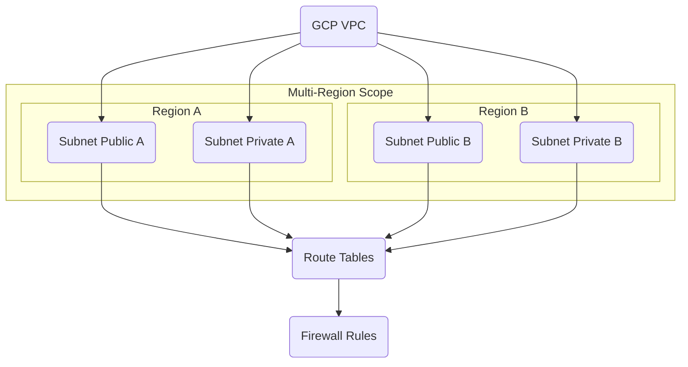

---
tags:
  - resource
  - cloud-platform
  - gcp-networking
Area: "[[My Areas]]"
Platform: "GCP"
Service: "Virtual Private Cloud (VPC)"
---

# GCP Virtual Private Cloud (VPC)

## Overview

- **GCP VPC** → A global, logically isolated virtual network spanning all GCP regions in the project
- **Key Features** → Global scope, regional subnets, custom routing, stateful firewall rules, multiple connectivity options
- **Use Cases** → Host applications, isolate workloads, connect to on-premises, multi-region deployments, microservices architecture
- **Scope** → Global resource with regional subnet components
- **Integration** → Foundation for Compute Engine, GKE, Cloud SQL, Load Balancers, and all compute services

---

## Architecture Diagram




---

## Configuration Examples

### Basic VPC Configuration
| Parameter | Value | Description | Required |
|-----------|-------|-------------|----------|
| Name | `production-vpc` | VPC network name | Yes |
| Subnet Mode | `custom` | Auto or custom subnet creation | Yes |
| BGP Routing Mode | `regional` | Regional or global routing | No |
| MTU | `1460` | Maximum transmission unit | No |

> [!example]- gcloud CLI Commands
> ```bash
> # Create custom mode VPC
> gcloud compute networks create production-vpc \
>     --subnet-mode=custom \
>     --bgp-routing-mode=regional \
>     --description="Production VPC with custom subnets"
> 
> # Create web tier subnet
> gcloud compute networks subnets create web-tier \
>     --network=production-vpc \
>     --range=10.0.1.0/24 \
>     --region=us-central1 \
>     --enable-private-ip-google-access
> 
> # Create app tier subnet
> gcloud compute networks subnets create app-tier \
>     --network=production-vpc \
>     --range=10.0.2.0/24 \
>     --region=us-central1 \
>     --enable-private-ip-google-access
> 
> # Create firewall rule for internal communication
> gcloud compute firewall-rules create allow-internal \
>     --network=production-vpc \
>     --allow=tcp,udp,icmp \
>     --source-ranges=10.0.0.0/16 \
>     --description="Allow internal VPC communication"
> 
> # List VPC networks
> gcloud compute networks list
> 
> # Describe VPC details
> gcloud compute networks describe production-vpc
> ```

> [!code]- Terraform Configuration
> ```hcl
> # Create custom mode VPC
> resource "google_compute_network" "production_vpc" {
>   name                    = "production-vpc"
>   auto_create_subnetworks = false
>   routing_mode           = "REGIONAL"
>   description            = "Production VPC with custom subnets"
> }
> 
> # Create web tier subnet
> resource "google_compute_subnetwork" "web_tier" {
>   name          = "web-tier"
>   ip_cidr_range = "10.0.1.0/24"
>   region        = "us-central1"
>   network       = google_compute_network.production_vpc.id
>   
>   private_ip_google_access = true
> }
> 
> # Create app tier subnet
> resource "google_compute_subnetwork" "app_tier" {
>   name          = "app-tier"
>   ip_cidr_range = "10.0.2.0/24"
>   region        = "us-central1"
>   network       = google_compute_network.production_vpc.id
>   
>   private_ip_google_access = true
> }
> 
> # Create firewall rule for internal communication
> resource "google_compute_firewall" "allow_internal" {
>   name    = "allow-internal"
>   network = google_compute_network.production_vpc.name
>   
>   allow {
>     protocol = "tcp"
>   }
>   
>   allow {
>     protocol = "udp"
>   }
>   
>   allow {
>     protocol = "icmp"
>   }
>   
>   source_ranges = ["10.0.0.0/16"]
>   description   = "Allow internal VPC communication"
> }
> ```

> [!note]- CDKTF (CDK for Terraform)
> Choose your preferred programming language for Infrastructure as Code:
> 
> > [!example]- Python CDKTF
> > ```python
> > from cdktf import App, TerraformStack
> > from cdktf_cdktf_provider_google import provider, compute_network, compute_subnetwork, compute_firewall
> > 
> > class ProductionVpcStack(TerraformStack):
> >     def __init__(self, scope, id):
> >         super().__init__(scope, id)
> > 
> >         # Configure the Google Cloud Provider
> >         provider.GoogleProvider(self, "google",
> >             project="my-project",
> >             region="us-central1"
> >         )
> > 
> >         # Create custom mode VPC
> >         vpc = compute_network.ComputeNetwork(
> >             self, "production_vpc",
> >             name="production-vpc",
> >             auto_create_subnetworks=False,
> >             routing_mode="REGIONAL",
> >             description="Production VPC with custom subnets"
> >         )
> > 
> >         # Create web tier subnet
> >         web_subnet = compute_subnetwork.ComputeSubnetwork(
> >             self, "web_tier",
> >             name="web-tier",
> >             ip_cidr_range="10.0.1.0/24",
> >             region="us-central1",
> >             network=vpc.id,
> >             private_ip_google_access=True
> >         )
> > 
> >         # Create app tier subnet
> >         app_subnet = compute_subnetwork.ComputeSubnetwork(
> >             self, "app_tier",
> >             name="app-tier",
> >             ip_cidr_range="10.0.2.0/24",
> >             region="us-central1",
> >             network=vpc.id,
> >             private_ip_google_access=True
> >         )
> > 
> >         # Create firewall rule
> >         compute_firewall.ComputeFirewall(
> >             self, "allow_internal",
> >             name="allow-internal",
> >             network=vpc.name,
> >             allow=[
> >                 {"protocol": "tcp"},
> >                 {"protocol": "udp"},
> >                 {"protocol": "icmp"}
> >             ],
> >             source_ranges=["10.0.0.0/16"],
> >             description="Allow internal VPC communication"
> >         )
> > 
> > app = App()
> > ProductionVpcStack(app, "production-vpc")
> > app.synth()
> > ```
> 
> > [!example]- TypeScript CDKTF
> > ```typescript
> > import { Construct } from "constructs";
> > import { App, TerraformStack } from "cdktf";
> > import { GoogleProvider } from "@cdktf/provider-google/lib/provider";
> > import { ComputeNetwork } from "@cdktf/provider-google/lib/compute-network";
> > import { ComputeSubnetwork } from "@cdktf/provider-google/lib/compute-subnetwork";
> > import { ComputeFirewall } from "@cdktf/provider-google/lib/compute-firewall";
> > 
> > class ProductionVpcStack extends TerraformStack {
> >   constructor(scope: Construct, id: string) {
> >     super(scope, id);
> > 
> >     // Configure the Google Cloud Provider
> >     new GoogleProvider(this, "google", {
> >       project: "my-project",
> >       region: "us-central1",
> >     });
> > 
> >     // Create custom mode VPC
> >     const vpc = new ComputeNetwork(this, "productionVpc", {
> >       name: "production-vpc",
> >       autoCreateSubnetworks: false,
> >       routingMode: "REGIONAL",
> >       description: "Production VPC with custom subnets",
> >     });
> > 
> >     // Create web tier subnet
> >     const webSubnet = new ComputeSubnetwork(this, "webTier", {
> >       name: "web-tier",
> >       ipCidrRange: "10.0.1.0/24",
> >       region: "us-central1",
> >       network: vpc.id,
> >       privateIpGoogleAccess: true,
> >     });
> > 
> >     // Create app tier subnet
> >     const appSubnet = new ComputeSubnetwork(this, "appTier", {
> >       name: "app-tier",
> >       ipCidrRange: "10.0.2.0/24",
> >       region: "us-central1",
> >       network: vpc.id,
> >       privateIpGoogleAccess: true,
> >     });
> > 
> >     // Create firewall rule
> >     new ComputeFirewall(this, "allowInternal", {
> >       name: "allow-internal",
> >       network: vpc.name,
> >       allow: [
> >         { protocol: "tcp" },
> >         { protocol: "udp" },
> >         { protocol: "icmp" },
> >       ],
> >       sourceRanges: ["10.0.0.0/16"],
> >       description: "Allow internal VPC communication",
> >     });
> >   }
> > }
> > 
> > const app = new App();
> > new ProductionVpcStack(app, "production-vpc");
> > app.synth();
> > ```
> 
> > [!example]- Go CDKTF
> > ```go
> > package main
> > 
> > import (
> >     "github.com/aws/constructs-go/constructs/v10"
> >     "github.com/hashicorp/terraform-cdk-go/cdktf"
> >     google "github.com/cdktf/cdktf-provider-google-go/google/v13"
> >     "github.com/cdktf/cdktf-provider-google-go/google/v13/computenetwork"
> >     "github.com/cdktf/cdktf-provider-google-go/google/v13/computesubnetwork"
> >     "github.com/cdktf/cdktf-provider-google-go/google/v13/computefirewall"
> > )
> > 
> > func NewProductionVpcStack(scope constructs.Construct, id string) cdktf.TerraformStack {
> >     stack := cdktf.NewTerraformStack(scope, &id)
> > 
> >     // Configure the Google Cloud Provider
> >     google.NewGoogleProvider(stack, jsii.String("google"), &google.GoogleProviderConfig{
> >         Project: jsii.String("my-project"),
> >         Region:  jsii.String("us-central1"),
> >     })
> > 
> >     // Create custom mode VPC
> >     vpc := computenetwork.NewComputeNetwork(stack, jsii.String("productionVpc"), &computenetwork.ComputeNetworkConfig{
> >         Name:                  jsii.String("production-vpc"),
> >         AutoCreateSubnetworks: jsii.Bool(false),
> >         RoutingMode:          jsii.String("REGIONAL"),
> >         Description:          jsii.String("Production VPC with custom subnets"),
> >     })
> > 
> >     // Create web tier subnet
> >     computesubnetwork.NewComputeSubnetwork(stack, jsii.String("webTier"), &computesubnetwork.ComputeSubnetworkConfig{
> >         Name:                 jsii.String("web-tier"),
> >         IpCidrRange:          jsii.String("10.0.1.0/24"),
> >         Region:               jsii.String("us-central1"),
> >         Network:              vpc.Id(),
> >         PrivateIpGoogleAccess: jsii.Bool(true),
> >     })
> > 
> >     // Create app tier subnet
> >     computesubnetwork.NewComputeSubnetwork(stack, jsii.String("appTier"), &computesubnetwork.ComputeSubnetworkConfig{
> >         Name:                 jsii.String("app-tier"),
> >         IpCidrRange:          jsii.String("10.0.2.0/24"),
> >         Region:               jsii.String("us-central1"),
> >         Network:              vpc.Id(),
> >         PrivateIpGoogleAccess: jsii.Bool(true),
> >     })
> > 
> >     // Create firewall rule
> >     computefirewall.NewComputeFirewall(stack, jsii.String("allowInternal"), &computefirewall.ComputeFirewallConfig{
> >         Name:    jsii.String("allow-internal"),
> >         Network: vpc.Name(),
> >         Allow: []*computefirewall.ComputeFirewallAllow{
> >             {Protocol: jsii.String("tcp")},
> >             {Protocol: jsii.String("udp")},
> >             {Protocol: jsii.String("icmp")},
> >         },
> >         SourceRanges: &[]*string{jsii.String("10.0.0.0/16")},
> >         Description:  jsii.String("Allow internal VPC communication"),
> >     })
> > 
> >     return stack
> > }
> > 
> > func main() {
> >     app := cdktf.NewApp(nil)
> >     NewProductionVpcStack(app, "production-vpc")
> >     app.Synth()
> > }
> > ```

> [!info]- Console UI Steps
> ### Creating a VPC in Google Cloud Console
> 
> **Step 1: Navigate to VPC Networks**
> 1. Open the Google Cloud Console
> 2. Navigate to **VPC network > VPC networks**
> 3. Click **Create VPC network**
> 
> **Step 2: Configure VPC Settings**
> 1. **Name**: Enter `production-vpc`
> 2. **Description**: "Production VPC with custom subnets"
> 3. **Subnet creation mode**: Select **Custom**
> 4. **Regional routing**: Choose **Regional** routing mode
> 
> **Step 3: Create Subnets**
> 1. Click **Add subnet** for the first subnet:
>    - **Name**: `web-tier`
>    - **Region**: `us-central1`
>    - **IP address range**: `10.0.1.0/24`
>    - **Private Google access**: `On`
> 2. Click **Add subnet** for the second subnet:
>    - **Name**: `app-tier`
>    - **Region**: `us-central1`
>    - **IP address range**: `10.0.2.0/24`
>    - **Private Google access**: `On`
> 
> **Step 4: Configure Firewall Rules**
> 1. Click **Create** to create the VPC
> 2. Navigate to **VPC network > Firewall**
> 3. Click **Create Firewall Rule**:
>    - **Name**: `allow-internal`
>    - **Network**: Select `production-vpc`
>    - **Direction**: `Ingress`
>    - **Action**: `Allow`
>    - **Targets**: `All instances in the network`
>    - **Source IP ranges**: `10.0.0.0/16`
>    - **Protocols and ports**: Check `TCP`, `UDP`, `Other protocols` (enter `icmp`)
> 
> **Step 5: Verify Configuration**
> 1. Return to **VPC networks** to see your new VPC
> 2. Click on the VPC name to view details and subnets
> 3. Verify firewall rules are applied correctly

---

## Related Services

### Core Dependencies
- [[GCP Subnets]] - Regional IP ranges within the VPC
- [[GCP Route Tables]] - Control traffic flow and routing decisions
- **GCP Firewall Rules** - Network-level security and access control

### Connectivity Options
- [[GCP VPC Peering]] - Connect to other VPCs privately
- [[GCP Shared VPC]] - Share networking across multiple projects
- [[GCP Cloud VPN]] - Secure connection to on-premises networks
- [[GCP Cloud Interconnect]] - Dedicated private connection to on-premises
- [[GCP Private Service Connect]] - Private access to Google and partner services

### VPC Types
- [[GCP Auto Mode VPC]] - Automatically created subnets in each region
- [[GCP Custom Mode VPC]] - Manually configured subnets and IP ranges

### Cross-Platform Equivalents
| GCP | AWS | Azure | Description |
|-----|-----|-------|-------------|
| VPC | VPC | Virtual Network | Logically isolated network |
| Subnet | Subnet | Subnet | Regional IP address ranges |
| Firewall Rules | Security Groups | Network Security Groups | Network access control |
| VPC Peering | VPC Peering | VNet Peering | Cross-network connectivity |

---

## References

### Official Documentation
- [VPC Overview](https://cloud.google.com/vpc/docs/vpc)
- [Subnet Configuration](https://cloud.google.com/vpc/docs/subnets)
- [Route Tables](https://cloud.google.com/vpc/docs/routes)
- [Firewall Rules](https://cloud.google.com/vpc/docs/firewalls)
- [VPC Pricing](https://cloud.google.com/vpc/pricing)

### Third-Party Resources
- [Stack Overflow - GCP Networking](https://stackoverflow.com/questions/tagged/google-cloud-networking)
- [Medium - GCP VPC Articles](https://medium.com/tag/google-cloud-vpc)
- [Reddit - GCP Community](https://reddit.com/r/googlecloud)
- [YouTube - GCP VPC Tutorials](https://youtube.com/results?search_query=gcp+vpc+tutorial)

### Learning Resources
- [Google Cloud Network Engineer Path](https://cloud.google.com/training/networking)
- [Professional Cloud Network Engineer Certification](https://cloud.google.com/certification/cloud-network-engineer)
- [VPC Hands-on Labs](https://cloud.google.com/training/courses/networking-gcp)
- [Architecture Center - VPC Patterns](https://cloud.google.com/architecture/best-practices-vpc-design)