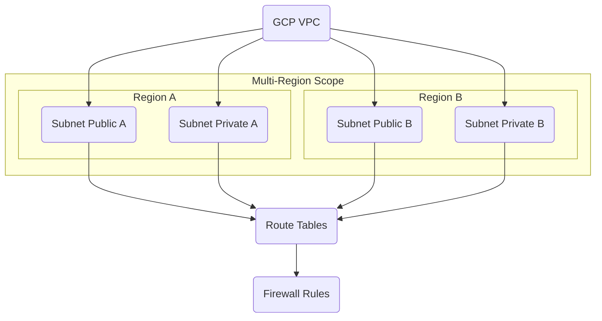

---
tags:
  - resource
  - cloud-platform
  - gcp-networking
Area: "[[My Areas]]"
Platform: "GCP"
Service: "Virtual Private Cloud (VPC)"
---

# GCP Virtual Private Cloud (VPC)

## Overview

- **GCP VPC** → A global, logically isolated virtual network spanning all GCP regions in the project
- **Key Features** → Global scope, regional subnets, custom routing, stateful firewall rules, multiple connectivity options
- **Use Cases** → Host applications, isolate workloads, connect to on-premises, multi-region deployments, microservices architecture
- **Scope** → Global resource with regional subnet components
- **Integration** → Foundation for Compute Engine, GKE, Cloud SQL, Load Balancers, and all compute services

---

## Architecture Diagram




---

## Configuration Examples

### Basic VPC Configuration
| Parameter | Value | Description | Required |
|-----------|-------|-------------|----------|
| Name | `production-vpc` | VPC network name | Yes |
| Subnet Mode | `custom` | Auto or custom subnet creation | Yes |
| BGP Routing Mode | `regional` | Regional or global routing | No |
| MTU | `1460` | Maximum transmission unit | No |

### Advanced Configuration
```yaml
# Example VPC configuration using gcloud CLI
vpc_config:
  name: "production-vpc"
  subnet_mode: "custom"
  bgp_routing_mode: "regional"
  subnets:
    - name: "web-tier"
      region: "us-central1"
      range: "10.0.1.0/24"
      private_google_access: true
    - name: "app-tier"
      region: "us-central1"
      range: "10.0.2.0/24"
      private_google_access: true
```

### gcloud Commands
```bash
# Create custom mode VPC
gcloud compute networks create production-vpc \
    --subnet-mode=custom \
    --bgp-routing-mode=regional \
    --description="Production VPC with custom subnets"

# Create web tier subnet
gcloud compute networks subnets create web-tier \
    --network=production-vpc \
    --range=10.0.1.0/24 \
    --region=us-central1 \
    --enable-private-ip-google-access

# Create app tier subnet
gcloud compute networks subnets create app-tier \
    --network=production-vpc \
    --range=10.0.2.0/24 \
    --region=us-central1 \
    --enable-private-ip-google-access

# Create firewall rule for internal communication
gcloud compute firewall-rules create allow-internal \
    --network=production-vpc \
    --allow=tcp,udp,icmp \
    --source-ranges=10.0.0.0/16 \
    --description="Allow internal VPC communication"

# List VPC networks
gcloud compute networks list

# Describe VPC details
gcloud compute networks describe production-vpc
```

---

## Related Services

### Core Dependencies
- [[GCP Subnets]] - Regional IP ranges within the VPC
- [[GCP Route Tables]] - Control traffic flow and routing decisions
- **GCP Firewall Rules** - Network-level security and access control

### Connectivity Options
- [[GCP VPC Peering]] - Connect to other VPCs privately
- [[GCP Shared VPC]] - Share networking across multiple projects
- [[GCP Cloud VPN]] - Secure connection to on-premises networks
- [[GCP Cloud Interconnect]] - Dedicated private connection to on-premises
- [[GCP Private Service Connect]] - Private access to Google and partner services

### VPC Types
- [[GCP Auto Mode VPC]] - Automatically created subnets in each region
- [[GCP Custom Mode VPC]] - Manually configured subnets and IP ranges

### Cross-Platform Equivalents
| GCP | AWS | Azure | Description |
|-----|-----|-------|-------------|
| VPC | VPC | Virtual Network | Logically isolated network |
| Subnet | Subnet | Subnet | Regional IP address ranges |
| Firewall Rules | Security Groups | Network Security Groups | Network access control |
| VPC Peering | VPC Peering | VNet Peering | Cross-network connectivity |

---

## References

### Official Documentation
- [VPC Overview](https://cloud.google.com/vpc/docs/vpc)
- [Subnet Configuration](https://cloud.google.com/vpc/docs/subnets)
- [Route Tables](https://cloud.google.com/vpc/docs/routes)
- [Firewall Rules](https://cloud.google.com/vpc/docs/firewalls)
- [VPC Pricing](https://cloud.google.com/vpc/pricing)

### Third-Party Resources
- [Stack Overflow - GCP Networking](https://stackoverflow.com/questions/tagged/google-cloud-networking)
- [Medium - GCP VPC Articles](https://medium.com/tag/google-cloud-vpc)
- [Reddit - GCP Community](https://reddit.com/r/googlecloud)
- [YouTube - GCP VPC Tutorials](https://youtube.com/results?search_query=gcp+vpc+tutorial)

### Learning Resources
- [Google Cloud Network Engineer Path](https://cloud.google.com/training/networking)
- [Professional Cloud Network Engineer Certification](https://cloud.google.com/certification/cloud-network-engineer)
- [VPC Hands-on Labs](https://cloud.google.com/training/courses/networking-gcp)
- [Architecture Center - VPC Patterns](https://cloud.google.com/architecture/best-practices-vpc-design)