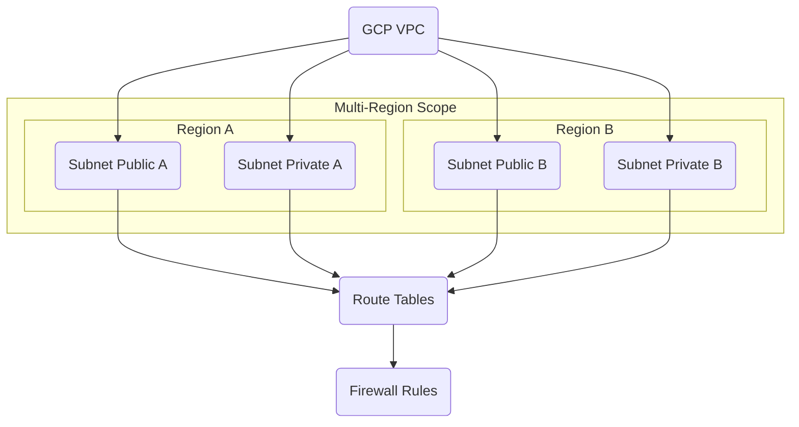

---
tags:
  - resource
Area: "[[My Areas]]"
---
### Explanation of GCP VPC

- **GCP VPC** → A **global**, logically isolated virtual network spanning all GCP regions in the project.  
- **Subnets** → **Regional** IP ranges inside the VPC. You choose ranges and create them per region.  
- **Routing** → VPC has **system** and **custom** routes that control traffic flow within and outside the VPC.  
- **Firewall rules** → **Stateful**, network-level rules that allow or deny traffic by tags or service accounts.  
- **Connectivity options** → Peering, Shared VPC, Cloud VPN, Cloud Interconnect, Private Service Connect.  

---

### Pages for this diagram

- [[GCP VPC]]
- [[GCP Subnets]]
- [[GCP Route Tables]]
- GCP Firewall Rules
- [[GCP VPC Peering]]
- [[GCP Shared VPC]]
- GCP Cloud VPN
- GCP Cloud Interconnect
- [[GCP Private Service Connect]]

---

#### References

#### Official

- [https://cloud.google.com/vpc/docs/vpc](https://cloud.google.com/vpc/docs/vpc)
- https://cloud.google.com/vpc/docs/subnets
- https://cloud.google.com/vpc/docs/routes
- https://cloud.google.com/vpc/docs/firewalls
#### Third-party

- [https://stackoverflow.com/questions/tagged/google-cloud-networking](https://stackoverflow.com/questions/tagged/google-cloud-networking)
- https://medium.com/tag/google-cloud-networking