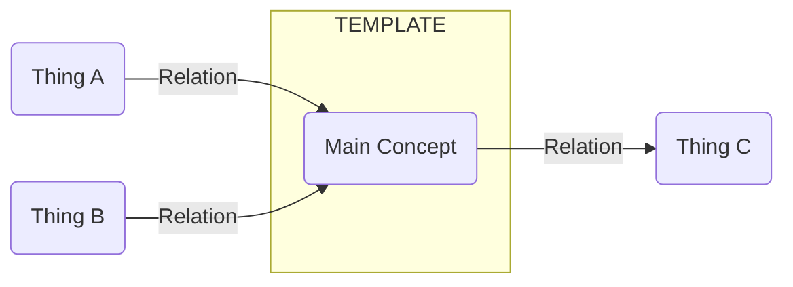

Short bullets that explain the concept at a glance.

### Pages for this diagram
- [Main Concept](./<slug-main-concept>.md)
- [Thing A](./<slug-thing-a>.md)
- [Thing B](./<slug-thing-b>.md)
- [Thing C](./<slug-thing-c>.md)

### References
- Official:
- Third-party:
