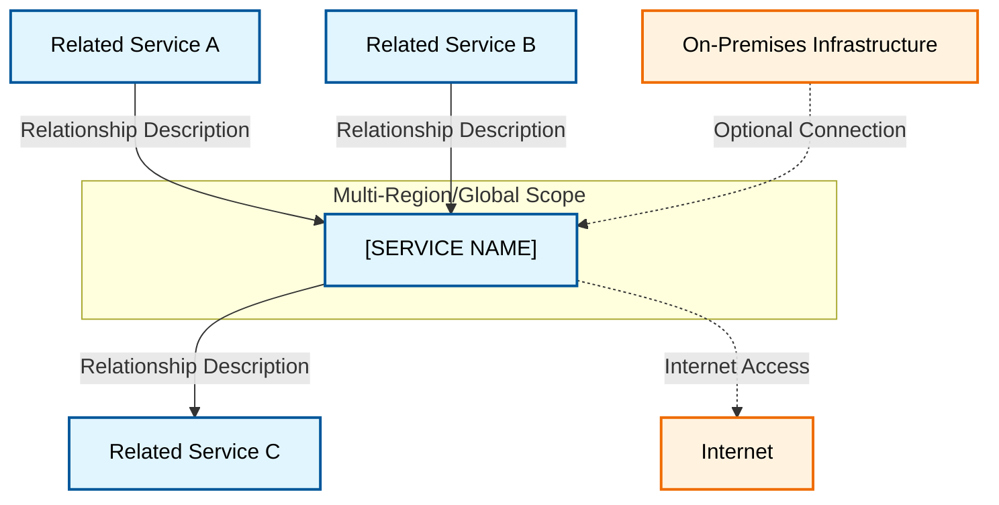

---
tags:
  - resource
  - cloud-platform
  - [specific-service-tag]
Area: "[[My Areas]]"
Platform: "[PLATFORM]"
Service: "[SERVICE NAME]"
---

# [SERVICE NAME]

## Overview

- **[Service Name]** → Brief description of what this service does and its primary purpose
- **Key Features** → Bullet points explaining the main capabilities and features
- **Use Cases** → Common scenarios where this service is most valuable
- **Scope** → Whether it's regional, global, or zonal in nature
- **Integration** → How it works with other services in the platform

---

## Architecture Diagram



---

## Configuration Examples

### Basic Configuration Table
| Parameter | Value | Description | Required |
|-----------|-------|-------------|----------|
| Name | `example-service` | Service instance name | Yes |
| Region | `us-central1` | Geographic region | Yes |
| Type | `standard` | Service tier/type | No |
| CIDR | `10.0.0.0/16` | IP address range | Yes |

### Advanced Configuration
```yaml
# Example configuration (adjust for platform)
service_config:
  name: "example-service"
  region: "us-central1"
  properties:
    - setting: "value"
    - enabled: true
```

---

## Related Services

### Core Dependencies
- [[Service A]] - Description of relationship
- [[Service B]] - Description of relationship
- [[Service C]] - Description of relationship

### Optional Integrations
- [[Optional Service 1]] - When and why you'd use this
- [[Optional Service 2]] - When and why you'd use this

### Cross-Platform Equivalents
| GCP | AWS | Azure | Description |
|-----|-----|-------|-------------|
| [GCP Service] | [AWS Service] | [Azure Service] | Brief comparison |

---

## References

### Official Documentation
- [Primary Service Documentation](https://cloud.google.com/docs/service-name)
- [Configuration Guide](https://cloud.google.com/docs/service-name/config)
- [Best Practices](https://cloud.google.com/docs/service-name/best-practices)
- [Pricing](https://cloud.google.com/pricing/service-name)

### Third-Party Resources
- [Stack Overflow - Service Tag](https://stackoverflow.com/questions/tagged/service-name)
- [Medium Articles](https://medium.com/tag/service-name)
- [Community Tutorials](https://example.com/tutorials)
- [Video Tutorials](https://youtube.com/search?q=service-name)

### Learning Resources
- [Official Training](https://cloud.google.com/training/service-name)
- [Certification Path](https://cloud.google.com/certification)
- [Labs and Tutorials](https://cloud.google.com/labs/service-name)
