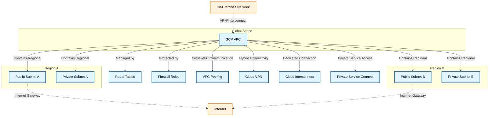

---
tags:
  - resource
  - cloud-platform
  - gcp-networking
Area: "[[My Areas]]"
Platform: "GCP"
Service: "Virtual Private Cloud (VPC)"
---

# GCP Virtual Private Cloud (VPC)

## Overview

- **GCP VPC** → A global, logically isolated virtual network spanning all GCP regions in the project
- **Key Features** → Global scope, regional subnets, custom routing, firewall rules, multiple connectivity options
- **Use Cases** → Host applications, isolate workloads, connect to on-premises, multi-region deployments
- **Scope** → Global resource with regional subnet components
- **Integration** → Works with Compute Engine, GKE, Cloud SQL, Load Balancers, and hybrid connectivity services

---

## Architecture Diagram



---

## Configuration Examples

### Basic Configuration Table
| Parameter | Value | Description | Required |
|-----------|-------|-------------|----------|
| Name | `my-vpc-network` | VPC network name | Yes |
| Subnet Mode | `custom` | Auto or custom subnet creation | Yes |
| Region | `us-central1` | Subnet region | Yes |
| CIDR | `10.0.0.0/16` | Subnet IP address range | Yes |
| Private Google Access | `enabled` | Access to Google APIs without external IP | No |

### Advanced Configuration
```yaml
# Example VPC configuration using gcloud CLI
vpc_config:
  name: "production-vpc"
  subnet_mode: "custom"
  subnets:
    - name: "web-tier-subnet"
      region: "us-central1"
      range: "10.0.1.0/24"
      private_google_access: true
    - name: "app-tier-subnet"
      region: "us-central1"
      range: "10.0.2.0/24"
      private_google_access: true
  firewall_rules:
    - name: "allow-internal"
      direction: "INGRESS"
      source_ranges: ["10.0.0.0/16"]
      allow: ["tcp", "udp", "icmp"]
```

---

## Related Services

### Core Dependencies
- [[GCP Subnets]] - Regional IP ranges within the VPC
- [[GCP Route Tables]] - Control traffic flow and routing decisions
- [[GCP Firewall Rules]] - Network-level security and access control

### Optional Integrations
- [[GCP VPC Peering]] - Connect to other VPCs privately
- [[GCP Shared VPC]] - Share networking across multiple projects
- [[GCP Cloud VPN]] - Secure connection to on-premises networks
- [[GCP Cloud Interconnect]] - Dedicated private connection to on-premises
- [[GCP Private Service Connect]] - Private access to Google and partner services

### Cross-Platform Equivalents
| GCP | AWS | Azure | Description |
|-----|-----|-------|-------------|
| VPC | VPC | Virtual Network | Logically isolated network |
| Subnet | Subnet | Subnet | Regional IP address ranges |
| Firewall Rules | Security Groups | Network Security Groups | Network access control |
| VPC Peering | VPC Peering | VNet Peering | Cross-network connectivity |

---

## References

### Official Documentation
- [VPC Overview](https://cloud.google.com/vpc/docs/vpc)
- [Subnet Configuration](https://cloud.google.com/vpc/docs/subnets)
- [Route Tables](https://cloud.google.com/vpc/docs/routes)
- [Firewall Rules](https://cloud.google.com/vpc/docs/firewalls)
- [VPC Pricing](https://cloud.google.com/vpc/pricing)

### Third-Party Resources
- [Stack Overflow - GCP Networking](https://stackoverflow.com/questions/tagged/google-cloud-networking)
- [Medium - GCP VPC Articles](https://medium.com/tag/google-cloud-vpc)
- [Reddit - GCP Community](https://reddit.com/r/googlecloud)
- [YouTube - GCP Networking Tutorials](https://youtube.com/results?search_query=gcp+vpc+tutorial)

### Learning Resources
- [Google Cloud Network Engineer Path](https://cloud.google.com/training/networking)
- [Professional Cloud Network Engineer Certification](https://cloud.google.com/certification/cloud-network-engineer)
- [VPC Hands-on Labs](https://cloud.google.com/training/courses/networking-gcp)
- [Architecture Center - VPC Patterns](https://cloud.google.com/architecture/best-practices-vpc-design)
